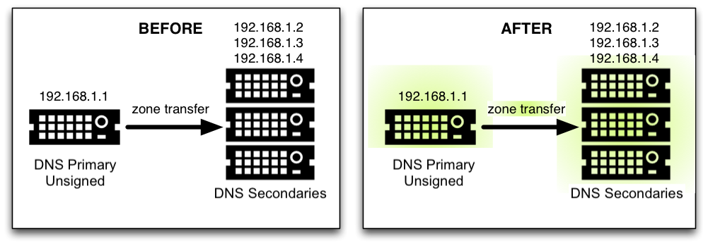
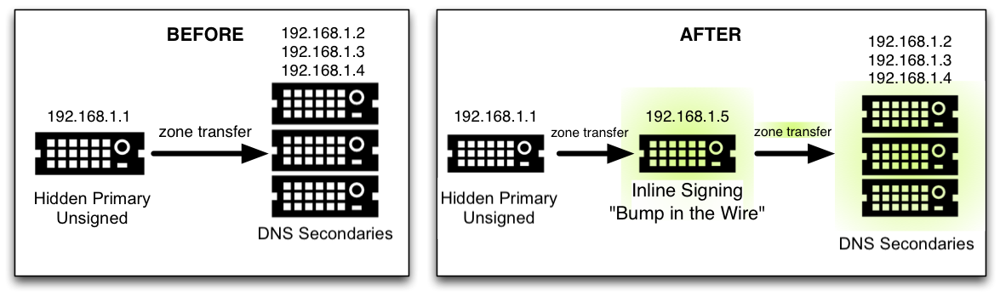

.. 
   Copyright (C) Internet Systems Consortium, Inc. ("ISC")
   
   This Source Code Form is subject to the terms of the Mozilla Public
   License, v. 2.0. If a copy of the MPL was not distributed with this
   file, you can obtain one at https://mozilla.org/MPL/2.0/.
   
   See the COPYRIGHT file distributed with this work for additional
   information regarding copyright ownership.

.. _dnssec_recipes:

诀窍
-------

本章逐步提供一些常见的DNSSEC配置的“诀窍”。

.. _recipes_inline_signing:

DNSSEC签名
~~~~~~~~~~~~~~

这里有两个诀窍：第一个展示了在主服务器上使用DNSSEC签名的例子，这在本指
南中已经介绍过；第二个展示了如何在隐藏主服务器和辅服务器之间设置一个
“中间节点”，以无缝地“快速” [#]_ 签名区。

.. [#]
   译注：原文为“on the fly”。

.. _recipes_inline_signing_primary:

主服务器DNSSEC签名
^^^^^^^^^^^^^^^^^^^^^^^^^^^^^

在这个诀窍中，我们的服务器如 :ref:`dnssec-signing-1` 所展示：我们有一个
主服务器(192.168.1.1)和三个辅服务器(192.168.1.2,192.168.1.3和
192.168.1.4)，它们接收区传输。为了签名区，我们需要重新配置主服务器。一
旦重新配置，快速地生成区的签名版本；区传输负责将经过签名的区数据同步到
所有辅名字服务器，而无需对它们进行配置或软件更改。

.. _dnssec-signing-1:

   DNSSEC签名诀窍1

使用在 :ref:`easy_start_guide_for_authoritative_servers` 中描述的方法，
我们只需要在相关的zone子句中添加一个 ``dnssec-policy`` 语句。这就是主服
务器192.168.1.1上的 ``named.conf`` zone语句的样子：

::

   zone "example.com" IN {
       type primary;
       file "db/example.com.db";
       key-directory "keys/example.com";
       dnssec-policy default;
       allow-transfer { 192.168.1.2; 192.168.1.3; 192.168.1.4; };
   };

我们选择使用缺省的策略，将为区生成的密钥存放于目录
``keys/example.com`` 。要使用自定义策略，请在配置文件中定义该策略，并在
区语句中选择它(如 :ref:`signing_custom_policy` 所述)。

在辅服务器上， ``named.conf`` 不需要更新，它看起来像这样：

::

   zone "example.com" IN {
       type secondary;
       file "db/example.com.db";
       primaries { 192.168.1.1; };
   };

实上，辅服务器甚至不需要运行BIND；它们可以运行任何支持DNSSEC的DNS产品。

.. _recipes_inline_signing_bump_in_the_wire:

“中间节点”签名
^^^^^^^^^^^^^^^^^^^^^^^^^^

在本诀窍中，我们通过在隐藏主服务器(192.168.1.1)和DNS辅服务器
(192.168.1.2、192.168.1.3和192.168.1.4)之间放置一个额外的名字服务器
(192.168.1.5)来利用自动签名的强大功能。附加的名字服务器192.168.1.5充当
“中间节点”，它从隐藏主服务器获取一个未签名区，并在另一端将签名区的数据
发送到辅名字服务器。本诀窍中描述的步骤可以用作DNSSEC部署策略的一部分，
因为它只需要对现有的隐藏主服务器和辅服务器进行最小的修改。

.. _dnssec-signing-2:

   DNSSEC签名诀窍2

重要的是要记住，在本例中192.168.1.1是一个不公开的隐藏主服务器，它不能在
NS资源记录集中列出。否则世界将得到冲突的答案：来自隐藏主服务器的未签名
答案和来自其它名字服务器的已签名答案。

在隐藏主服务器192.168.1.1上唯一需要做的配置更改是确保它允许我们的中间服
务器执行区传输：

::

   zone "example.com" IN {
       ...
       allow-transfer { 192.168.1.5; };
       ...
   };

在中间服务器192.168.1.5上，在
:ref:`easy_start_guide_for_authoritative_servers` 中描述的任务仍然需要
执行，例如生成密钥对和上传信息到父区。该服务器被配置为隐藏主服务器
192.168.1.1的辅服务器，以接收未签名的数据；然后，使用这个中间服务器可以
访问的密钥，来动态地签名数据；最后，通过区传输将签名数据发送给其它三个
辅助服务器。它的 ``named.conf`` zone语句看起来像这样：

::

   zone example.com {
       type secondary;
       primaries { 192.168.1.1; };
       file "db/example.com.db";
       key-directory "keys/example.com";
       dnssec-policy default;
       allow-transfer { 192.168.1.2; 192.168.1.3; 192.168.1.4; };
   };

(与前面一样，这里选择了缺省策略。参见 :ref:`signing_custom_policy` 查看
如何定义和使用自定义策略的说明。)

最后，在三个辅助服务器上，应该更新配置以接收来自192.168.1.5(中间服务器)
的区传输，而不是来自192.168.1.1(隐藏主服务器)。如果使用BIND，
``named.conf`` 文件看起来像这样：

::

   zone "example.com" IN {
       type secondary;
       file "db/example.com.db";
       primaries { 192.168.1.5; };   # this was 192.168.1.1 before!
   };

.. _recipes_rollovers:

轮转
~~~~

如果您正在使用 ``dnssec-policy`` 语句为您的区签名，那么本节实际上与您无
关。在策略语句中，您设置了希望密钥有效的时间长度、信息传播到您的区所花
费的时间、父区注册一个新DS记录所花费的时间，等等，差不多就是这些。
``named`` 自动实现了一切，除了上传新的DS记录到你的父区 - 这包含在
:ref:`signing_easy_start_upload_to_parent_zone` 。(为了方便起见，这里提
供了上传KSK到父区的会话的一些截图。)然而，这些诀窍在描述轮转过程中发生
的事情以及应该监视什么方面可能很有用。

.. _recipes_zsk_rollover:

ZSK轮转
^^^^^^^

本诀窍介绍了如何使用预发布方法执行ZSK轮转。关于其它ZSK轮转方法，请参见
:ref:`dnssec_advanced_discussions` 中的 :ref:`zsk_rollover_methods` 。

下面是发生在2021年1月1日的ZSK轮转的时间线例子：

1. 2020年12月1日 （在轮转之前一个月）

   -  生成新ZSK

   -  将新ZSK的DNSKEY增加到区中

2. 2021年1月1日 （轮转日）

   -  新ZSK用于替换区内大部分的RRSIG

3. 2021年2月1日(轮转之后一个月)

   -  从区中移除旧的ZSK DNSKEY资源记录集

   -  修改KSK生成的DNSKEY签名

在下面的示例中，当前活动的ZSK的ID为17694。有关密钥管理和轮转的更多信息，
请参阅 :ref:`advanced_discussions_key_management` 。

在ZSK轮转之前一个月
+++++++++++++++++++

在2020年12月1日，也就是例子轮转之前一个月，您(作为管理员)应该更改当前密
钥(17694)上的参数。将其设置为到2021年1月1日失活，并于2021年2月1日从区中
删除；另外，生成一个后续密钥(51623)：

::

   # cd /etc/bind/keys/example.com/
   # dnssec-settime -I 20210101 -D 20210201 Kexample.com.+008+17694
   ./Kexample.com.+008+17694.key/GoDaddy

   ./Kexample.com.+008+17694.private
   # dnssec-keygen -S Kexample.com.+008+17694
   Generating key pair..++++++ ...........++++++ 
   Kexample.com.+008+51623

第一条命令使我们转到密钥目录 ``/etc/bind/keys/example.com/`` ，这里存放
着 ``example.com`` 的密钥。

第二条命令 ``dnssec-settime`` 为当前ZSK(``Kexample.com.+008+17694``)设
置一个失活(``-I``)日期2021年1月1日，和一个删除日期2021年2月1日。

第三条命令 ``dnssec-keygen`` 创建一条后续密钥，使用与当前ZSK完全相同的
参数（算法，密钥大小等）。在我们的例子中创建的新ZSK是
``Kexample.com.+008+51623`` 。

确保后续密钥可以被 ``named`` 读取。

``named`` 的日志信息表明何时发生下一次密钥检查事件，其频率可以由
``dnssec-loadkeys-interval`` 控制。日志消息如下所示：

::

   zone example.com/IN (signed): next key event: 01-Dec-2020 00:13:05.385

您还可以通过查看密钥文件来检查密钥的发布日期：

::

   # cd /etc/bind/keys/example.com
   # cat Kexample.com.+008+51623.key 
   ; This is a zone-signing key, keyid 11623, for example.com.
   ; Created: 20201130160024 (Mon Dec  1 00:00:24 2020)
   ; Publish: 20201202000000 (Fri Dec  2 08:00:00 2020)
   ; Activate: 20210101000000 (Sun Jan  1 08:00:00 2021)
   ...

由于发布日期设置为12月2日上午，而我们的例子场景发生在12月1日，第二天早
上您将会注意到区已经获得了一条新的DNSKEY记录，但是新的ZSK还没有用于生成
签名。下面是查询权威名字服务器192.168.1.13时的简短输出 —— 使用了缩短后
的DNSKEY和RRSIG：

::

   $ dig @192.168.1.13 example.com. DNSKEY +dnssec +multiline

   ...
   ;; ANSWER SECTION:
   example.com.        600 IN DNSKEY 257 3 8 (
                   AwEAAcWDps...lM3NRn/G/R
                   ) ; KSK; alg = RSASHA256; key id = 6817
   example.com.        600 IN DNSKEY 256 3 8 (
                   AwEAAbi6Vo...qBW5+iAqNz
                   ) ; ZSK; alg = RSASHA256; key id = 51623
   example.com.        600 IN DNSKEY 256 3 8 (
                   AwEAAcjGaU...0rzuu55If5
                   ) ; ZSK; alg = RSASHA256; key id = 17694
   example.com.        600 IN RRSIG DNSKEY 8 2 600 (
                   20210101000000 20201201230000 6817 example.com.
                   LAiaJM26T7...FU9syh/TQ= )
   example.com.        600 IN RRSIG DNSKEY 8 2 600 (
                   20210101000000 20201201230000 17694 example.com.
                   HK4EBbbOpj...n5V6nvAkI= )
   ...

为了更好地衡量，让我们看一下这个区的SOA记录及其签名。注意RRSIG是由当前
ZSK, 17694签名的。当您稍后想要验证新的ZSK是否有效时，将会用到它：

::

   $ dig @192.168.1.13 example.com. SOA +dnssec +multiline

   ...
   ;; ANSWER SECTION:
   example.com.        600 IN SOA ns1.example.com. admin.example.com. (
                   2020120102 ; serial
                   1800       ; refresh (30 minutes)
                   900        ; retry (15 minutes)
                   2419200    ; expire (4 weeks)
                   300        ; minimum (5 minutes)
                   )
   example.com.        600 IN RRSIG SOA 8 2 600 (
                   20201230160109 20201130150109 17694 example.com.
                   YUTC8rFULaWbW+nAHzbfGwNqzARHevpryzRIJMvZBYPo
                   NAeejNk9saNAoCYKWxGJ0YBc2k+r5fYq1Mg4ll2JkBF5
                   buAsAYLw8vEOIxVpXwlArY+oSp9T1w2wfTZ0vhVIxaYX
                   6dkcz4I3wbDx2xmG0yngtA6A8lAchERx2EGy0RM= )

这些是ZSK轮转时需要执行的所有手动任务。如果您遵循了本指南中使用
``inline-signing`` 和 ``auto-dnssec`` 的配置例子，那么其它一切都是由
BIND自动为您实现的。

ZSK轮转日
+++++++++

在实际的轮转当天，虽然从技术上讲您没有什么可做的，但您仍然应该关注区域，
以确保新ZSK(在本例中为51623)正在生成新的签名。最简单的方法是查询权威名
字服务器192.168.1.13以获取SOA记录，就像一个月之前所做的那样：

::

   $ dig @192.168.1.13 example.com. SOA +dnssec +multiline

   ...
   ;; ANSWER SECTION:
   example.com.        600 IN SOA ns1.example.com. admin.example.com. (
                   2020112011 ; serial
                   1800       ; refresh (30 minutes)
                   900        ; retry (15 minutes)
                   2419200    ; expire (4 weeks)
                   300        ; minimum (5 minutes)
                   )
   example.com.        600 IN RRSIG SOA 8 2 600 (
                   20210131000000 20201231230000 51623 example.com.
                   J4RMNpJPOmMidElyBugJp0RLqXoNqfvo/2AT6yAAvx9X
                   zZRL1cuhkRcyCSLZ9Z+zZ2y4u2lvQGrNiondaKdQCor7
                   uTqH5WCPoqalOCBjqU7c7vlAM27O9RD11nzPNpVQ7xPs
                   y5nkGqf83OXTK26IfnjU1jqiUKSzg6QR7+XpLk0= )
   ...

如您所见，由旧ZSK(17694)生成的签名已经消失，取而代之的是由新ZSK(51623)
生成的新签名。

.. note::

   并不是所有的签名都会在同一天神奇地消失；这取决于每个签名的生成时间。
   在最坏的情况下，旧的ZSK(17694)在失活之前签了一个新的签名，这意味着
   该签名可以再存活近30，直到2月1日之前。

   这就是为什么把旧ZSK保留在区中而不是立即删除它是很重要的。

ZSK轮转之后一个月
+++++++++++++++++

同样，从技术上讲，这一天你没有什么需要做的，但核实旧ZSK(17694)现在完全
从你的区中消失是没有坏处的。 ``named`` 不会接触文件系统上的
``Kexample.com.+008+17694.private`` 和 ``Kexample.com.+008+17694.key``
。对DNSKEY运行同样的 ``dig`` 命令就足够了：

::

   $ dig @192.168.1.13 example.com. DNSKEY +multiline +dnssec

   ...
   ;; ANSWER SECTION:
   example.com.        600 IN DNSKEY 257 3 8 (
                   AwEAAcWDps...lM3NRn/G/R
                   ) ; KSK; alg = RSASHA256; key id = 6817
   example.com.        600 IN DNSKEY 256 3 8 (
                   AwEAAdeCGr...1DnEfX+Xzn
                   ) ; ZSK; alg = RSASHA256; key id = 51623
   example.com.        600 IN RRSIG DNSKEY 8 2 600 (
                   20170203000000 20170102230000 6817 example.com.
                   KHY8P0zE21...Y3szrmjAM= )
   example.com.        600 IN RRSIG DNSKEY 8 2 600 (
                   20170203000000 20170102230000 51623 example.com.
                   G2g3crN17h...Oe4gw6gH8= )
   ...

祝贺您，ZSK的轮转完成了！至于实际的密钥文件(以 ``.key`` 和 ``.private``
结尾的文件)，它们可以在这时被删除，但也不是必须被删除。

.. _recipes_ksk_rollover:

KSK轮转
^^^^^^^

本诀窍描述了如何使用双DS方法执行KSK轮转。关于其它KSK轮转方法，请参见
:ref:`dnssec_advanced_discussions` 中的 :ref:`ksk_rollover_methods` 。
使用这个诀窍的注册商是 `GoDaddy <https://www.godaddy.com>`__ 。同样在这
个中，我们使用SHA-1将DS记录的数量控制在每个活动集只有一条，以便更清晰，
虽然在实践中大多数区操作员选择上传两条DS记录，如
:ref:`working_with_parent_zone` 所示。有关密钥管理和轮转的更多信息，请
参阅 :ref:`advanced_discussions_key_management` 。

下面是发生在2021年1月1日的KSK轮转的时间线例子：

1. 2020年12月1日 （在轮转之前一个月）

   -  修改当前KSK的定时器

   -  生成新KSK和DS记录

   -  将新KSK的DNSKEY增加到区中

   -  上传新的DS记录到父区

2. 2021年1月1日 （轮转日）

   -  使用新KSK对所有的DNSKEY资源记录集签名，生成新的RRSIG

   -  向区中添加新的RRSIG

   -  将旧ZSK的RRSIG从区中移除

   -  开始使用新的KSK签名DNSKEY

3. 2021年2月1日(轮转一个月之后)

   -  从区中移除旧的KSK DNSKEY

   -  从父区移除旧的DS记录

当前活动的KSK的ID为24828，这是已在父区中发布的DS记录：

::

   # dnssec-dsfromkey -a SHA-1 Kexample.com.+007+24828.key
   example.com. IN DS 24828 7 1 D4A33E8DD550A9567B4C4971A34AD6C4B80A6AD3

.. _one_month_before_ksk_rollover:

在KSK轮转之前一个月
+++++++++++++++++++

在2020年12月1日，也就是计划轮转的前一个月，您(作为管理员)应该更改当前密
钥上的参数。将其设置为2021年1月1日失活，并在2021年2月1日从区中删除；还
要生成一个后续密钥(23550)。最后，根据新密钥23550生成一个新DS记录：

::

   # cd /etc/bind/keys/example.com/
   # dnssec-settime -I 20210101 -D 20210201 Kexample.com.+007+24828
   ./Kexample.com.+007+24848.key
   ./Kexample.com.+007+24848.private
   # dnssec-keygen -S Kexample.com.+007+24848
   Generating key pair.......................................................................................++ ...................................++ 
   Kexample.com.+007+23550
   # dnssec-dsfromkey -a SHA-1 Kexample.com.+007+23550.key
   example.com. IN DS 23550 7 1 54FCF030AA1C79C0088FDEC1BD1C37DAA2E70DFB

第一条命令使我们转到密钥目录 ``/etc/bind/keys/example.com/`` ，这里存放
着 ``example.com`` 的密钥。

第二条命令 ``dnssec-settime`` 为当前KSK(``Kexample.com.+007+24848``)设
置一个失活(``-I``)日期2021年1月1日，和一个删除(``-D``)日期2021年2月1日。

第三条命令 ``dnssec-keygen`` 创建一条后续密钥，使用与当前KSK完全相同的
参数（算法，密钥大小等）。在我们的例子中创建的新KSK是
``Kexample.com.+007+23550`` 。

第四条也是最后一条命令， ``dnssec-dsfromkey`` ，使用SHA-1作为摘要类型，
从新的KSK(23550)创建一条DS记录。同样，在实践中，大多数人都会为这两种受
支持的摘要类型(SHA-1和SHA-256)生成两条DS记录，但对于我们的例子，我们只
使用一个记录来保持输出较小，并希望更清楚。

确保后续密钥可以被 ``named`` 读取。

``syslog`` 消息表明何时发生下一次密钥检查事件，日志消息如下所示：

::

   zone example.com/IN (signed): next key event: 01-Dec-2020 00:13:05.385

您可以通过查看密钥文件来检查密钥的发布日期：

::

   # cd /etc/bind/keys/example.com
   # cat Kexample.com.+007+23550.key
   ; This is a key-signing key, keyid 23550, for example.com.
   ; Created: 20201130160024 (Thu Dec  1 00:00:24 2020)
   ; Publish: 20201202000000 (Fri Dec  2 08:00:00 2020)
   ; Activate: 20210101000000 (Sun Jan  1 08:00:00 2021)
   ...

由于发布日期设置为12月2日上午，而我们的例子场景发生在12月1日，第二天早
上您将注意到区已经基于新KSK获得了一个新DNSKEY记录，但是还没有相应的
RRSIG。下面是查询权威名字服务器192.168.1.13时的简短输出 —— 使用了缩短后
的DNSKEY和RRSIG：

::

   $ dig @192.168.1.13 example.com. DNSKEY +dnssec +multiline

   ...
   ;; ANSWER SECTION:
   example.com.   300 IN DNSKEY 256 3 7 (
                   AwEAAdYqAc...TiSlrma6Ef
                   ) ; ZSK; alg = NSEC3RSASHA1; key id = 29747
   example.com.   300 IN DNSKEY 257 3 7 (
                   AwEAAeTJ+w...O+Zy9j0m63
                   ) ; KSK; alg = NSEC3RSASHA1; key id = 24828
   example.com.   300 IN DNSKEY 257 3 7 (
                   AwEAAc1BQN...Wdc0qoH21H
                   ) ; KSK; alg = NSEC3RSASHA1; key id = 23550
   example.com.   300 IN RRSIG DNSKEY 7 2 300 (
                   20201206125617 20201107115617 24828 example.com.
                   4y1iPVJOrK...aC3iF9vgc= )
   example.com.   300 IN RRSIG DNSKEY 7 2 300 (
                   20201206125617 20201107115617 29747 example.com.
                   g/gfmPjr+y...rt/S/xjPo= )

   ...

生成DS记录后，可以随时上传；没有必要等待DNSKEY在你的区发布，因为这个新
的KSK还没有激活。您可以在12月1日生成新的DS记录后立即执行，也可以等到第
二天确认新的DNSKEY记录已经添加到区中之后。下面是一些来自GoDaddy网站的截
图，用来添加一个新的DS记录 [#]_ 。

1. 登录后，点击要管理的域名旁边的绿色“Launch”按钮。

   .. _add-ds-1:

   .. figure:: ../dnssec-guide/img/add-ds-1.png
      :alt: Upload DS Record Step #1
      :width: 70.0%

      上传DS记录步骤1

2. 向下滚动到“DS Records”部分，并单击“Manage”。

   .. _add-ds-2:

   .. figure:: ../dnssec-guide/img/add-ds-2.png
      :alt: Upload DS Record Step #2
      :width: 40.0%

      上传DS记录步骤2

3. 将出现一个对话框，显示当前密钥(24828)。单击“Add DS Record”。

   .. _add-ds-3:

   .. figure:: ../dnssec-guide/img/add-ds-3.png
      :alt: Upload DS Record Step #3
      :width: 80.0%

      上传DS记录步骤3

4. 输入Key ID、算法、摘要类型和摘要，然后单击“Next”。

   .. _add-ds-4:

   .. figure:: ../dnssec-guide/img/add-ds-4.png
      :alt: Upload DS Record Step #4
      :width: 80.0%

      上传DS记录步骤4

5. 解决任何错误并单击“Finish”。

   .. _add-ds-5:

   .. figure:: ../dnssec-guide/img/add-ds-5.png
      :alt: Upload DS Record Step #5
      :width: 80.0%

      上传DS记录步骤5

6. 两个DS记录都显示了。点击“Save”。

   .. _add-ds-6:

   .. figure:: ../dnssec-guide/img/add-ds-6.png
      :alt: Upload DS Record Step #6
      :width: 80.0%

      上传DS记录步骤6

最后，让我们验证一下注册商是否已经发布了新的DS记录。这可能需要几分钟到
几天的时间，取决于你的父区。您可以通过查询您的区的DS记录来验证父区是否
已经发布了新的DS记录。在下面的例子中，使用的是谷歌公共DNS服务器8.8.8.8：

::

   $ dig @8.8.8.8 example.com. DS

   ...
   ;; ANSWER SECTION:
   example.com.    21552   IN  DS  24828 7 1 D4A33E8DD550A9567B4C4971A34AD6C4B80A6AD3
   example.com.    21552   IN  DS  23550 7 1 54FCF030AA1C79C0088FDEC1BD1C37DAA2E70DFB

您还可以直接查询父区的权威名字服务器，以查看这些记录是否已发布。DS记录
不会显示在您自己的权威区，所以您不能查询您自己的名字服务器。在本诀窍中，
父区是 ``.com`` ，所以查询一些 ``.com`` 的名字服务器是另一个合适的验证
方法。

KSK轮转日
+++++++++

如果您遵循了本文档中的例子，如
:ref:`easy_start_guide_for_authoritative_servers` 中所描述的，那么在实
际的轮转当天，从技术上讲，您不需要手动执行任何操作。但是，您仍然应该密
切关注该区，以确保新的KSK(在本例中为23550)正在生成新的签名。最简单的方
法是向权威名字服务器192.168.1.13查询同样的DNSKEY和签名，就像一个月前所
做的那样：

::

   $ dig @192.168.1.13 example.com. DNSKEY +dnssec +multiline

   ...
   ;; ANSWER SECTION:
   example.com.   300 IN DNSKEY 256 3 7 (
                   AwEAAdYqAc...TiSlrma6Ef
                   ) ; ZSK; alg = NSEC3RSASHA1; key id = 29747
   example.com.   300 IN DNSKEY 257 3 7 (
                   AwEAAeTJ+w...O+Zy9j0m63
                   ) ; KSK; alg = NSEC3RSASHA1; key id = 24828
   example.com.   300 IN DNSKEY 257 3 7 (
                   AwEAAc1BQN...Wdc0qoH21H
                   ) ; KSK; alg = NSEC3RSASHA1; key id = 23550
   example.com.    300 IN RRSIG DNSKEY 7 2 300 (
                   20210201074900 20210101064900 23550 mydnssecgood.org.
                   S6zTbBTfvU...Ib5eXkbtE= )
   example.com.    300 IN RRSIG DNSKEY 7 2 300 (
                   20210105074900 20201206064900 29747 mydnssecgood.org.
                   VY5URQA2/d...OVKr1+KX8= )
   ...

如您所见，由旧KSK(24828)生成的签名已经消失，被由新KSK(23550)生成的新签
名所取代。

KSK轮转之后一个月
+++++++++++++++++

虽然从区中删除旧的DNSKEY应该通过 ``named`` 自动删除，但删除DS记录是手动
的。首先，您应该通过查询区的DNSKEY记录来确保旧的DNSKEY记录已经从您的区
中消失；这次我们希望不会看到ID为24828的密钥：

::

   $ dig @192.168.1.13 example.com. DNSKEY +dnssec +multiline

   ...
   ;; ANSWER SECTION:
   example.com.    300 IN DNSKEY 256 3 7 (
                   AwEAAdYqAc...TiSlrma6Ef
                   ) ; ZSK; alg = NSEC3RSASHA1; key id = 29747
   example.com.    300 IN DNSKEY 257 3 7 (
                   AwEAAc1BQN...Wdc0qoH21H
                   ) ; KSK; alg = NSEC3RSASHA1; key id = 23550
   example.com.    300 IN RRSIG DNSKEY 7 2 300 (
                   20210208000000 20210105230000 23550 mydnssecgood.org.
                   Qw9Em3dDok...bNCS7KISw= )
   example.com.    300 IN RRSIG DNSKEY 7 2 300 (
                   20210208000000 20210105230000 29747 mydnssecgood.org.
                   OuelpIlpY9...XfsKupQgc= )
   ...

因为ID为24828的密钥已经消失，您现在可以从父区中删除该密钥的旧DS记录。小
心不要删除正确的DS记录。如果您不小心删除了密钥ID为23550的新DS记录，可能
会导致称为“安全性缺陷”的问题，如在
:ref:`troubleshooting_security_lameness` 中所述，并可能导致用户无法解析
该区中的任何名称。

1. 登录(在我们的示例中，同样是GoDaddy.com)并启动域之后，向下滚动到
   “DS Records”部分并单击Manage。

   .. _remove-ds-1:

   .. figure:: ../dnssec-guide/img/remove-ds-1.png
      :alt: Remove DS Record Step #1
      :width: 40.0%

      删除DS记录步骤1

2. 出现一个对话框，显示两个密钥(24828和23550)。使用最右边的X按钮移除
   24828密钥。

   .. _remove-ds-2:

   .. figure:: ../dnssec-guide/img/remove-ds-2.png
      :alt: Remove DS Record Step #2
      :width: 80.0%

      删除DS记录步骤2

3. 密钥24828现在被划掉了；点击“Save”，完成删除。

   .. _remove-ds-3:

   .. figure:: ../dnssec-guide/img/remove-ds-3.png
      :alt: Remove DS Record Step #3
      :width: 80.0%

      删除DS记录步骤3

Congratulations, the KSK rollover is complete! As for the actual key
files (ending in ``.key`` and ``.private``), they may be deleted at this
point, but they do not have to be.
祝贺，KSK轮转完成！至于实际的密钥文件(以 ``.key`` 和 ``.private`` 结尾)，
它们可以在这时被删除，但也不是必须被删除。

.. [#]
   截屏取自GoDaddy的接口，时间是本指南最早版本发布时（2015）。自那时以
   来可能会有变化。

.. _recipes_nsec3:

NSEC和NSEC3
~~~~~~~~~~~

.. _recipes_nsec_to_nsec3:

从NSEC迁移到NSEC3
^^^^^^^^^^^^^^^^^

这个诀窍描述了如何从使用NSEC过渡到使用NSEC3，如在
:ref:`advanced_discussions_proof_of_nonexistence` 中描述的。此诀窍假定
区已经签名，并且根据 :ref:`easy_start_guide_for_authoritative_servers`
中描述的步骤配置 ``named`` 。

.. warning::

   如果你的区用RSASHA1(算法5)签名，你需要执行一次算法轮转到
   RSASHA1-NSEC3-SHA1(算法7)才能迁移到NSEC3，如在
   :ref:`advanced_discussions_DNSKEY_algorithm_rollovers` 中所描述。
   这确保了不理解NSEC3的旧验证解析器将退回到将该区域视为不安全的(而不是
   “伪造的”)，如 :rfc:`5155` 的第2部份所述。

要启用NSEC3，请更新您的 ``dnssec-policy`` 并添加所需的NSEC3参数。
下面的例子对名为 ``standard`` DNSSEC策略的区启用NSEC3，使用10次迭代，无
opt-out，以及一个16字符长度的随机字符串：

::

    dnssec-policy "standard" {
        nsec3param iterations optout no salt-length 16;
    };

然后使用 ``rndc`` 重新配置服务器。如果看到下面的调试日志消息，就可以知
道它工作了。

::

   Oct 21 13:47:21 received control channel command 'reconfig'
   Oct 21 13:47:21 zone example.com/IN (signed): zone_addnsec3chain(1,CREATE,10,1234567890ABCDEF)

您还可以通过查询一个知道其不存在的名字，并检查NSEC3记录的存在来验证它是
否工作。例如：

::

   $ dig @192.168.1.13 thereisnowaythisexists.example.com. A +dnssec +multiline

   ...
   TOM10UQBL336NFAQB3P6MOO53LSVG8UI.example.com. 300 IN NSEC3 1 0 10 1234567890ABCDEF (
                   TQ9QBEGA6CROHEOC8KIH1A2C06IVQ5ER
                   NS SOA RRSIG DNSKEY NSEC3PARAM )
   ...

我们的例子按顺序使用了4个参数：1,0,10和1234567890ABCDEF。1表示算法，0表
示opt-out标志，10表示迭代次数，1234567890ABCDEF是盐。要了解这些参数的更
多信息，请参见 :ref:`advanced_discussions_nsec3param` 。

.. _recipes_nsec3_to_nsec:

从NSEC3迁移到NSEC
^^^^^^^^^^^^^^^^^

从NSEC3迁移回NSEC很容易；只需从您的 ``dnssec-policy`` 中删除
``nsec3param`` 配置选项，并重新配置名字服务器。如果您在日志中看到这些消
息，就知道它工作了：

::

   named[14093]: received control channel command 'reconfig'
   named[14093]: zone example.com/IN: zone_addnsec3chain(1,REMOVE,10,1234567890ABCDEF)

您还可以查询一个知道其不存在的名字，并且您应该不再看到任何NSEC3记录的踪
迹。

::

   $ dig @192.168.1.13 reieiergiuhewhiouwe.example.com. A +dnssec +multiline

   ...
   example.com.        300 IN NSEC aaa.example.com. NS SOA RRSIG NSEC DNSKEY
   ...
   ns1.example.com.    300 IN NSEC web.example.com. A RRSIG NSEC
   ...

.. _recipes_nsec3_salt:

修改NSEC3盐
^^^^^^^^^^^

在 :ref:`advanced_discussions_nsec3_salt` 中，我们讨论了为什么你可能想
要定期改变你的盐以获得更好私密性的原因。在本诀窍中，我们看一下要执行什
么命令来实际修改盐，以及如何验证它已被更改。

当前 ``dnssec-policy`` 没有简单的方法来使用相同的盐长度重新加盐，所以要
改变你的NSEC3盐，你需要改变 ``salt-length`` 值并重新配置你的服务器。您
应该在日志中看到以下消息，假设您的旧盐是“1234567890ABCDEF”，并且
``named`` 创建了“FEDCBA09”(盐长度8)作为新盐：

::

   named[15848]: zone example.com/IN: zone_addnsec3chain(1,REMOVE,10,1234567890ABCDEF)
   named[15848]: zone example.com/IN: zone_addnsec3chain(1,CREATE|OPTOUT,10,FEDCBA0987654321)

为了验证它是否有效，您可以向名字服务器(在我们的示例中是192.168.1.13)，
查询一个知道其不存在的名字，并检查返回的NSEC3记录：

::

   $ dig @192.168.1.13 thereisnowaythisexists.example.com. A +dnssec +multiline

   ...
   TOM10UQBL336NFAQB3P6MOO53LSVG8UI.example.com. 300 IN NSEC3 1 0 10 FEDCBA09 (
                   TQ9QBEGA6CROHEOC8KIH1A2C06IVQ5ER
                   NS SOA RRSIG DNSKEY NSEC3PARAM )
   ...

如果你想使用相同的盐长度，你可以重复以上步骤，回到原来的长度值。

.. _recipes_nsec3_optout:

NSEC3 Opt-Out
^^^^^^^^^^^^^

本诀窍讨论了如何启用和禁用NSEC3 opt-out，以及如何显示每个动作的结果。如
在 :ref:`advanced_discussions_nsec3_optout` 中所讨论的，NSEC3 opt-out是
一个可以帮助保存有许多未签名授权的父区上的资源的特性。

因为NSEC3PARAM记录并不跟踪是否使用了opt-out，所以很难检查当标志改变时是
否需要对NSEC3链进行更改。与更改NSEC3盐类似，您的最佳选择是连同另一个
NSEC3参数(如 ``iterations`` )一起更改 ``optout`` 的值，并在接下来的步骤
中恢复 ``iterations`` 的值。

对于这个诀窍，我们假设区 ``example.com`` 有以下四个条目(对于这个示例，
这些条目是什么记录类型并不相关)：

-  ``ns1.example.com``

-  ``ftp.example.com``

-  ``www.example.com``

-  ``web.example.com``

并且区 ``example.com`` 有五个授权到五个子域，其中只有一个已签名且具有有
效的DS资源记录集：

-  ``aaa.example.com``, not signed

-  ``bbb.example.com``, signed

-  ``ccc.example.com``, not signed

-  ``ddd.example.com``, not signed

-  ``eee.example.com``, not signed

在启用NSEC3 opt-out之前，区 ``example.com`` 包含10条NSEC3记录；下面是实
际NSEC3记录之前的纯文本名称列表：

-  *aaa.example.com*: 9NE0VJGTRTMJOS171EC3EDL6I6GT4P1Q.example.com.

-  *bbb.example.com*: AESO0NT3N44OOSDQS3PSL0HACHUE1O0U.example.com.

-  *ccc.example.com*: SF3J3VR29LDDO3ONT1PM6HAPHV372F37.example.com.

-  *ddd.example.com*: TQ9QBEGA6CROHEOC8KIH1A2C06IVQ5ER.example.com.

-  *eee.example.com*: L16L08NEH48IFQIEIPS1HNRMQ523MJ8G.example.com.

-  *ftp.example.com*: JKMAVHL8V7EMCL8JHIEN8KBOAB0MGUK2.example.com.

-  *ns1.example.com*: FSK5TK9964BNE7BPHN0QMMD68IUDKT8I.example.com.

-  *web.example.com*: D65CIIG0GTRKQ26Q774DVMRCNHQO6F81.example.com.

-  *www.example.com*: NTQ0CQEJHM0S17POMCUSLG5IOQQEDTBJ.example.com.

-  *example.com*: TOM10UQBL336NFAQB3P6MOO53LSVG8UI.example.com.

我们可以通过以下配置启用NSEC3的opt-out，将 ``optout`` 的值从 ``no`` 更
改为 ``yes`` ：

::

   dnssec-policy "standard" {
       nsec3param iterations 10 optout yes salt-length 16;
   };

启用NSEC3 opt-out功能后，可以减少NSEC3记录的数量。注意，未签名的授权
``aaa`` ， ``ccc`` ， ``ddd`` 和 ``eee`` 不再有相应的NSEC3记录。

-  *bbb.example.com*: AESO0NT3N44OOSDQS3PSL0HACHUE1O0U.example.com.

-  *ftp.example.com*: JKMAVHL8V7EMCL8JHIEN8KBOAB0MGUK2.example.com.

-  *ns1.example.com*: FSK5TK9964BNE7BPHN0QMMD68IUDKT8I.example.com.

-  *web.example.com*: D65CIIG0GTRKQ26Q774DVMRCNHQO6F81.example.com.

-  *www.example.com*: NTQ0CQEJHM0S17POMCUSLG5IOQQEDTBJ.example.com.

-  *example.com*: TOM10UQBL336NFAQB3P6MOO53LSVG8UI.example.com.

如果需要取消NSEC3 opt-out，请重新修改配置：

::

   dnssec-policy "standard" {
       nsec3param iterations 10 optout no salt-length 16;
   };

.. note::

   NSEC3哈希纯文本域名，我们可以使用工具 ``nsec3hash`` 计算自己的哈希值。
   例如，要使用上面列出的参数计算 ``www.example.com`` 的散列名称，可以
   执行这个命令：

   ::

      # nsec3hash 1234567890ABCDEF 1 10 www.example.com.
      NTQ0CQEJHM0S17POMCUSLG5IOQQEDTBJ (salt=1234567890ABCDEF, hash=1, iterations=10)

.. _revert_to_unsigned:

恢复到未签名
~~~~~~~~~~~~~~~~~~~~~

此诀窍描述了如何从一个已签名区(DNSSEC)恢复到一个未签名区(DNS)。

世界是否认为你的区已签名是由你的父区所承载的DS记录的存在决定的；如果没
有DS记录，世界会认为你的区是未签名的。因此，恢复到未签名状态就像从父区
删除所有DS记录一样简单。

以下的例子展示了如何使用 `GoDaddy <https://www.godaddy.com>`__ 的基于
Web的接口删除DS记录：

1. 登录后，点击要管理的域名旁边的绿色“Launch”按钮。

.. _unsign-1:

   .. figure:: ../dnssec-guide/img/unsign-1.png
      :alt: Revert to Unsigned Step #1
      :width: 60.0%

      恢复到未签名步骤1

2. 向下滚动到"DS Records"部份并点击Manage。

.. _unsign-2:

   .. figure:: ../dnssec-guide/img/unsign-2.png
      :alt: Revert to Unsigned Step #2
      :width: 40.0%

      恢复到未签名步骤2

3. 出现一个对话框，显示所有当前的密钥。使用最右边的X按钮删除每个密钥。

.. _unsign-3:

   .. figure:: ../dnssec-guide/img/unsign-3.png
      :alt: Revert to Unsigned Step #3
      :width: 70.0%

      恢复到未签名步骤3

4. 点击Save.

.. _unsign-4:

   .. figure:: ../dnssec-guide/img/unsign-4.png
      :alt: Revert to Unsigned Step #4
      :width: 70.0%

      恢复到未签名步骤4

为了安全起见，在实际删除区中的所有签名数据之前，请等待一段时间，以防某
些验证解析器缓存了信息。在您确定所有缓存的信息已经过期(通常这意味着一个
TTL间隔已经过去)之后，您可以重新配置您的区。

下面是 ``named.conf`` 被签名时的样子：

::

   zone "example.com" IN {
       type primary;
       file "db/example.com.db";
       allow-transfer { any; };
       dnssec-policy "default";
   };

修改 ``dnssec-policy`` 行，表示你想恢复到未签名状态：

::

   zone "example.com" IN {
       type primary;
       file "db/example.com.db";
       allow-transfer { any; };
       dnssec-policy "insecure";
   };

然后使用 ``rndc reload`` 重新加载区。

"insecure"策略是一个内置策略（如同"default"）。它确保仍然由DNSSEC维护的
区能够平滑地迁移到未签名的状态。

当DS记录从父区中删除时，使用
``rndc dnssec -checkds -key <id> withdrawn example.com`` 告诉 ``named``
DS已被删除，其余的DNSSEC记录将被及时删除。

一段时间后，区将恢复到传统的、不安全的DNS格式。可以通过检查所有DNSKEY和
RRSIG记录是否已从区中删除来验证。

然后可以从 ``named.conf`` 中删除 ``dnssec-policy`` 行并重新装载区。区现
在已恢复到传统的、不安全的DNS格式。
