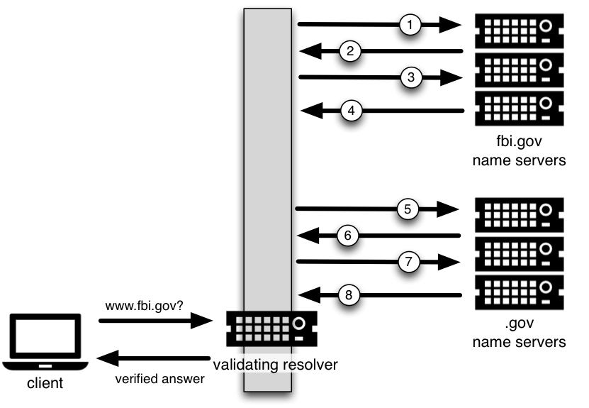

.. Copyright (C) Internet Systems Consortium, Inc. ("ISC")
..
.. SPDX-License-Identifier: MPL-2.0
..
.. This Source Code Form is subject to the terms of the Mozilla Public
.. License, v. 2.0.  If a copy of the MPL was not distributed with this
.. file, you can obtain one at https://mozilla.org/MPL/2.0/.
..
.. See the COPYRIGHT file distributed with this work for additional
.. information regarding copyright ownership.

.. _DNSSEC_validation:

验证
-----

.. _easy_start_guide_for_recursive_servers:

递归服务器的轻松开始指南
~~~~~~~~~~~~~~~~~~~~~~~~~

本节提供用于设置一个能够工作的知晓 DNSSEC 的递归服务器，又名验证解析器，
的基本信息。一个验证解析器对每个收到的远程响应执行验证，即通过使用公钥
加密体制和散列函数，沿着信任链来核实其收到的答复是合法的。

.. _enabling_validation:

开启 DNSSEC 验证
^^^^^^^^^^^^^^^^^

我们如何开启 DNSSEC 验证？事实上，你完全不必重新配置名字服务器，由于最新
的 BIND 9  版本 - 包括包和发行版 - 已经缺省带有对 DNSSEC 验证的支持。在
做任何配置修改之前，遵循在 :ref:`how_to_test_recursive_server` 所描述的
步骤，检查你是否已经开启了 DNSSEC 验证。

在早期的 BIND 版本中，包括 9.11-ESV，DNSSEC验证必须被显式打开。要想
完成这个目标，你仅仅需要在你的配置文件的 ``options`` 部份增加一行：

::

   options {
        ...
        dnssec-validation auto;
        ...
    };

重启 ``named`` 或执行 ``rndc reconfig`` ，然后你的递归服务器现在就能够愉
快地验证每条 DNS 响应了。如果这对你不起作用，并且你已经按照
:ref:`dnssec_support_in_bind` 中的描述验证了对DNSSEC的支持，你可能还需要
调整一些其它网络相关的配置。参考 :ref:`network_requirements` 以确保你的
网络已经为 DNSSEC做好了准备。

.. _effect_of_enabling_validation:

开启 DNSSEC 验证的影响
^^^^^^^^^^^^^^^^^^^^^^^^^^^^^^^^^^^^^

一点开启 DNSSEC 验证，任何没有通过验证的 DNS 响应都会产生一个对所要解
析的域名的失败（客户端通常能够观察到一个 SERVFAIL 状态）。如果所有配置
都正确，就会产生正确结果；这意谓着一个最终用户能够对抗恶意攻击。

然而，如果存在DNSSEC配置问题(有时超出管理员的控制范围)，一个特定的名称或
者有时甚至整个域可能会从DNS中“消失”，并无法通过该解析器访问。对于最终用户，
这个问题可能表现为名字解析缓慢或完全失败；URL的某些部分没有加载；或者web
浏览器返回一个错误消息，表明该页面无法显示。例如，如果根名字服务器被错误
地配置了关于 ``.org`` 的错误信息，这可能会导致 ``.org`` 域的所有验证失败。
对于终端用户来说，似乎所有的 ``.org`` 网站都停止服务了 [#]_ 。如果你遇到
与DNSSEC相关的问题，不要试图禁用验证；几乎肯定有某种解决方案使验证保持开
启状态。一个基本的故障排除指南可以在 :ref:`dnssec_troubleshooting` 中找到。

.. [#]
   当然，某些DNSSEC之外的原因也可能导致这种情况发生：例如，根为 ``.org``
   名字服务器发布了错误的地址。

.. _how_to_test_recursive_server:

所以考虑您正在验证（如何测试一个递归服务器）
~~~~~~~~~~~~~~~~~~~~~~~~~~~~~~~~~~~~~~~~~~~~~~~~~~~~~~~~~~~~~~~~

现在您已经重新配置了递归服务器并重新启动了它，那么如何知道您的递归名字服
务器实际上正在验证每个DNS查询呢？有几种方法来检查，我们在下面列出其中的
一些。

.. _using_web_based_tests_to_verify:

使用基于 Web 的工具来核实
^^^^^^^^^^^^^^^^^^^^^^^^^^^^^^^

对于大多数人而言，检查一个递归名字服务器是否验证 DNS 请求的最简单方法
就是在许多基于 web 的工具中选择一个来使用。

配置您的客户端计算机来使用新配置的递归服务器进行DNS解析；然后使用这些基
于Web的测试之一来确认它实际上正在验证DNS响应。

-  `Internet.nl <https://en.conn.internet.nl/connection/>`__

-  `DNSSEC Resolver Test (uni-due.de) <https://dnssec.vs.uni-due.de/>`__

-  `DNSSEC or Not (VeriSign) <https://www.dnssec-or-not.com/>`__

.. _using_dig_to_verify:

使用 ``dig`` 来核实
^^^^^^^^^^^^^^^^^^^^^^^

基于 Web 的 DNSSEC 验证工具通常用到 JavaScript。如果你不信任基于web的
工具所依赖的JavaScript 魔法，你可以自己动手，使用命令行 DNS 工具自己
检查验证解析器。

虽然 ``nslookup`` 更为流行，部份原因是因为它在大多数系统上是自带的，
不需要额外安装的，但是它是不支持 DNSSEC 的。另一方面， ``dig`` 是完全
支持 DNSSEC 标准并且作为 BIND 的一部分而被安装。如果你的系统上还没有
安装 ``dig`` ，可以从 ISC 的 `website <https://www.isc.org/download>`__
下载并安装。ISC 在其网站也提供预编译的 windows 版本。

``dig`` 是一个用于询问 DNS 名字服务器的灵活的工具。它执行 DNS 查找并
显示从名字服务器返回的所请求问题的答复。大多数老练的 DNS 管理员使用
``dig`` 来解决 DNS 问题，因为其灵活性，易于使用和清晰的输出。

下面的例子展示了当 DNSSEC 验证开启（即，缺省）时，如何使用 ``dig`` 来
向名字服务器 10.53.0.1 请求 ``ftp.isc.org`` 的 A 记录。地址 10.53.0.1
仅用于例子中；使用你的递归名字服务器的实际地址或主机名来替代它。

::

   $ dig @10.53.0.1 ftp.isc.org. A +dnssec +multiline

   ; <<>> DiG 9.16.0 <<>> @10.53.0.1 ftp.isc.org a +dnssec +multiline
   ; (1 server found)
   ;; global options: +cmd
   ;; Got answer:
   ;; ->>HEADER<<- opcode: QUERY, status: NOERROR, id: 48742
   ;; flags: qr rd ra ad; QUERY: 1, ANSWER: 2, AUTHORITY: 0, ADDITIONAL: 1

   ;; OPT PSEUDOSECTION:
   ; EDNS: version: 0, flags: do; udp: 4096
   ; COOKIE: 29a9705c2160b08c010000005e67a4a102b9ae079c1b24c8 (good)
   ;; QUESTION SECTION:
   ;ftp.isc.org.       IN A

   ;; ANSWER SECTION:
   ftp.isc.org.        300 IN A 149.20.1.49
   ftp.isc.org.        300 IN RRSIG A 13 3 300 (
                   20200401191851 20200302184340 27566 isc.org.
                   e9Vkb6/6aHMQk/t23Im71ioiDUhB06sncsduoW9+Asl4
                   L3TZtpLvZ5+zudTJC2coI4D/D9AXte1cD6FV6iS6PQ== )

   ;; Query time: 452 msec
   ;; SERVER: 10.53.0.1#53(10.53.0.1)
   ;; WHEN: Tue Mar 10 14:30:57 GMT 2020
   ;; MSG SIZE  rcvd: 187

这个输出中重要的细节是在头部出现了 ``ad`` 标志。这表示 BIND 提取了所有
与请求（ ``ftp.isc.org`` ）的目标相关的 DNSSEC 信息，并且所收到的答复
通过了在 :ref:`how_are_answers_verified` 中描述的验证过程。我们可以信任
答复的真实和完整，即 ``ftp.isc.org`` 真的指向 IP 地址 149.20.1.49，并且
它不是来自一个聪明的攻击者的欺骗的答复。

与早期版本的BIND不同，当前版本的BIND总是请求DNSSEC记录(通过在对上游服务
器的查询中设置 ``do`` 位)，不管DNSSEC设置如何。然而，禁用验证后，不会检
查返回的签名。这可以通过显式禁用DNSSEC验证来看到。要做到这一点，在配置
文件的“options”部分添加一行 ``dnssec-validation no;`` ，例如：

::

   options {
       ...
       dnssec-validation no;
       ...
   };

如果重新启动服务器(以确保缓存干净)并执行相同的 ``dig`` 命令，结果非常相
似：

::

   $ dig @10.53.0.1 ftp.isc.org. A +dnssec +multiline

   ; <<>> DiG 9.16.0 <<>> @10.53.0.1 ftp.isc.org a +dnssec +multiline
   ; (1 server found)
   ;; global options: +cmd
   ;; Got answer:
   ;; ->>HEADER<<- opcode: QUERY, status: NOERROR, id: 39050
   ;; flags: qr rd ra; QUERY: 1, ANSWER: 2, AUTHORITY: 0, ADDITIONAL: 1

   ;; OPT PSEUDOSECTION:
   ; EDNS: version: 0, flags: do; udp: 4096
   ; COOKIE: a8dc9d1b9ec45e75010000005e67a8a69399741fdbe126f2 (good)
   ;; QUESTION SECTION:
   ;ftp.isc.org.       IN A

   ;; ANSWER SECTION:
   ftp.isc.org.        300 IN A 149.20.1.49
   ftp.isc.org.        300 IN RRSIG A 13 3 300 (
                   20200401191851 20200302184340 27566 isc.org.
                   e9Vkb6/6aHMQk/t23Im71ioiDUhB06sncsduoW9+Asl4
                   L3TZtpLvZ5+zudTJC2coI4D/D9AXte1cD6FV6iS6PQ== )

   ;; Query time: 261 msec
   ;; SERVER: 10.53.0.1#53(10.53.0.1)
   ;; WHEN: Tue Mar 10 14:48:06 GMT 2020
   ;; MSG SIZE  rcvd: 187

然而，这一次在头部中没有 ``ad`` 标志。虽然 ``dig`` 仍然返回DNSSEC相关的
资源记录，但它不检查它们，因此不能保证答案的真实性。如果你要执行这个测
试，记得在继续之前重新启用DNSSEC验证(通过从配置文件中删除
``dnssec-validation no;`` 行)。

.. _verifying_protection_from_bad_domains:

对错误域名的验证保护
~~~~~~~~~~~~~~~~~~~~~~~~~~~~~~~~~~~~~~~~~~

同样重要的是，要确保DNSSEC正在保护您的网络免受无法验证的域名的影响；这
种失败可能是由于对您系统的攻击，试图让它接受错误的DNS信息。验证可能失败
的原因有很多：可能答复无法验证，因为它是一个欺骗的响应；也许这个签名是
一个已经过期的网络重放攻击；或者子区及其密钥已经被泄露，而父区的信息告
诉我们不对劲。有一个域名设置为无法通过DNSSEC验证，
``www.dnssec-failed.org`` 。

启用了DNSSEC验证(默认)后，查找该名称的尝试将失败：

::

   $ dig @10.53.0.1 www.dnssec-failed.org. A

   ; <<>> DiG 9.16.0 <<>> @10.53.0.1 www.dnssec-failed.org. A
   ; (1 server found)
   ;; global options: +cmd
   ;; Got answer:
   ;; ->>HEADER<<- opcode: QUERY, status: SERVFAIL, id: 22667
   ;; flags: qr rd ra; QUERY: 1, ANSWER: 0, AUTHORITY: 0, ADDITIONAL: 1

   ;; OPT PSEUDOSECTION:
   ; EDNS: version: 0, flags:; udp: 4096
   ; COOKIE: 69c3083144854587010000005e67bb57f5f90ff2688e455d (good)
   ;; QUESTION SECTION:
   ;www.dnssec-failed.org.     IN  A

   ;; Query time: 2763 msec
   ;; SERVER: 10.53.0.1#53(10.53.0.1)
   ;; WHEN: Tue Mar 10 16:07:51 GMT 2020
   ;; MSG SIZE  rcvd: 78

另一方面，如果禁用了DNSSEC验证(通过在配置文件的 ``options`` 子句中添加
语句 ``dnssec-validation no;``)，则查找成功：

::

   $ dig @10.53.0.1 www.dnssec-failed.org. A

   ; <<>> DiG 9.16.0 <<>> @10.53.0.1 www.dnssec-failed.org. A
   ; (1 server found)
   ;; global options: +cmd
   ;; Got answer:
   ;; ->>HEADER<<- opcode: QUERY, status: NOERROR, id: 54704
   ;; flags: qr rd ra; QUERY: 1, ANSWER: 2, AUTHORITY: 0, ADDITIONAL: 1

   ;; OPT PSEUDOSECTION:
   ; EDNS: version: 0, flags:; udp: 4096
   ; COOKIE: 251eee58208917f9010000005e67bb6829f6dabc5ae6b7b9 (good)
   ;; QUESTION SECTION:
   ;www.dnssec-failed.org.     IN  A

   ;; ANSWER SECTION:
   www.dnssec-failed.org.  7200    IN  A   68.87.109.242
   www.dnssec-failed.org.  7200    IN  A   69.252.193.191

   ;; Query time: 439 msec
   ;; SERVER: 10.53.0.1#53(10.53.0.1)
   ;; WHEN: Tue Mar 10 16:08:08 GMT 2020
   ;; MSG SIZE  rcvd: 110

不要因为一些名称无法解析就禁不住禁用DNSSEC验证。记住，DNSSEC保护您的
DNS查找免受黑客攻击。下一节描述如何快速检查未能成功查找名字是否由于验证
失败。

.. _how_do_i_know_validation_problem:

我如何知道出了验证问题？
^^^^^^^^^^^^^^^^^^^^^^^^^^^^^^^^^^^^^^^^^^

既然所有的DNSSEC验证失败都会导致一个通用的 ``SERVFAIL`` 消息，那么我们
如何知道它是否真的是一个验证错误呢？幸运的是， ``dig`` 中有个标志，（
``+cd`` ，表示“关闭检查”）它告诉服务器关闭DNSSEC验证。如果收到
``SERVFAIL`` 消息，设置 ``+cd`` 标志重新运行查询。如果查询在带有
``+cd`` 时成功，而在没有它的情况下以 ``SERVFAIL`` 结束，那么您知道您正
在处理一个验证问题。因此，使用前面的例子 ``www.dnssec-failed.org`` ，并
在解析器中启用DNSSEC验证：

::

   $ dig @10.53.0.1 www.dnssec-failed.org A +cd

   ; <<>> DiG 9.16.0 <<>> @10.53.0.1 www.dnssec-failed.org. A +cd
   ; (1 server found)
   ;; global options: +cmd
   ;; Got answer:
   ;; ->>HEADER<<- opcode: QUERY, status: NOERROR, id: 62313
   ;; flags: qr rd ra cd; QUERY: 1, ANSWER: 2, AUTHORITY: 0, ADDITIONAL: 1

   ;; OPT PSEUDOSECTION:
   ; EDNS: version: 0, flags:; udp: 4096
   ; COOKIE: 73ca1be3a74dd2cf010000005e67c8c8e6df64b519cd87fd (good)
   ;; QUESTION SECTION:
   ;www.dnssec-failed.org.     IN  A

   ;; ANSWER SECTION:
   www.dnssec-failed.org.  7197    IN  A   68.87.109.242
   www.dnssec-failed.org.  7197    IN  A   69.252.193.191

   ;; Query time: 0 msec
   ;; SERVER: 10.53.0.1#53(10.53.0.1)
   ;; WHEN: Tue Mar 10 17:05:12 GMT 2020
   ;; MSG SIZE  rcvd: 110

更多关于排错的信息，请参阅 :ref:`dnssec_troubleshooting` 。

.. _validation_easy_start_explained:

对验证轻松开始的解释
~~~~~~~~~~~~~~~~~~~~~~~~~~~~~~~

在 :ref:`easy_start_guide_for_recursive_servers` 中，我们使用一行配置来
开启DNSSEC验证：追踪签名和密钥，确保它们是真实的。现在我们来仔细看看
DNSSEC验证的实际功能，以及其它一些选项。

.. _dnssec_validation_explained:

``dnssec-validation``
^^^^^^^^^^^^^^^^^^^^^

::

   options {
       dnssec-validation auto;
   };

这个“auto”行使用 ``managed-keys`` 特性开启自动DNSSEC信任锚配置，此时不
需要手动配置密钥。 ``dnssec-validation`` 选项有三种可能的选择：

-  *yes* ：开启DNSSEC验证，但需要手动配置信任锚。在手动配置至少一个可信
   密钥之前，实际上不会进行验证。

-  *no* ：禁用DNSSEC验证，并且递归服务器行为以“老式”方式执行不安全的
   DNS查找。

-  *auto* ：启用DNSSEC验证，并使用DNS根区域的默认信任锚(包含在BIND 9中
   )。这是缺省值；如果配置文件中没有 ``dnssec-validation`` 行，BIND会自
   动执行此操作。

让我们讨论一下 *yes* 和 *auto* 之间的区别。如果设置为 *yes* ，则必须使
用配置文件中的 ``trust-anchors`` 语句(可以带 ``static-key`` 或
``static-ds`` 修饰符)手动定义和维护信任锚；如果设置为 *auto* (缺省值，
如例子所示)，则不需要进一步操作，因为BIND包含一个根密钥副本 [#]_ 。当设
置为 *auto* 时，BIND会自动更新密钥(也称为信任锚，在
:ref:`trust_anchors_description` 中讨论)，无需DNS管理员干预。

我们推荐使用缺省的 *auto* ，除非有很好的理由需要手工维护信任锚。要了解
更多关于信任锚的信息，请参考 :ref:`trusted_keys_and_managed_keys` 。

.. _how_does_dnssec_change_dns_lookup_revisited:

DNSSEC 如何改变了 DNS 查找（再论）?
^^^^^^^^^^^^^^^^^^^^^^^^^^^^^^^^^^^^^^^^^^^^^^

现在，您已经在递归名字服务器上启用了验证，并验证了它是否有效。究竟改变
了什么？在 :ref:`how_does_dnssec_change_dns_lookup` 中我们在一个较高的
层次了解过DNSSEC验证过程的12个步骤的简化版本。现在让我们重走该过程，并
更详细地查看您的验证解析器正在做什么。同样，作为一个例子，我们正在查找
域名 ``www.isc.org`` 的A记录(参见 :ref:`dnssec_12_steps`)

1.  验证解析器向 ``isc.org`` 的名字服务器中请求 ``www.isc.org`` 的A记录。
    该请求将 ``DNSSEC OK`` (``do``)位设置为1，通知远程授权服务器需要
    DNSSEC应答。

2.  由于区 ``isc.org`` 是签名的，并且它的名字服务器是DNSSEC感知的，因此
    它以对A记录请求的答复和A记录的RRSIG作为响应。

3.  验证解析器查询 ``isc.org`` 的DNSKEY。

4.  ``isc.org`` 名字服务器响应DNSKEY和RRSIG记录。DNSKEY用于验证在步骤2
    所收到的答复。

5.  验证解析器向父区(``.org``)查询 ``isc.org`` 的DS记录。

6.  ``.org`` 名字服务器也是DNSSEC感知的，因此它响应DS和RRSIG记录。DS记
    录用于验证在步骤4所收到的答复。

7.  验证解析器查询 ``.org`` 的DNSKEY。

8.  ``.org`` 名字服务器响应其DNSKEY和RRSIG。DNSKEY用于验证在步骤6所收到
    的答复。

9.  验证解析器向父区(根)查询 ``.org`` 的DS记录。

10. 根名称服务器是DNSSEC感知的，以DS和RRSIG记录响应。DS记录用于验证在步
    骤8所收到的答复。

11. 验证解析器请求根的DNSKEY。

12. 根名字服务器响应其DNSKEY和RRSIG。DNSKEY用于验证在步骤10所收到的答复。

步骤12之后，验证解析器将收到的DNSKEY与为其配置的一个或多个密钥进行比较，
以决定所收到的密钥是否可信。我们在 :ref:`trust_anchors_description` 中
讨论这些本地配置的密钥，或信任锚。

使用DNSSEC，每个响应不仅包括答案，还包括一个数字签名(RRSIG)，因此验证解
析器可以验证所收到的答复。这就是我们下一节，
:ref:`how_are_answers_verified` ，中要看的内容。

.. _how_are_answers_verified:

答复是如何被验证的？
^^^^^^^^^^^^^^^^^^^^^^^^^

.. note::

   请记住，当你阅读本节时，尽管这里时常使用了像“加密”和“解密”这样的
   词汇，DNSSEC 并不提供私密性。公钥加密机制用于验证数据的 *真实性*
   （谁发出了它们）和数据的 *完整性*  （在传输过程中它没有被修改过），
   但任何偷听者仍然能够看到明文中的 DNS 请求和响应，即使开启了
   DNSSEC。

那么DNSSEC答复究竟是如何被验证的呢？我们先来看看可验证的信息是如何生成
的。在权威服务器上，每条DNS记录(或消息)都要经过一个哈希函数，然后用一个
私钥对这个哈希值进行加密。这个加密的哈希值就是数字签名。

   生成签名

当验证解析器查询资源记录时，它将同时接收纯文本消息和数字签名。验证解析
器知道所使用的哈希函数(它列在数字签名记录本身中)，因此它可以接受纯文本
消息，并通过相同的哈希函数使其产生一个哈希值，我们将其称为哈希值X。验证
解析器还可以获得公钥(作为DNSKEY记录发布)，解密数字签名，并返回权威服务
器产生的原始散列值，我们将其称为散列值Y。如果散列值X和Y是相同的，并且时
间是正确的(下面将详细说明这意味着什么)，那么答案将得到验证，这意味着这
个答案来自权威服务器(真实性)，并且内容在传输过程中保持完整(完整性)。

   验证签名

以A记录 ``ftp.isc.org`` 为例。纯文本是：

::

   ftp.isc.org.     4 IN A  149.20.1.49

数字签名部分是：

::

   ftp.isc.org.      300 IN RRSIG A 13 3 300 (
                   20200401191851 20200302184340 27566 isc.org.
                   e9Vkb6/6aHMQk/t23Im71ioiDUhB06sncsduoW9+Asl4
                   L3TZtpLvZ5+zudTJC2coI4D/D9AXte1cD6FV6iS6PQ== )

当验证解析器查询A记录 ``ftp.isc.org`` 时，它将同时接收A记录和RRSIG记录。
它对A记录运行哈希函数(在本例中，是由数字13表示的SHA256，表示
ECDSAP256SHA256)并产生哈希值X。解析器还获取适当的DNSKEY记录来解密签名，
解密的结果是散列值Y。

但是等等，还有更多！仅仅因为X等于Y并不意味着一切都很好。我们还得看时间。
还记得我们之前提到过需要检查时间是否正确吗？查看一下上述例子中的两个时
间戳：

-  签名有效期: 20200401191851

-  签名开始日期: 20200302184340

这告诉我们该签名是在UTC 2020年3月2日下午6:43:40(20200302184340)生成的，
并且在UTC 2020年4月1日下午7:18:51(20200401191851)之前有效。验证解析器的
当前系统时间需要介于这两个时间戳之间。如果没有，则验证失败，因为它可能
是攻击者在重放过去捕获的旧答案集，或者向我们提供一个带有错误未来时间戳
的精心制作的答案集。

如果答案通过了哈希值检查和时间戳检查，它将被验证，并设置验证数据(``ad``
)位，然后将响应发送给客户端；如果未通过验证，则返回一个SERVFAIL给客户端。

.. [#]
   BIND技术上包含两份根密钥的拷贝：一份在 ``bind.keys.h`` 中，是构建在
   可执行代码中，而另一份是在 ``bind.keys`` 中，由一条 ``trust-anchors``
   语句提供。这两份拷贝的密钥时一样的。

.. _trust_anchors_description:

信任锚
~~~~~~

信任锚是放置在验证解析器中的一个密钥，以便验证器可以使用已知或可信的公
钥(信任锚)验证给定请求的结果。验证解析器必须至少安装一个信任锚以执行
DNSSEC验证。

.. _how_trust_anchors_are_used:

如何使用信任锚
~~~~~~~~~~~~~~

在章节 :ref:`how_does_dnssec_change_dns_lookup_revisited` ，我们走过了
12个步骤的DNSSEC查找过程。在这12个步骤的末尾，发生了一个关键的比较：从
远程服务器接收到的密钥和我们在文件中拥有的密钥进行比较，看我们能否信任
它。我们文件中的密钥称为信任锚，有时也称为信任密钥、信任点或安全入口点。

这个12步的查找过程描述了理想情况下的DNSSEC查找，其中每个单个域名都经过
了签名和正确的授权，每个验证解析器只需要有一个信任锚 —— 即根的公钥。但
是没有限制验证解析器必须只有一个信任锚。事实上，在采用DNSSEC的早期阶段，
验证解析器有多个信任锚并不罕见。

例如，在根区签名(在2010年7月)之前，一些希望验证 ``gov`` 区中的域名的验
证解析器需要获取并安装 ``.gov`` 的密钥。当时 ``www.fbi.gov`` 这个例子的
查找过程是8个步骤，而不是12个步骤：

1. 验证解析器向 ``fbi.gov`` 名字服务器查询 ``www.fbi.gov`` 的A记录。

2. FBI的名字服务器以对应的答复及其RRSIG作为响应。

3. 验证解析器向FBI的名字服务器查询其DNSKEY记录。

4. FBI的名字服务器以其DNSKEY及其RRSIG作为响应。

5. 验证解析器向 ``.gov`` 名字服务器查询 ``fbi.gov`` 的DS记录。

6. ``.gov`` 名字服务器响应 ``fbi.gov`` 的DS记录和相关的RRSIG记录。

7. 验证解析器向 ``.gov`` 名字服务器查询其DNSKEY记录。

8. ``.gov`` 名字服务器以其DNSKEY和相关的RRSIG作为响应。

这些看起来都很相似，除了它比我们之前看到的12步要短。一旦验证解析器在步
骤8收到DNSKEY文件，它识别这是其手工配置的受信任的密钥（信任锚），就永远
不会去向根名字服务器询问 ``.gov`` 的DS记录，或向根名字服务器询问其
DNSKEY。

实际上，每当验证解析器接收到一个DNSKEY时，它都会检查这是否是一个已配置
的可信密钥，以决定是否需要继续跟踪验证链。

.. _trusted_keys_and_managed_keys:

受信任的密钥和被管理的密钥
^^^^^^^^^^^^^^^^^^^^^^^^^^^^^

因为是解析器负责验证，所以我们必须至少配置一个密钥(信任锚)。它是如何来
到这里的，我们又如何维护它？

如果你遵循 :ref:`easy_start_guide_for_recursive_servers` 中的建议，通过
将 ``dnssec-validation`` 设置为 *auto* ，就没有什么可做的了。BIND已经包
含了一个根密钥的副本(在文件 ``BIND .keys`` 中)，并在根密钥发生变化时自
动更新它。 [#]_ 它看起来像这样：

::

   trust-anchors {
           # This key (20326) was published in the root zone in 2017.
           . initial-key 257 3 8 "AwEAAaz/tAm8yTn4Mfeh5eyI96WSVexTBAvkMgJzkKTOiW1vkIbzxeF3
                   +/4RgWOq7HrxRixHlFlExOLAJr5emLvN7SWXgnLh4+B5xQlNVz8Og8kv
                   ArMtNROxVQuCaSnIDdD5LKyWbRd2n9WGe2R8PzgCmr3EgVLrjyBxWezF
                   0jLHwVN8efS3rCj/EWgvIWgb9tarpVUDK/b58Da+sqqls3eNbuv7pr+e
                   oZG+SrDK6nWeL3c6H5Apxz7LjVc1uTIdsIXxuOLYA4/ilBmSVIzuDWfd
                   RUfhHdY6+cn8HFRm+2hM8AnXGXws9555KrUB5qihylGa8subX2Nn6UwN
                   R1AkUTV74bU=";
   };

当然，您可以决定自己手动管理这个密钥。首先，你需要确保
``dnssec-validation`` 被设置成 *yes* 而不是 *auto* ：

::

   options {
       dnssec-validation yes;
   };

然后，从值得信任的源，如 `<https://www.isc.org/bind-keys>`__ ，手工下载
根密钥。最后，将手工下载的根密钥放入一条 ``trust-anchors`` 语句中，如下
所示：

::

   trust-anchors {
           # This key (20326) was published in the root zone in 2017.
           . static-key 257 3 8 "AwEAAaz/tAm8yTn4Mfeh5eyI96WSVexTBAvkMgJzkKTOiW1vkIbzxeF3
                   +/4RgWOq7HrxRixHlFlExOLAJr5emLvN7SWXgnLh4+B5xQlNVz8Og8kv
                   ArMtNROxVQuCaSnIDdD5LKyWbRd2n9WGe2R8PzgCmr3EgVLrjyBxWezF
                   0jLHwVN8efS3rCj/EWgvIWgb9tarpVUDK/b58Da+sqqls3eNbuv7pr+e
                   oZG+SrDK6nWeL3c6H5Apxz7LjVc1uTIdsIXxuOLYA4/ilBmSVIzuDWfd
                   RUfhHdY6+cn8HFRm+2hM8AnXGXws9555KrUB5qihylGa8subX2Nn6UwN
                   R1AkUTV74bU=";
   };

这个 ``trust-anchors`` 语句和一个在 ``bind.keys`` 文件中的类似，在
``bind.keys`` 中的密钥的定义有 ``initial-key`` 修饰符，而在配置文件的语
句中，它被 ``static-key`` 所取代。这两者之间有一个重要的区别：用
``static-key`` 定义的密钥在从配置文件中删除之前始终是可信的。而带有
``initial-key`` 修饰符的密钥只受信任一次：直到它加载被管理密钥数据库并
启动密钥维护过程。此后，BIND使用被管理密钥数据库
(``managed-keys. BIND .jnl``)作为密钥信息的来源。

.. warning::

   记住，如果您选择自己管理密钥，那么每当密钥更改时(对于大多数区域来说，
   这是定期发生的)，就需要手动更新配置。如果不这样做，将导致对密钥的子
   域的几乎所有DNS查询的中断。因此，如果你手动管理 ``.gov`` ，所有在
   ``.gov`` 空间的域名可能变得无法解析；如果您手动管理根密钥，您可能会
   中断所有发向你的递归名字服务器的DNS请求。

在DNSSEC的早期，显式管理密钥是很常见的，那时根区和许多顶级域都没有签名。
从那以后， `超过90% <https://stats.research.icann.org/dns/tld_report/>`__
的顶级域都已签名，包括所有最大的域。除非您自己有管理密钥的特殊需求，否
则最好使用BIND默认值，并让软件管理根密钥。

.. [#]
   根区在2010年7月签名，截止到本文写作时（2020年年中），密钥在2018年变
   更过一次。未来的计划是每五年轮转一次密钥。

.. _whats_edns0_all_about:

EDNS是关于什么的（以及我为什么需要关注）？
~~~~~~~~~~~~~~~~~~~~~~~~~~~~~~~~~~~~~~~~~~

.. _whats-edns0-all-about-overview:

EDNS概述
^^^^^^^^^^^^^

传统的 DNS 响应大小是典型的小（小于512字节），仅仅能够装入一个小的
UDP 报文中。DNS 扩展机制（EDNS，或ENDS(0)）提供了一个在更大的 UDP
报文中发送 DNS 数据的机制。要支持 EDNS，DNS 服务器和网络都需要正确
地准备，以支持更大的报文大小和多个分段。

这对DNSSEC很重要，因为表明DNSSEC感知能力的 ``+do`` 位在EDNS中携带，并且
DNSSEC的响应比传统的DNS响应更大。如果DNS服务器和网络环境不支持较大的UDP
报文，将导致TCP重传，或者较大的UDP响应将被丢弃。用户可能会遇到缓慢的DNS
解析，或者根本无法解析某些名字。

注意，无论你是否验证DNSSEC, EDNS都会应用，因为BIND在默认情况下启用了
DNSSEC。

有关DNSSEC对网络环境的要求，请参阅 :ref:`network_requirements` 。

.. _edns_on_dns_servers:

DNS服务器上的EDNS
^^^^^^^^^^^^^^^^^

多年来，BIND已经默认启用EDNS，并且UDP数据包大小被设置为最大4096字节。
DNS管理员不需要执行任何重新配置。你可以使用 ``dig`` 来验证你的服务器是
否支持EDNS，并且查看它允许这条 ``dig`` 命令所发出的UDP报文大小。

::

   $ dig @10.53.0.1 www.isc.org. A +dnssec +multiline

   ; <<>> DiG 9.16.0 <<>> @10.53.0.1 ftp.isc.org a +dnssec +multiline
   ; (1 server found)
   ;; global options: +cmd
   ;; Got answer:
   ;; ->>HEADER<<- opcode: QUERY, status: NOERROR, id: 48742
   ;; flags: qr rd ra ad; QUERY: 1, ANSWER: 2, AUTHORITY: 0, ADDITIONAL: 1

   ;; OPT PSEUDOSECTION:
   ; EDNS: version: 0, flags: do; udp: 4096
   ; COOKIE: 29a9705c2160b08c010000005e67a4a102b9ae079c1b24c8 (good)
   ;; QUESTION SECTION:
   ;ftp.isc.org.       IN A

   ;; ANSWER SECTION:
   ftp.isc.org.        300 IN A 149.20.1.49
   ftp.isc.org.        300 IN RRSIG A 13 3 300 (
                   20200401191851 20200302184340 27566 isc.org.
                   e9Vkb6/6aHMQk/t23Im71ioiDUhB06sncsduoW9+Asl4
                   L3TZtpLvZ5+zudTJC2coI4D/D9AXte1cD6FV6iS6PQ== )

   ;; Query time: 452 msec
   ;; SERVER: 10.53.0.1#53(10.53.0.1)
   ;; WHEN: Tue Mar 10 14:30:57 GMT 2020
   ;; MSG SIZE  rcvd: 187

这里有一个有用的测试工具（由DNS-OARC提供），你可以使用它来验证解析器在
EDNS支持方面的行为：
`<https://www.dns-oarc.net/oarc/services/replysizetest/>`__ .

一旦您验证了您的名称服务器启用了EDNS，事情就应该结束了，对吗？遗憾的是，
EDNS是一个对DNS的逐跳扩展。这意味着EDNS的使用是一个在DNS解析过程中每一
对主机之间的协商过程，这最终意味着如果你的一个上游名字服务器（例如，你
的名字服务器转发到的ISP的递归名字服务器）不支持EDNS，你可能会遭遇DNS查
找失败，或者不能执行DNSSEC验证。

.. _support_for_large_packets_network_equipment:

在网络设备上支持大包
^^^^^^^^^^^^^^^^^^^^^^^^^^^^^^^^^^^^^^^^^^^^^^

如果您的递归名字服务器和ISP的名字服务器都支持EDNS，那么我们在这里都没问
题，是吗？别着急。由于这些大数据包必须通过网络，网络基础设施本身必须允
许它们通过。

当数据通过网络进行物理传输时，它必须被分解成块。数据块的大小称为最大传
输单元(Maximum Transmission Unit, MTU)，它可能因网络的不同而不同。当一
个大数据包需要被分解成比MTU更小的块时，IP分片就发生了；然后，这些较小的
数据块需要在目的地重新组装成大数据包。IP分片不一定是一件坏事，它很可能
发生在您的网络上。

一些网络设备(如防火墙)可能会对DNS流量进行假设。其中一个假设是每个DNS包
有多大。当防火墙看到一个比预期更大的DNS包时，它要么拒绝这个大包，要么丢
弃它的片段，因为防火墙认为这是一种攻击。这种配置在过去可能不会造成问题，
因为传统的DNS包通常都很小。然而，对于DNSSEC，这些配置需要更新，因为
DNSSEC流量通常超过1500字节(一个常见的MTU值)。如果没有更新配置以支持更大
的DNS包大小，通常会导致更大的包被拒绝，对最终用户来说，查询似乎没有得到
回答。或者在分片的情况下，只有一部份答复到达了验证解析器，这样你的验证
解析器可能需要一遍又一遍地重新请求，给最终用户的体验就是DNS/网络非常慢。

当您更新网络设备上的配置时，请确保TCP端口53也允许DNS通信。

.. _dns_uses_tcp:

等等... DNS 使用 TCP？
^^^^^^^^^^^^^^^^^^^^^^

是的。DNS 使用 TCP 53 端口作为一个回退机制，当其无法使用 UDP 传输
数据时。这种情况一直存在，甚至在 DNSSEC 出现之前很久。传统的依赖 TCP
53 端口的 DNS 操作是区传送。而使用 DNSSEC，或者带有 IPv6 记录，例如
AAAA，的DNS，都增加了 DNS 数据经由 TCP 传输的机会。

由于增加的报文大小，DNSSEC 比传统的（不安全的）DNS 更多地回退到 TCP。
如果你的网络现在阻塞或过滤 TCP 53端口，你可能已经经历过了 DNS 解析的
不稳定，甚至在部署 DNSSEC 之前。
