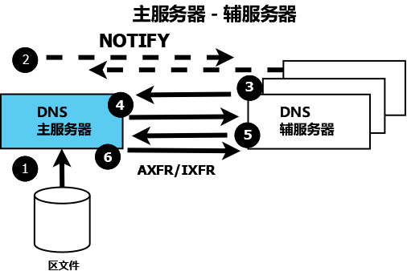

.. Copyright (C) Internet Systems Consortium, Inc. ("ISC")
..
.. SPDX-License-Identifier: MPL-2.0
..
.. This Source Code Form is subject to the terms of the Mozilla Public
.. License, v. 2.0.  If a copy of the MPL was not distributed with this
.. file, you can obtain one at https://mozilla.org/MPL/2.0/.
..
.. See the COPYRIGHT file distributed with this work for additional
.. information regarding copyright ownership.

.. _config_auth_samples:

权威名字服务器
--------------

它们为所支持的区为用户的请求提供权威答案：例如，区数据描述域名
**example.com** 。一个权威名字服务器可以支持一个或多个区。

每个区要么被定义为一个 **主区** ，要么被定义为一个 **辅区** 。一个主区
直接从一个文件系统中读取它的区数据。一个辅区使用一个 **区传送** 进程从
主区获取其区数据；从一个主区和一个辅区给出的答案没有区别。一个权威名字
服务器可以支持主区和和辅区的任何组合。

.. Note:: 术语 **主区** 和 **辅区** 不意味着任何访问优先级。解析器（给
   用户请求提供完整答案的名字服务器）对一个权威答案是来自主名字服务器
   还是来自辅名字服务器没有意识（且不能区分）。解析器使用区的权威服务
   器列表（至少有两个）并对列表中的每个服务器维护一个往返时间（RTT） -
   从发出请求到收到响应的时间。解析器使用值最低的服务器（最快的）作为
   区的首选服务器，并继续这样做，直到它的RTT高于列表中下一个值最低的服
   务器，这时后者就成为首选服务器。 

   由于相互兼容性，BIND 9将"primary"和"master"当做同义词，将"secondary"
   和"slave"当做同义词。

下图展示了主、辅名字服务器间的关系。下面的文字详细展示了这个过程。

   权威主、辅名字服务器

下面括号中的数字指的是上图中编号的项目。

1. 权威主名称服务器总是从(1)一个本地或网络文件存储加载（或重新加载）其
   区文件。

2. 权威辅名字服务器总是通过一个 **区传送** 操作从一个主服务器加载器区
   数据。区传送可以使用 **AXFR** （全量区传送）或者 **IXFR** （增量区
   传送），条件是主辅名字服务器都支持这项服务。区传送进程（AXFR或IXFR）
   按如下方式工作：

   a) 区的辅名字服务器定期请求（3和4） :ref:`SOA RR<soa_rr>` 。这个间
      隔由授权开始（SOA）资源记录的 **refresh** 参数所定义。

   b) 辅服务器比较从主服务器获取的SOA资源记录中的 **serial number** 参
      数与它自身当前区数据中的SOA资源记录中的序列号。

   c) 如果收到的序列号在算术比较上大于（更高）当前的，辅服务器使用AXFR
      或者IXFR（依赖于主服务器和辅服务器的配置）发起一个区传送(5)，使
      用TCP的53端口(6)。

3. 典型情况下推荐的SOA资源记录的区刷新时间（即辅服务器读取或轮询主服务
   器上区的SOA资源记录的时间间隔）为数小时，以减小流量。因此，最坏情况
   区变化的传播可能需要较长的时间。

4. 可选的 NOTIFY (:rfc:`1996`) 特性(2)被自动配置；使用
   :namedconf:ref:`notify` 语句来关闭这个特性。
   无论何时主服务器装载或重新装载了一个区，它就会向已配置的辅服务器（
   或多个辅服务器）发送一个NOTIFY消息，并且可选地可以使用
   :any:`also-notify` 语句配置向其它主机发送NOTIFY消息。
   NOTIFY消息只是简单地指示辅服务器，主服务器装载或者重新装载了区。当
   收到了NOTIFY消息，辅服务器响应指示它收到了NOTIFY，并且立即从主服务
   器（如上面第2a部份中描述）读SOA资源记录。如果区文件发生变化了，传播
   实际上立即进行。

权威的例子都使用NOTIFY，但标识所使用的语句，以便在不需要时删除它们。

.. _sample_primary:

主权威名字服务器
~~~~~~~~~~~~~~~~

区文件 :ref:`来自基本例子<base_zone_file>` ，未作修改，但
:iscman:`named.conf` 作了如下修改：

.. code-block:: c

        // authoritative primary named.conf file
        // options clause defining the server-wide properties
        options {
          // all relative paths use this directory as a base
          directory "/var";
          // version statement for security to avoid hacking known weaknesses
          // if the real version number is revealed
          version "not currently available";
          // This is the default - allows user queries from any IP
          allow-query { any; };
          // normal server operations may place items in the cache
          // this prevents any user query from accessing these items
          // only authoritative zone data will be returned
          allow-query-cache { none; };
          // Do not provide recursive service to user queries
          recursion no;
        };
        // logging clause
        // log to /var/log/named/example.log all events from info UP in severity (no debug)
        // uses 3 files in rotation swaps files when size reaches 250K
        // failure messages that occur before logging is established are
        // in syslog (/var/log/messages)
        //
        logging {
          channel example_log {
            // uses a relative path name and the directory statement to
            // expand to /var/log/named/example.log
            file "log/named/example.log" versions 3 size 250k;
            // only log info and up messages - all others discarded
            severity info;
          };
          category default {
            example_log;
          };
        };
        // Provide forward mapping zone for localhost
        // (optional)
        zone "localhost" {
          type primary;
          file "master/localhost-forward.db";
          notify no;
        };
        // Provide reverse mapping zone for the loopback
        // address 127.0.0.1
        zone "0.0.127.in-addr.arpa" {
          type primary;
          file "localhost.rev";
          notify no;
        };
        // We are the primary server for example.com
        zone "example.com" {
          // this is the primary name server for the zone
          type primary;
          file "example.com";
          // this is the default
          notify yes;
          // IP addresses of secondary servers allowed to
          // transfer example.com from this server
          allow-transfer {
            192.168.4.14;
            192.168.5.53;
          };
        };

增加的语句和块在上面的文件中已经注释。

:any:`zone` 块，以及 :any:`allow-query`,
:any:`allow-query-cache`,
:any:`allow-transfer`, :any:`file`,
:namedconf:ref:`notify`, :any:`recursion` 和 :any:`type`
语句在相应的章节中有详细描述。

.. _sample_secondary:

辅权威名字服务器
~~~~~~~~~~~~~~~~

区文件 ``local-host-forward.db`` 和 ``localhost.rev``
:ref:`来自基本例子<base_zone_file>` ，未作修改。不要求 **example.com**
区文件（区文件通过区传送从主服务器获取）。
:ref:`named.conf<named_conf>` 文件作了如下修改：

.. code-block:: c

        // authoritative secondary named.conf file
        // options clause defining the server-wide properties
        options {
          // all relative paths use this directory as a base
          directory "/var";
          // version statement for security to avoid hacking known weaknesses
          // if the real version number is revealed
          version "not currently available";
          // This is the default - allows user queries from any IP
          allow-query { any; };
          // normal server operations may place items in the cache
          // this prevents any user query from accessing these items
          // only authoritative zone data will be returned
          allow-query-cache { none; };
          // Do not provide recursive service to user queries
          recursion no;
        };
        // logging clause
        // log to /var/log/named/example.log all events from info UP in severity (no debug)
        // uses 3 files in rotation swaps files when size reaches 250K
        // failure messages that occur before logging is established are
        // in syslog (/var/log/messages)
        //
        logging {
          channel example_log {
            // uses a relative path name and the directory statement to
            // expand to /var/log/named/example.log
            file "log/named/example.log" versions 3 size 250k;
            // only log info and up messages - all others discarded
            severity info;
           };
           category default {
             example_log;
          };
        };
        // Provide forward mapping zone for localhost
        // (optional)
        zone "localhost" {
          type primary;
          file "master/localhost-forward.db";
          notify no;
        };
        // Provide reverse mapping zone for the loopback
        // address 127.0.0.1
        zone "0.0.127.in-addr.arpa" {
          type primary;
          file "localhost.rev";
          notify no;
        };
        // We are the secondary server for example.com
        zone "example.com" {
          // this is a secondary server for the zone
          type secondary;
          // the file statement here allows the secondary to save
          // each zone transfer so that in the event of a program restart
          // the zone can be loaded immediately and the server can start
          // to respond to queries without waiting for a zone transfer
          file "example.com.saved";
          // IP address of example.com primary server
          primaries { 192.168.254.2; };
        };

增加的语句和块在上面的文件中已经注释。

:any:`zone` 块，以及 :any:`allow-query`,
:any:`allow-query-cache`,
:any:`allow-transfer`, :any:`file`,
:namedconf:ref:`primaries`,
:any:`recursion` 和 :any:`type` 语句在相应的章节中
有详细描述。

如果未使用NOTIFY，不需要修改这个 :ref:`named.conf<named_conf>` 文件，
因为是主服务器发出了NOTIFY消息。

.. note::
   当读者认为他们理解了主辅的时候，实际可能会更复杂。辅区也可以是其它
   辅区的主分区。在默认情况下， :iscman:`named` 为它加载的每个区发送
   NOTIFY消息。为辅区而在 :any:`zone` 块中指定
   :ref:`notify primary-only;<notify>` 使得 :iscman:`named` 仅为它加载
   的主区发送NOTIFY消息。
