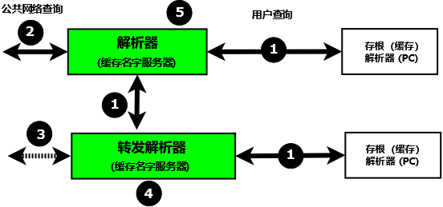

.. Copyright (C) Internet Systems Consortium, Inc. ("ISC")
..
.. SPDX-License-Identifier: MPL-2.0
..
.. This Source Code Form is subject to the terms of the Mozilla Public
.. License, v. 2.0.  If a copy of the MPL was not distributed with this
.. file, you can obtain one at https://mozilla.org/MPL/2.0/.
..
.. See the COPYRIGHT file distributed with this work for additional
.. information regarding copyright ownership.

.. _config_resolver_samples:

解析器（缓存名字服务器）
------------------------

解析器处理 :ref:`递归用户查询 <recursive_query>` 并提供完整答
案；即，它们发送一个或多个 :ref:`迭代查询 <iterative_query>`
到DNS体系。在获得一个完整答案（或一个错误）之后，一个解析器将答案传递
给用户并将其缓存。随后的用户对同样的请求将会从解析器的缓存中获得答复，
直到所缓存的答案的 :term:`TTL` 已经过期，这时它将从缓存中被清理；下一个
请求同样信息的用户将导致一系列到DNS体系的新请求。

解析器经常被各种各样令人困惑的名称所引用，包括缓存名称服务器、递归名称
服务器、转发解析器、区域解析器和全服务解析器。

下图展示了解析器如何在典型的网络环境中工作。

   解析器和转发解析器

1. 终端用户系统在分发时都带有一个本地 **存根解析器** 作为标准特性。当
   今，大多数存根解析器还提供本地缓存服务，以加快用户响应时间。

2. 存根解析器具有功能上的限制；特别地，它不能跟随
   :ref:`指引<referral>` 。当一个存根解析器收到来自一个本地程序，
   例如一个浏览器，对一个名字的请求，并且答案不在其本地缓存中时，它发
   送一个 :ref:`递归用户查询<recursive_query>` (1)到一个本地配
   置的解析器(5)，后者可能在其缓存中会有可用的答案。如果它没有，它发出
   :ref:`迭代查询<iterative_query>` (2)到DNS层次体系以获取答
   案。对于Linux和Unix主机，本地系统向其发送用户查询的解析器配置在
   ``/etc/resolv.conf`` 中；对于Windows用户，可以通过控制面板或设置界
   面进行配置或修改。

3. 作为选择，用户查询可以发给一个 **转发解析器** (4)。
   转发解析器乍一看似乎毫无意义，因为它们似乎是作为一个简单的传递，并
   且像存根解析器一样，需要一个全服务解析器(5)。然而，由于以下原因，转
   发解析器对网络来说是非常强大的补充：

   a) 成本和性能。在转发解析器(4)上的每个 **递归用户查询** (1)会产生两
      个消息 — 查询及其答案。解析器(5)可能必须发出三个、四个或更多的查
      询对(2)来获得所需的答案。流量大大减少，提高了性能或降低了成本（
      如果链接是收费的）。此外，由于转发解析器通常在多个主机之间共享，
      它的缓存更有可能包含答案，再次提高了用户性能。

   b) 网络维护。转发解析器(4)可以用来减轻本地管理的负担，它提供了一个
      可单点，以管理对远程名字服务器的更改，而不必更新所有主机。因此，
      可以将特定网络区段或区域中的所有主机配置为指向转发解析器，转发解
      析器可以配置为按需传输DNS流量，并以最小的代价随时间进行更改。

   c) 消毒流量。特别是在较大的私有网络中，使用转发解析器结构传输DNS流
      量可能是明智的。例如，转发解析器(4)可以配置为处理所有域内流量（
      相对安全）并将所有外部流量转发到 **加固的** 解析器(5)。

   d) 隐形网络。转发解析器被广泛应用于
      :ref:`隐藏或分割网络<split_dns_sample>` 。

4. 转发解析器(4)可以配置为将所有流量转发到一个解析器(5)，或者只转发有
   选择的流量(5)，同时直接解析其它流量(3)。

.. Attention:: 虽然上图显示了 **递归用户查询** 通过接口(1)到达，但没有
   什么可以阻止它们通过接口(2)经公共网络到达。如果对可以发送此类查询的
   源IP没有任何限制，则该解析器被称为 **开放解析器** 。
   的确，在世界还年轻的时候，这就是互联网上的运作方式。现在已经发生了
   很多变化，看似友好、慷慨的行为可能会被流氓行为者用来引发各种各样的
   问题，包括 **拒绝服务(DoS)** 攻击。解析器应该始终配置为限制可以使用
   其服务的IP地址。BIND 9提供了许多语句和块来简化定义这些IP限制和配
   置 **封闭解析器** 。这里给出的解析器示例都使用各种技术配置了封闭解
   析器。

额外的区文件
~~~~~~~~~~~~

根服务器(Hint)区文件
^^^^^^^^^^^^^^^^^^^^

解析器（尽管不一定是转发解析器）需要访问DNS层次结构。为此，他们需要知
道13个 :ref:`根服务器<root_servers>` 的地址（IPv4和/或IPv6）。这是通过
提供根服务器区文件来完成的，该文件包含在标准BIND 9发行版中，名为
``named.root`` （通常在/etc/namedb或/usr/local/namedb中）。该文件也可
以从IANA网站(https://www.iana.org/domains/root/files)获得。

   .. Note:: 许多发行版由于历史原因重命名此文件。有关实际文件名，请参
      阅适当的分发文档。

使用 :any:`type hint` 和一个名为“.”（通常沉默的点）的区（域）来
引用提示区文件。

   .. Note:: 根服务器IP地址已经稳定了许多年，并且在不久的将来可能会继
      续保持稳定。BIND 9在其可执行文件中有一个根服务器列表，因此即使该
      文件被省略、过期或损坏，BIND 9仍然可以正常工作。由于这个原因，许
      多例子配置省略了提示文件。这里给出的所有示例都包含提示文件，主要
      是为了提醒您配置的功能，而不是绝对必要的。

私有IP反向映射区文件
^^^^^^^^^^^^^^^^^^^^

解析器被配置为当请求的信息不在其缓存或者不在任何本地区中定义时发送
:ref:`迭代查询<iterative_query>` 到公共DNS层次体系。许多网络
广泛使用私有IP地址（在 :rfc:`1918` ， :rfc:`2193` ， :rfc:`5737` 和
:rfc:`6598` 中定义）。根据它们的性质，这些IP地址在各种用户区文件中是正
向映射。然而，某些应用会发出 **反向映射** 请求（将一个IP地址映射为一个
名字）。如果私有IP地址没有在一个或多个反向映射区文件中定义，解析器就将
其发送到DNS层次体系，但在这中间它们只是无用的流量，对所有用户减慢了DNS
响应。

可以使用标准 :ref:`反向映射技术<ipv4_reverse>` 或者使用
:any:`empty-zones-enable` 语句来定义私有IP地址。缺
省时这个语句被设置为 ``empty-zones-enable yes;`` ，因而通过对任何请求
发送一个NXDOMAIN错误响应（指示名字不存在）来阻止不必要的DNS流量。然而，
有些应用程序可能需要对这种反向映射请求的真正响应，否则它们将无法正常工
作。邮件系统尤其执行反向DNS查询作为第一线的垃圾邮件检查；在这种情况下，
反向映射的区文件是必不可少的。这里为解析器和转发解析器提供的例子配置文
件为私有IP地址192.168.254.4提供了反向映射区文件，该地址是
:ref:`基本区文件<base_zone_file>` 中的邮件服务器地址，作为反向映射
技术的演示。文件被命名为 ``192.168.254.rev`` ，并有一个区名为
**254.168.192.in-addr.arpa** 。

.. code-block::

	; reverse map zone file for 192.168.254.4 only
	$TTL 2d  ; 172800 seconds
	$ORIGIN 254.168.192.IN-ADDR.ARPA.
	@     IN      SOA   ns1.example.com. hostmaster.example.com. (
						2003080800 ; serial number
						3h         ; refresh
						15m        ; update retry
						3w         ; expiry
						3h         ; nx = nxdomain ttl
						)
	; only one NS is required for this local file
	; and is an out of zone name
	      IN      NS      ns1.example.com.
	; other IP addresses can be added as required
	; this maps 192.168.254.4 as shown
	4     IN      PTR     mail.example.com. ; fully qualified domain name (FQDN)

.. _sample_resolver:

解析器配置
~~~~~~~~~~

这个解析器为一个预定义IP地址集合提供
:ref:`递归查询支持<recursive_query>` 。
因此它是一个 **封闭的** 解析器且不会被涉及到广泛的网络攻击中。

.. code-block:: c

        // resolver named.conf file
        // Two corporate subnets we wish to allow queries from
        // defined in an acl clause
        acl corpnets {
          192.168.4.0/24;
          192.168.7.0/24;
        };

        // options clause defining the server-wide properties
        options {
          // all relative paths use this directory as a base
          directory "/var";
          // version statement for security to avoid hacking known weaknesses
          // if the real version number is revealed
          version "not currently available";
          // this is the default
          recursion yes;
          // recursive queries only allowed from these ips
          // and references the acl clause
          allow-query { corpnets; };
          // this ensures that any reverse map for private IPs
          // not defined in a zone file will *not* be passed to the public network
          // it is the default value
          empty-zones-enable yes;
        };

        // logging clause
        // log to /var/log/named/example.log all events from info UP in severity (no debug)
        // uses 3 files in rotation swaps files when size reaches 250K
        // failure messages that occur before logging is established are
        // in syslog (/var/log/messages)
        //
        logging {
          channel example_log {
            // uses a relative path name and the directory statement to
            // expand to /var/log/named/example.log
            file "log/named/example.log" versions 3 size 250k;
            // only log info and up messages - all others discarded
            severity info;
           };
           category default {
             example_log;
          };
        };

        // zone file for the root servers
        // discretionary zone (see root server discussion above)
        zone "." {
          type hint;
          file "named.root";
        };

        // zone file for the localhost forward map
        // discretionary zone depending on hosts file (see discussion)
        zone "localhost" {
          type primary;
          file "masters/localhost-forward.db";
          notify no;
        };

        // zone file for the loopback address
        // necessary zone
        zone "0.0.127.in-addr.arpa" {
          type primary;
          file "localhost.rev";
          notify no;
        };

        // zone file for local IP reverse map
        // discretionary file depending on requirements
        zone "254.168.192.in-addr.arpa" {
          type primary;
          file "192.168.254.rev";
          notify no;
        };

:any:`zone` 和 :any:`acl` 块，以及
:any:`allow-query`, :any:`empty-zones-enable`,
:any:`file`, :namedconf:ref:`notify`, :any:`recursion` 和
:any:`type` 语句在相应的章节中有详细描述。

在此提醒，这个解析器的配置 **不会** 为下列情况而访问DNS层次体系（不使
用公共网络）进行任何递归查询：

1. 答案已经在缓存中。

2. 域名是 **localhost** （localhost区）。

3. 127.0.0.1的反向映射请求（0.0.127.in-addr.arpa区）。

4. 192.168.254/24的反向映射请求（254.168.192.in-addr.arpa区）。

5. 任何本地IP的反向映射请求（ :any:`empty-zones-enable` 语句）。

所有其它递归请求将会导致访问DNS层次体系以解析请求。

.. _sample_forwarding:

转发解析器配置
~~~~~~~~~~~~~~

这个转发解析器配置转发所有的递归请求，那些已定义区和那些答案已在缓存的
请求之外，到一个IP地址为192.168.250.3的全服务解析器，以及到一个IP地址
为192.168.230.27的备选。转发解析器将会缓存所有这些服务器的响应。这个配
置是关闭的，因为它定义了将接受递归查询的那些IP。

第二个配置，其中 :ref:`也提供了<selective_forward_sample>` 选择性转发。

.. code-block:: c

        // forwarding named.conf file
        // Two corporate subnets we wish to allow queries from
        // defined in an acl clause
        acl corpnets {
          192.168.4.0/24;
          192.168.7.0/24;
        };

        // options clause defining the server-wide properties
        options {
          // all relative paths use this directory as a base
          directory "/var";
          // version statement for security to avoid hacking known weaknesses
          // if the real version number is revealed
          version "not currently available";
          // this is the default
          recursion yes;
          // recursive queries only allowed from these ips
          // and references the acl clause
          allow-query { corpnets; };
          // this ensures that any reverse map for private IPs
          // not defined in a zone file will *not* be passed to the public network
          // it is the default value
          empty-zones-enable yes;
          // this defines the addresses of the resolvers to which queries will be forwarded
          forwarders {
            192.168.250.3;
            192.168.230.27;
          };
          // indicates all queries will be forwarded other than for defined zones
          forward only;
        };

        // logging clause
        // log to /var/log/named/example.log all events from info UP in severity (no debug)
        // uses 3 files in rotation swaps files when size reaches 250K
        // failure messages that occur before logging is established are
        // in syslog (/var/log/messages)
        //
        logging {
          channel example_log {
            // uses a relative path name and the directory statement to
            // expand to /var/log/named/example.log
            file "log/named/example.log" versions 3 size 250k;
            // only log info and up messages - all others discarded
            severity info;
          };
          category default {
            example_log;
          };
        };

        // hints zone file is not required

        // zone file for the localhost forward map
        // discretionary zone depending on hosts file (see discussion)
        zone "localhost" {
          type primary;
          file "masters/localhost-forward.db";
          notify no;
        };

        // zone file for the loopback address
        // necessary zone
        zone "0.0.127.in-addr.arpa" {
          type primary;
          file "localhost.rev";
          notify no;
        };

        // zone file for local IP reverse map
        // discretionary file depending on requirements
        zone "254.168.192.in-addr.arpa" {
          type primary;
          file "192.168.254.rev";
          notify no;
        };

:any:`zone` 和 :any:`acl` 块，以及
:any:`allow-query`, :any:`empty-zones-enable`,
:any:`file`, :any:`forward`, :any:`forwarders`,
:namedconf:ref:`notify`, :any:`recursion` 和 :any:`type`
语句在相应的章节中有详细描述。

在此提醒，这个转发解析器的配置 **不会** 转发任何下列情况的递归请求：

1. 答案已经在缓存中。

2. 域名是 **localhost** （localhost区）。

3. 127.0.0.1的反向映射请求（0.0.127.in-addr.arpa区）。

4. 192.168.254/24的反向映射请求（254.168.192.in-addr.arpa区）。

5. 任何本地IP的反向映射请求（ :any:`empty-zones-enable` 语句）。

所有其它递归请求将会被转发以解析请求。

.. _selective_forward_sample:

选择性转发解析器配置
~~~~~~~~~~~~~~~~~~~~

这个转发解析器配置只是转发对区 **example.com** 的递归请求到192.168.250.3和
192.168.230.27。所有其它递归请求，即不在所定义区和答案已被缓存的请求，都由
这个解析器处理。转发解析器将缓存所有来自公共网络和来自作为转发目标的解析器
的响应。这个配置是封闭的，因为它定义了将接受递归查询的那些IP。

.. code-block:: c

        // selective forwarding named.conf file
        // Two corporate subnets we wish to allow queries from
        // defined in an acl clause
        acl corpnets {
          192.168.4.0/24;
          192.168.7.0/24;
        };

        // options clause defining the server-wide properties
        options {
          // all relative paths use this directory as a base
          directory "/var";
          // version statement for security to avoid hacking known weaknesses
          // if the real version number is revealed
          version "not currently available";
          // this is the default
          recursion yes;
          // recursive queries only allowed from these ips
          // and references the acl clause
          allow-query { corpnets; };
          // this ensures that any reverse map for private IPs
          // not defined in a zone file will *not* be passed to the public network
          // it is the default value
          empty-zones-enable yes;

          // forwarding is not global but selective by zone in this configuration
        };

        // logging clause
        // log to /var/log/named/example.log all events from info UP in severity (no debug)
        // uses 3 files in rotation swaps files when size reaches 250K
        // failure messages that occur before logging is established are
        // in syslog (/var/log/messages)
        //
        logging {
          channel example_log {
            // uses a relative path name and the directory statement to
            // expand to /var/log/named/example.log
            file "log/named/example.log" versions 3 size 250k;
            // only log info and up messages - all others discarded
            severity info;
           };
           category default {
             example_log;
          };
        };

        // zone file for the root servers
        // discretionary zone (see root server discussion above)
        zone "." {
          type hint;
          file "named.root";
        };

        // zone file for the localhost forward map
        // discretionary zone depending on hosts file (see discussion)
        zone "localhost" {
          type primary;
          file "masters/localhost-forward.db";
          notify no;
        };

        // zone file for the loopback address
        // necessary zone
        zone "0.0.127.in-addr.arpa" {
          type primary;
          file "localhost.rev";
          notify no;
        };

        // zone file for local IP reverse map
        // discretionary file depending on requirements
        zone "254.168.192.in-addr.arpa" {
          type primary;
          file "192.168.254.rev";
          notify no;
        };
        // zone file forwarded example.com
        zone "example.com" {
          type forward;
          // this defines the addresses of the resolvers to
          // which queries for this zone will be forwarded
          forwarders {
            192.168.250.3;
            192.168.230.27;
          };
          // indicates all queries for this zone will be forwarded
          forward only;
        };

:any:`zone` 和 :any:`acl` 块，以及
:any:`allow-query`, :any:`empty-zones-enable`,
:any:`file`, :any:`forward`, :any:`forwarders`,
:namedconf:ref:`notify`, :any:`recursion` 和 :any:`type`
语句在相应的章节中有详细描述。

在此提醒，这个解析器的配置 **不会** 为下列情况而访问DNS层次体系（不使
用公共网络）进行任何递归查询：

1. 答案已经在缓存中。

2. 域名是 **localhost** （localhost区）。

3. 127.0.0.1的反向映射请求（0.0.127.in-addr.arpa区）。

4. 192.168.254/24的反向映射请求（254.168.192.in-addr.arpa区）。

5. 任何本地IP的反向映射请求（empty-zones-enable语句）。

6. 对域名 **example.com** 的请求，这种情况下，它将被转发到
   192.168.250.3或192.168.230.27（example.com区）。

所有其它的递归请求都会导致访问DNS层次体系来解析这个请求。

.. _load_balancing:

负载均衡
--------

在DNS的 :ref:`区文件<zone_file>` 中为一个名字配置多个资源记录（RRs），
可以完成原始形式的负载均衡。

例如，如果你有3 台 HTTP 服务器分别使用10.0.0.1，10.0.0.2和10.0.0.3
的网络地址，像以下这个记录集就意味着客户端将会分别对每台机器有
三分之一的连接时间：

+-----------+------+----------+----------+----------------------------+
| Name      | TTL  | CLASS    | TYPE     | Resource Record (RR) Data  |
+-----------+------+----------+----------+----------------------------+
| www       | 600  |   IN     |   A      |   10.0.0.1                 |
+-----------+------+----------+----------+----------------------------+
|           | 600  |   IN     |   A      |   10.0.0.2                 |
+-----------+------+----------+----------+----------------------------+
|           | 600  |   IN     |   A      |   10.0.0.3                 |
+-----------+------+----------+----------+----------------------------+

当一个解析器请求这些记录时，BIND将滚动这三个记录，
以一个随机的顺序响应请求。在上面的例子中，不同的客户端将会随机收到以
1，2，3；2，3，1 和 3，1，2的顺序的
记录。大多数客户端将使用所得到的第一个记录而丢弃其余的。

关于将响应排序的更详细的内容，参考 :namedconf:ref:`options`
块中的 :ref:`rrset-order<rrset_ordering>` 语句。
