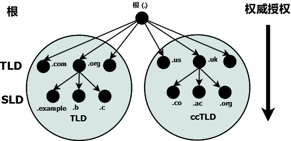
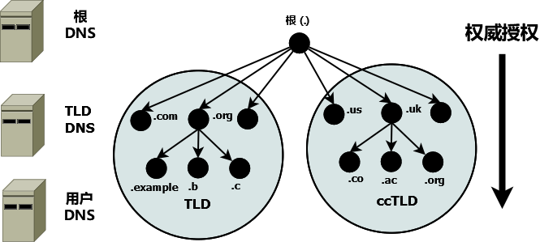
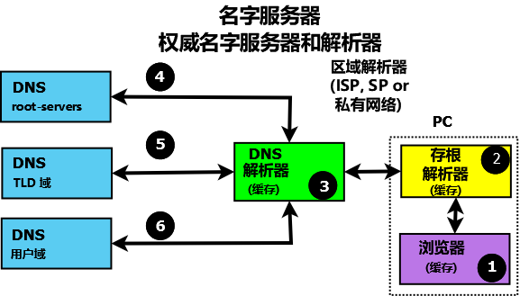
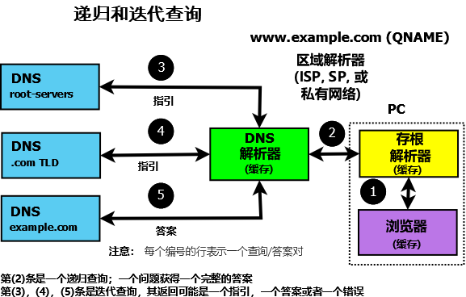

.. Copyright (C) Internet Systems Consortium, Inc. ("ISC")
..
.. SPDX-License-Identifier: MPL-2.0
..
.. This Source Code Form is subject to the terms of the Mozilla Public
.. License, v. 2.0.  If a copy of the MPL was not distributed with this
.. file, you can obtain one at https://mozilla.org/MPL/2.0/.
..
.. See the COPYRIGHT file distributed with this work for additional
.. information regarding copyright ownership.

.. _dns_overview:

域名系统（DNS）
---------------

这是一个对域名系统（DNS）功能和组织的简要描述。提供它是为了让用户熟悉
所涉及的概念、所使用的（经常令人困惑的）术语，以及各部分如何组合在一起
形成一个正常运转的系统。

所有的网络系统都使用网络地址进行操作，例如IPv4和IPv6。绝大多数人发现，
与看似无穷无尽的网络地址数字串相比，名字更容易处理。最早的ARPANET系统
（互联网由此发展而来）使用一个 **hosts** 文件来将名字映射到地址，然后
在每次变化之后将其分发给所有实体。在操作上，一旦有超过100个联网实体，
这样的系统就会迅速变得不可持续，这导致了我们今天所使用的域名系统的规范
和实现。

.. _dns_fundamentals:

DNS基础
~~~~~~~

DNS命名系统被组织成多层树形结构，自然形成分布式系统。树中的每个节点都
有一个标记，它定义了 **权威** 的 **域** （它的区域或区）。树顶端的节点
是 **根域** ；它授权给下一级的 **域** ，后者通常称为
**顶级域（TLD）** 。它们再授权给 **二级域（SLD）** ，以此类推。顶级域
（TLD）包含一个特殊的TLD组，被称为 **国家代码顶级域（ccTLD）** ，其中
每个国家被赋予一个来自ISO 3166的两字母国家代码作为其域名。

.. Note:: 域名系统由ICANN（https://www.icann.org）（一个501c非营利性实体）
   控制；他们目前的政策是，任何新的顶级域名，包括三个或更多字符，可以
   由任何商业赞助商团体提出，如果它符合ICANN的标准，将被添加到顶级域名
   中。

授权和权威的概念沿着DNS树（DNS层次结构）向下流动，如下所示：

   DNS名字空间中的授权和权威

域名是树中一个节点的标记。 **域名** 唯一标识DNS树中的任何节点，从左到
右通过组合所有域标记（每个域标记在其父区或权威域内都是唯一的），用一个
点分隔每个标记，直到根域。在上图中，以下都是域名：

.. code-block::

	example.com
	b.com
	ac.uk
	us
	org

根有一个唯一的标记“.”（点），当写一个普通域名时，点通常都被省略，但当
写一个 **完整域名（FQDN）** 时，点必须出现。因此：

.. code-block::

	example.com     # domain name
	example.com.    # FQDN

权威和授权
~~~~~~~~~~

每个域（节点）都被其父域 **授权** 为权威。授权的权威包括特定的责任，以
确保它授权的每个域在其权威区或权威域内具有唯一的名字或标记，并维护一个
其授权域的 **权威的** 列表。责任还包括运行两个（或多个）名字服务器（可
能外包给第三方）的运行要求，该服务器将在 :ref:`区文件<zone_file>` 中包
含其授权区内的所有域标记的权威数据。重申一次，树形结构确保了DNS名字空
间是自然分布的。

下图说明了 **权威名字服务器** 存在于DNS名字空间中的每个级别和每个域：

   DNS名字空间中的权威名字服务器

.. Note:: 域和区的区别可能令人困惑。实际上，这些术语在DNS中通常当做同
   义词使用。然而，如果您使用的是有向图和树形结构理论或类似的新理论，
   则可以将区视为通过任何节点（或域）的弧，域位于其顶点。因此，该区包
   含域以下的所有名字空间。因此，这可以导致子区的概念，而这些确实定义
   在最初的DNS规范中。值得庆幸的是，子区这个术语已经消失在时间的迷雾中。

.. _root_servers:

根服务器
~~~~~~~~

**根服务器** 是DNS权威基础设施的关键部份。根服务器有13个（从
*a.root-servers.net* 到 *m.root-servers.net* ）。数字13是基于历史上在
一个512字节的UDP包中能放入的名字和IPv4地址的最大数量，而不是对某些文化
中被视为不吉利数字的逆反关联。512字节的UDP数据限制不再是一个限制性因素，
现在所有根服务器都支持IPv4和IPv6。并且几乎所有的根服务器都使用
**任播** ，当前有超过300个根服务器实例在全世界范围提供服务（更多信息参
见 https://www.root-servers.org）。根服务器是DNS中所有 **名字解析** 的
起点。

名字解析
~~~~~~~~

到目前为止，所有的重点都放在了DNS如何存储其权威域（区）数据上。最终用
户系统使用名称（电子邮件地址或web地址），并需要访问这些权威数据来获取
IP地址，他们使用IP地址来联系所需的网络资源，如web、FTP或邮件服务器。将
一个域名转换为结果（典型情况是一个IP地址，虽然也可能获得其它类型的数
据）通常称为 **名字解析** ，并由 **解析器** （也被称为 **缓存名字服务
器** 或许多其它术语）处理。下图显示了典型的名字解析过程：

   权威名字服务器和名字解析

一个终端用户应用，例如一个浏览器，在需要解析一个名字如
**www.example.com** 时，生成一个内部的系统调用，调用一个最小的函数解析
实体，称为 **存根解析器** (2)。存根解析器（使用已保存的IP地址）联系解
析器（一个缓存名字服务器或全服务解析器）(3)，后者负责联系所有需要的权
威名字服务器（4，5和6）以提供答案，然后将其返回给用户（2，1）。为提高
性能，所有的解析器（包括大多数存根解析器）缓存（存储）其结果，这样后续
的对同样数据的请求就取自解析器的缓存，去掉对重复的名字解析过程和使用耗
时资源的需求。所有在存根解析器，解析器和权威名字服务器之间的通信都使用
DNS协议规定的查询和响应消息对。

.. _referral:

.. _recursive_query:

.. _iterative_query:

DNS协议和查询
~~~~~~~~~~~~~~~

DNS **查询** 使用UDP协议上保留的53端口（TCP和TLS作为可选项可以用于网络
的某些部份）。

下图显示了以DNS查询和响应表达的名字解析过程。

   解析器和查询

存根解析器向解析器发送一个 **递归查询** 消息（在查询的QUESTION部份带有
所请求的域名）(2)。 **递归** 查询只是请求解析器找出完整答案。存根解析
器只是发送递归查询，并总是需要解析器的服务。递归查询的响应可能是：

1. 在查询响应的ANSWER部份答复用户的问题。

2. 一个错误（例如NXDOMAIN - 名字不存在）。

解析器在接收到用户的递归查询后，如果ANSWER在其缓存中，则立即响应，或者
访问DNS层次结构以获取答案。解析器总是从根服务器开始并发出一个 **迭代查
询** (4,5和6)。对迭代查询的响应可能是：

1. 在查询响应的ANSWER部份答复解析器的问题。

2. 一个 **指引** （由一个空的ANSWER部份和带数据的AUTHORITY部份所指示，
   并且典型情况是在响应的ADDITIONAL部份中的IP地址）。

3. 一个错误（例如NXDOMAIN - 名字不存在）。

如果响应是一个答案或者一个错误，就将其立即返回给用户（并缓存以备将来使
用）。如果响应是一个指引，解析器需要执行更多的动作来答复用户的递归查询。

从本质上说，指引表示被查询的服务器不知道答案（响应的ANSWER部份为空），
但是它引导解析器到它所知道的，关于在查询的QUESTION部份中提供的域名的（
在响应的AUTHORITY中的）权威名字服务器。因此，如果QUESTION是针对域名
**www.example.com** ，迭代查询发到的根服务器在AUTHORITY部份添加一个
**.com权威名字服务器** 的列表。解析器从AUTHORITY部份选择一台服务器并发
送迭代查询给它。类似地，.com权威名字服务器发送一个指引，其中包含一个
**example.com** 权威名字服务器列表。这个过程沿着DNS层次体系不断向下，
指定返回一个ANSWER或者一个错误，这时给用户的原始递归查询发送一个响应。

.. Note:: 对DNS层次体系的访问总是从根开始，逐步向下；在DNS层次体系中没
   有“向上”的概念。显然，如果解析器已经缓存了.com权威服务器的列表，并
   且用户的递归查询的QUESTION中包含一个以.com结尾域名，它就可以省略对
   根服务器的访问。然而，这仅是缓存的一个例子（在本例中是一种性能优势
   ），并没有改变DNS层次结构中自顶向下访问的概念。

无止境的好奇心可能会发现阅读 :rfc:`1034` 和 :rfc:`1035` 是了解更多信息
的有用起点。

DNS和BIND 9
~~~~~~~~~~~~

BIND 9是DNS协议的一个完整实现。在所支持的主机上，BIND 9可以被配置（使
用 ``named.conf`` 文件）为一个权威名字服务器，一个解析器或者一个存根解
析器。大的运营商通常将DNS服务器按系统限于单一功能，而较小的运营商会发
现BIND 9的灵活配置特性支持多个功能，例如用一台DNS服务器上同时充作一个
权威名字服务器和一个解析器。

基本的 :ref:`权威名字服务器<config_auth_samples>` 和
:ref:`解析器和转发解析器<config_resolver_samples>` ，以及
:ref:`高级配置<Advanced>` 和 :ref:`安全配置<Security>` 的例子，都已提供。
