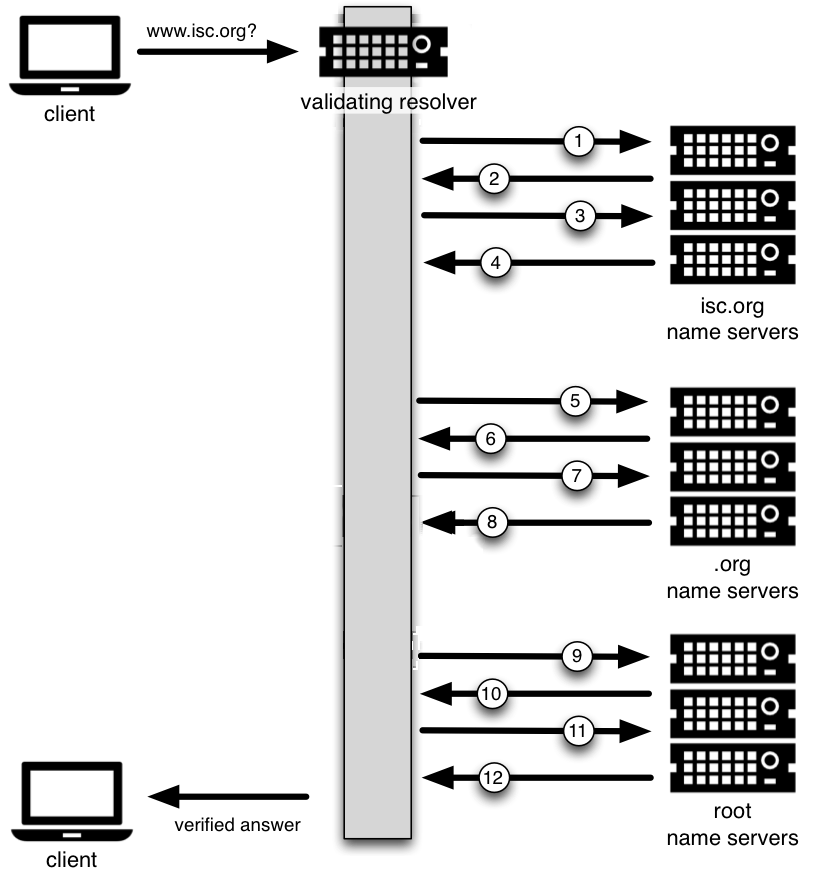

.. Copyright (C) Internet Systems Consortium, Inc. ("ISC")
..
.. SPDX-License-Identifier: MPL-2.0
..
.. This Source Code Form is subject to the terms of the Mozilla Public
.. License, v. 2.0.  If a copy of the MPL was not distributed with this
.. file, you can obtain one at https://mozilla.org/MPL/2.0/.
..
.. See the COPYRIGHT file distributed with this work for additional
.. information regarding copyright ownership.

.. _dnssec_guide_introduction:

介绍
----

.. _who_should_read:

谁应该阅读本指南？
~~~~~~~~~~~~~~~~~~

本指南旨在为已经熟悉现有BIND和DNS基础设施的DNS管理员介绍DNSSEC。他或她可
能对DNSSEC感到好奇，但可能没有时间研究DNSSEC，了解DNSSEC是否应该成为他或
她的环境的一部分，并理解在现场部署它意味着什么。

本指南介绍BIND 9.16.9及之后版本配置DNSSEC的基本信息。本指南中的大多数信
息和示例也适用于9.9.0之后的BIND版本，但这里描述的一些关键特性仅在9.16.9
版本中引入。假设读者了解域名系统（Domain Name System，DNS）和相关网络基
础设施的基础工作原理。不要求了解更深入的DNS和TCP/IP知识。本指南假设读者
不了解DNSSEC或相关技术，如公钥加密。

.. _who_should_not_read:

谁不必阅读本指南？
~~~~~~~~~~~~~~~~~~

如果你已经在运行一个DNSSEC签名的区，你可能不会从本文档的前半部分学到很
多东西，你可能想从 :ref:`dnssec_advanced_discussions` 开始。如果您想了
解协议扩展的细节，例如数据字段和标志，或者新的记录类型，本文档可以帮助
您入门，但它不包括所有的技术细节。

如果您对DNSSEC有经验，您可能会发现本文中的一些概念对您来说过于简化了，
为了便于说明，有时会故意省略一些细节。

如果你管理着一个大型或者复杂的 BIND 环境，本指南可能没有为你提供足够的
信息，因为其目的仅是提供基础的、通用的可工作的例子。

如果您是顶级域(TLD)操作员，或者管理着在签名顶级域之下的区，本指南可以
帮助您入门，但它没有提供足够的细节来满足您的所有需求。

如果您的DNS环境使用了非BIND的DNS产品，或者除了BIND之外还包含别的DNS产
品，本文档可能提供一些背景信息或重叠信息，但您应该检查每个产品的供应商
文档以了解具体情况。

最后，在内部或私有网络上部署DNSSEC未包含在本文档中，除了在
:ref:`dnssec_on_private_networks` 中的一个简短讨论。

.. _what_is_dnssec:

DNSSEC 是什么？
~~~~~~~~~~~~~~~

域名系统(Domain Name System，DNS)是在互联网是一个友好和信任的地方的时代
设计的。协议本身对恶意或伪造的应答提供的保护很少。DNS安全扩展（
DNS Security Extensions，DNSSEC）通过向DNS数据中添加数字签名来满足这一需
求，这样就可以验证每个DNS响应的完整性（在传输过程中答案没有改变）和真实
性（数据来自真实的源，而不是冒名者）。在理想的情况下，当DNSSEC完全部署时，
每个DNS应答都可以被验证和信任。

DNSSEC不提供安全隧道；它不加密或隐藏DNS数据。它独立于现有的公钥基础设施
（PKI）运行。它不需要SSL证书或共享秘密。它在设计时考虑了向后兼容性，并且
可以在不影响“旧的”不安全域名的情况下部署。

DNSSEC部署在DNS基础设施的三个主要组件上：

-  *递归服务器* ：人们使用递归服务器查找外部域名，如 ``www.example.com`` 。
   递归服务器的操作人员需要启用DNSSEC验证。启用验证后，递归服务器对它们收
   到的每个DNS响应执行额外的任务，以确保其真实性。

-  *权威服务器* ：在其名字服务器上发布DNS数据的人需要签名该数据。这需要创
   建额外的资源记录，并在必要时将它们发布到父区。启用DNSSEC后，权威服务器
   除了标准答案外，还会使用额外的DNS数据（如数字签名和密钥）响应查询。

-  *应用* ：该组件存在于每个客户端机器上，从Web服务器到智能手机。这包括不
   同操作系统上的解析器库，以及Web浏览器等应用程序。

在本指南中，我们将重点介绍前两个组件，递归服务器和权威服务器，只简单介绍
第三个组件。我们将了解DNSSEC如何工作、如何配置验证解析器、如何对DNS区数据
签名以及其它操作任务和注意事项。

.. _what_does_dnssec_add_to_dns:

DNSSEC给DNS增加了什么？
~~~~~~~~~~~~~~~~~~~~~~~

.. note::

   公钥密码学的工作原理是一对密钥：一个公开给全世界，另一个秘密地保存。毫
   无疑问，它们被称为公钥和私钥。如果你不熟悉这个概念，可以把它想象成一个
   巧妙设计的锁，一把钥匙上锁，一把钥匙开锁。在DNSSEC中，我们将解锁的公钥
   分发给世界上的其他人，同时保持上锁密钥的私有性。要了解如何使用它来保护
   DNS消息，请参阅 :ref:`how_are_answers_verified` 。

DNSSEC引入了八种新的资源记录类型：

-  RRSIG （资源记录的数字化签名）

-  DNSKEY （公开密钥）

-  DS (parent-child)

-  NSEC （不存在的证明）

-  NSEC3 （不存在的证明）

-  NSEC3PARAM （不存在的证明）

-  CDS （子-父信令）

-  CDNSKEY（子-父信令）

本指南并不深入剖析每种资源记录类型；详细信息留给读者自行研究和探索。
以下是每种新资源记录的简短介绍：

-  *RRSIG* ：启用DNSSEC后，几乎每个DNS应答（A, PTR, MX, SOA, DNSKEY等）都
   至少带有一个资源记录签名或RRSIG。递归名字服务器（也被称为验证解析器）
   使用这些签名来验证接收到的答案。要了解如何生成和使用数字签名，请参阅
   :ref:`how_are_answers_verified` 。

-  *DNSKEY* ：DNSSEC依赖于公钥密码学来保证数据的真实性和完整性。在DNSSEC
   中有几种密钥，一些是私有的，一些是公开的。公共密钥作为区数据的一部分
   发布到世界上，它们存储在DNSKEY记录类型中。

   通常，DNSSEC中的密钥用于以下角色中的一个或两个：作为区签名密钥(ZSK)，
   用于保护所有区数据，或者作为密钥签名密钥(KSK)，用于保护区的密钥。同时
   用于两个角色的密钥被称为组合签名密钥(Combined Signing key, CSK)。我们
   在 :ref:`advanced_discussions_key_generation` 中更详细地讨论密钥。

-  *DS* ：DNSSEC的一个关键组成部分是父区可以“担保”其子区。DS记录是可验证
   的信息(由子节点的公钥之一生成)，父区作为信任链的一部分发布关于其子节点
   的信息。要了解更多关于信任链，参见 :ref:`chain_of_trust` 。

-  *NSEC, NSEC3, NSEC3PARAM* ：这些资源记录都处理一个非常有趣的问题：证明
   某些东西不存在。我们在 :ref:`advanced_discussions_proof_of_nonexistence`
   中更详细地研究了这些记录类型。

-  *CDS, CDNSKEY* ：CDS和CDNSKEY资源记录适用于操作事项，是一种向父区发出
   信号的方式，它为子区保存的DS记录应该更新。这在 :ref:`cds_cdnskey` 中有
   更详细的介绍。

.. _how_does_dnssec_change_dns_lookup:

DNSSEC如何改变了DNS查找？
~~~~~~~~~~~~~~~~~~~~~~~~~

传统的(不安全的)DNS查找很简单：递归名字服务器接收来自客户机的查询，以便
查找 ``www.isc.org`` 之类的名称。递归名字服务器跟踪负责的权威名字服务器，
将查询发送到其中一个权威名字服务器，并等待它响应答案。

启用DNSSEC验证后，验证递归名字服务器(又称 *验证解析器*)在其查询中请求额
外的资源记录，希望远程权威名字服务器响应的不仅仅是查询的答案，还包括一些
与答案一起的证明。如果接收到DNSSEC响应，验证解析器将执行加密计算来验证答
案的真实性(数据的来源)和完整性(数据在传输过程中没有被更改)，甚至询问父区
作为验证的一部分。它重复这个过程：获取密钥，验证，询问父区，父区的父区，
... ，直到验证解析器到达它信任的密钥为止。在理想的、完全部署的DNSSEC中，
所有验证解析器只需要信任一个密钥：根密钥。

.. _dnssec_12_steps:

12步 DNSSEC 验证流程（简化版）
~~~~~~~~~~~~~~~~~~~~~~~~~~~~~~~~

下面的示例在非常高的级别上显示了DNSSEC验证过程的12个步骤，查找名字
``www.isc.org`` ：

1.  在从客户端接收到解析 ``www.isc.org`` 的DNS查询后，验证解析器遵循标准
    DNS协议来跟踪 ``isc.org`` 的名字服务器，并向它发送一个DNS查询来请求
    ``www.isc.org`` 的A记录。但由于这是一个启用DNSSEC的解析器，因此发出
    的查询设置了一个位，表明它希望得到DNSSEC的答案，希望接收它的名字服务
    器是启用DNSSEC的，并能够满足这个安全请求。

2.  ``isc.org`` 名字服务器启用了dnssec，因此它的响应带有答案(在本例中是A
    记录)和数字签名，用于验证目的。

3.  验证解析器需要能够验证数字签名的密码算法的密钥，因此它向 ``isc.org``
    名字服务器询问这些密钥。

4.  ``isc.org`` 名字服务器的响应中包含密码算法的密钥(和密钥的数字签名)，
    其用于生成在步骤2中发送的数字签名。此时，验证解析器可以使用此信息来
    验证在步骤2所收到的答案。

    让我们稍微休息一下，看看目前为止我们都学了些什么。我们的服务器为什么
    会信任这个答案？是否一位聪明的攻击者接管了 ``isc.org`` 名字服务器，
    当然她会发送匹配的密钥和签名。我们需要询问其他人以获得信心，即我们真
    的是在与真正的 ``isc.org`` 名字服务器交谈。这是DNSSEC的一个关键部分：
    在某些时候， ``isc.org`` 的DNS管理员上载一些加密信息到它的父区， 
    ``.org`` ，可能是通过一个安全的Web表单，也可能通过一个电子邮件交换，
    甚至可能面对面方式。无论如何，在某种情况，关于子区(``isc.org``)的一
    些可验证信息被发送给父区(``.org``)以安全保存。

5.  验证解析器向父区(``.org``)询问它所保存的关于其子区 ``isc.org`` 的可
    验证信息。

6.  可验证的信息从 ``.org`` 服务器发送。此时，验证解析器将此结果与在步骤
    4所收到的答复进行比较；如果两者匹配，就证明了 ``isc.org`` 的真实性。

    让我们来看看这个过程。您可能在想，如果聪明的攻击者在接管了 ``isc.org``
    服务器的同时也破解了 ``.org`` 服务器该怎么办？当然所有这些信息都会匹
    配！这就是为什么我们现在将注意力转向 ``.org`` 服务器，查询它的密码算
    法的密钥，并且向上移动一级到 ``.org`` 的父区，根。

7.  验证解析器要求 ``.org`` 权威名字服务器提供其密码算法的密钥，以验证在
    步骤6所收到的答案。

8.  ``.org`` 名字服务器响应答案(在本例中是密钥和签名)。此时，验证解析器
    可以验证在步骤6所收到的答案。

9.  验证解析器向根( ``.org`` 的父区)询问保存在其上的关于其子区 ``.org``
    的可验证信息。

10. 根名字服务器发送回所保存的关于 ``.org`` 的可验证信息。 验证解析器使
    用此信息验证在步骤8所收到的答案。

    此时， ``isc.org`` 和 ``.org`` 都检查了。但是根呢？如果这个攻击者真
    的很聪明，不知怎么地欺骗了我们，让我们认为她是根名称服务器呢？当然她
    会发给我们全部都能匹配的信息！因此，我们重复这个询问过程，并要求从根
    名字服务器获取密钥。

11. 验证解析器要求根名字服务器提供其密码算法的密钥，以验证在步骤10所收到
    的答案。

12. 根名字服务器发送它的密钥；此时，验证解析器可以验证在步骤10所收到的答
    案。

.. _chain_of_trust:

信任链
~~~~~~~~~

但是根服务器本身呢？我们向谁去验证根的密钥呢？根区没有父区。在安全性方面，
您必须信任某个人，在DNSSEC(稍后我们将讨论当前的不完美状态和处理它的方法)
的完美保护环境中，每个验证解析器只需要信任一个实体，即根名字服务器。验证
解析器已经在文件中拥有根密钥(稍后我们将讨论如何获得根密钥文件)。所以在收
到步骤12的答复之后，验证解析器将其与已在文件中的密钥相比较，如果答复中的
一个密钥与文件中的一个密钥相匹配，我们就可以信任来自根的答复。因此我们可
以信任 ``.org`` ，因此我们可以信任 ``.isc.org`` 。在DNSSEC中，这被称为
“信任链”。

我们稍后再在 :ref:`how_does_dnssec_change_dns_lookup_revisited` 中回顾这
个12步骤的过程，其中有更多的技术细节。

.. _why_is_dnssec_important:

DNSSEC 为什么重要？（为什么我需要关注它？）
~~~~~~~~~~~~~~~~~~~~~~~~~~~~~~~~~~~~~~~~~~~

你可能会想：所有这些DNSSEC的东西听起来很棒，但我为什么要在乎？下面是一些
你为什么要考虑部署DNSSEC的原因：

1. *作为一个好网民* ：通过在你的DNS服务器上启用DNSSEC验证(在
   :ref:`dnssec_validation` 中描述的)，通过检查返回的答复，你正在更多的
   保护你的用户和你自己；通过签名您的区(在 :ref:`dnssec_signing` 中描述
   的)，您使其他人验证您的区数据成为可能。随着越来越多的人采用DNSSEC，互
   联网整体上对每个人来说都变得更加安全。

2. *合规性* ：如果您的组织受制于强制性的合规性标准，您甚至可能在实施
   DNSSEC方面没有发言权。例如，美国政府在2008年设定了最后期限，要求所有
   ``.gov`` 子域名在2009年12月之前签名 [#]_ 。因此，如果你运行着
   ``.gov`` 的一个子域名，你必须实现DNSSEC合规。ICANN还要求所有新顶级域
   名都支持DNSSEC。

3. *增强安全性* ：好吧，所以“让我们做得好”这一崇高的目标并不吸引你，而且
   你也没有任何合规标准需要担心。下面是一个为什么你应该考虑DNSSEC的更实际
   的原因：在发生DNS安全事件时，例如缓存中毒或域劫持，当所有金融和品牌损
   失降临到你的域名之后，你可能会被置于任何可能已经到位的预防措施的审查之
   下。就像你的网站只能通过HTTP而不能通过HTTPS访问一样。

4. *新特性* ：DNSSEC不仅增强了安全性，而且还带来了一套全新的特性。一旦DNS
   可以完全信任，就有可能在DNS中发布SSL证书，或用于全自动跨平台电子邮件加
   密的PGP密钥，或SSH指纹…… 新特性仍在开发中，但它们都依赖于可靠的DNS基础
   设施。要浏览这些下一代DNS特性，请查阅 :ref:`introduction_to_dane` 。

.. [#]
   美国政府管理和预算办公室(OMB)发布了
   `a memo in
   2008 <https://georgewbush-whitehouse.archives.gov/omb/memoranda/fy2008/m08-23.pdf>`__,
   要求到2009年12月所有 ``.gov`` 子域完成DNSSEC签名。这解释了为什么
   ``.gov`` 是当前部署DNSSEC签名最多的域，`其90%的子域已签名。
   <https://fedv6-deployment.antd.nist.gov/cgi-bin/generate-gov>`__

.. _how_does_dnssec_change_my_job:

DNSSEC如何改变DNS管理员的工作？
~~~~~~~~~~~~~~~~~~~~~~~~~~~~~~~

有了这个协议扩展，您在DNS中习惯的一些事情已经改变了。作为DNS管理员，您需
要定期执行新的维护任务(在 :ref:`signing_maintenance_tasks` 中所述)；当存
在DNS解析问题时，你需要使用新的故障排除技术和工具(在
:ref:`dnssec_troubleshooting` 中所述)。BIND 9尽最大努力使这些事情尽可能
透明和无缝。在本指南中，我们尝试使用配置示例，使BIND 9 DNS管理员的工作量
最小。
