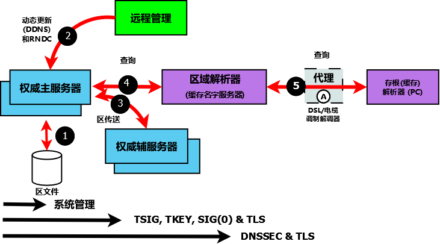

.. Copyright (C) Internet Systems Consortium, Inc. ("ISC")
..
.. SPDX-License-Identifier: MPL-2.0
..
.. This Source Code Form is subject to the terms of the Mozilla Public
.. License, v. 2.0.  If a copy of the MPL was not distributed with this
.. file, you can obtain one at https://mozilla.org/MPL/2.0/.
..
.. See the COPYRIGHT file distributed with this work for additional
.. information regarding copyright ownership.

.. _intro_dns_security:

DNS安全概述
-----------

DNS是一个通信协议。所有通信协议都可能受到篡改和窃听的威胁。对用户来说，
重要的是审计其面对运行环境中各种威胁的暴露面，并实施适当的解决方案。
作为一种特定的DNS协议实现，BIND 9提供了丰富的安全特性。本节的目的是帮
助用户从可用的安全特性中选择特定用户环境所需的安全特性。

一个普通的DNS网络如下所示，后面还有一些文字描述。一般来说，从图的左边
走得越远，实现就越复杂。

.. Note:: 历史上，DNS数据被认为是公共的，安全被关注，主要是确保DNS数据
   的完整性。DNS数据隐私越来越被视为整体安全的一个重要维度，具体来说即
   :ref:`DNS over TLS<dns_over_tls>` 。

   BIND 9安全概述

以下注释指的是上图中编号的元素。

1. 可以使用多种系统管理技术和方法来保护BIND 9的本地环境，包括
   :ref:`文件权限<file_permissions>` ，在
   :ref:`jail <chroot_and_setuid>` 中运行BIND 9，以及使用
   :ref:`Access_Control_Lists` 。

2. 远程名字服务控制（ :ref:`rndc<ops_rndc>` ）程序允许系统管理员控制一
   个名字服务器的运行。大多数BIND 9包或发行都预先配置了本地（环回地址
   ）安全性。如果要远程运行 ``rndc`` ，则需要更多的配置。 ``nsupdate``
   工具使用 **动态DNS（DDNS）** 特性，允许用户动态修改区文件的内容。
   ``nsupdate`` 访问和安全可以使用 ``named.conf``
   :ref:`statements or using TSIG or SIG(0) cryptographic methods <dynamic_update_security>`
   来控制。显然，如果用于 ``rndc`` 或DDNS的远程主机位于完全受用户控制
   的网络内，则安全威胁可视为不存在。因此，任何实现需求都取决于站点的
   安全策略。

3. 从一个 **主服务器** 跨过公网向一个或多个 **辅** 权威名字服务器进行
   区传送会带来风险。区传送可以使用 ``named.conf``
   :ref:`statements, TSIG cryptographic methods or TLS<sec_file_transfer>`
   来加固。显然，如果辅权威名字服务器都位于完全受用户控制的网络内，则
   安全威胁可视为不存在。因此，任何实现需求都取决于站点的安全策略。

4. 如果权威名字服务器（主服务器或辅服务器）的运行者希望确保对用户发起
   的由他们负责的区的查询的DNS响应只能来自他们的服务器，用户接收的数据
   与发送的数据相同，不存在的名字是真实的，那么 :ref:`DNSSEC` 是唯一的
   解决方案。DNSSEC要求对权威名字服务器和访问这些服务器的任何解析器进
   行配置和操作修改。

5. 典型的互联网接入最终用户设备（PC，笔记本电脑甚至智能手机）要么有一
   个存根解析器，要么通过一个DNS代理运行。存根解析器需要一个区域或全服
   务解析器的服务来完全地回答用户查询。大多数PC和笔记本电脑上的存根解
   析器通常具有缓存功能，以提高性能。当前还没有实现了DNSSEC的标准的存
   根解析器或代理DNS工具。BIND 9可以配置为在受支持的Linux或Unix平台上
   提供这种功能。 :ref:`DNS over TLS <dns_over_tls>` 可以配置为验证存
   根解析器和区域（或全服务）解析器之间数据的完整性。然而，除非解析器
   和权威名字服务器实现了DNSSEC，否则不能保证（从权威名字服务器到存根
   解析器的）端到端完整性。
