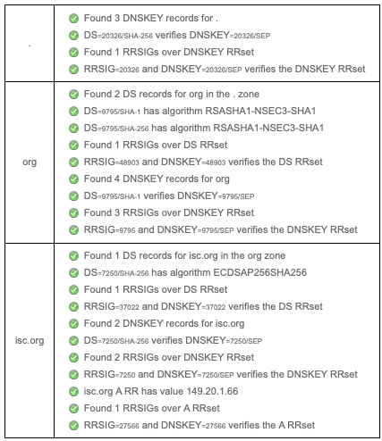
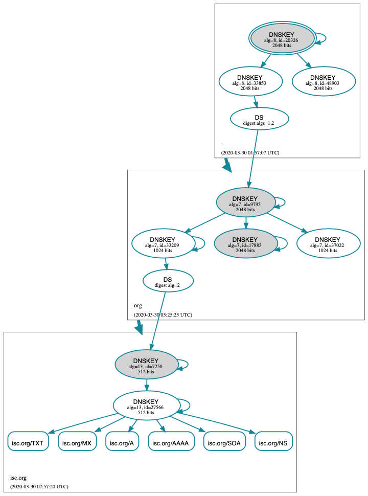

.. Copyright (C) Internet Systems Consortium, Inc. ("ISC")
..
.. SPDX-License-Identifier: MPL-2.0
..
.. This Source Code Form is subject to the terms of the Mozilla Public
.. License, v. 2.0.  If a copy of the MPL was not distributed with this
.. file, you can obtain one at https://mozilla.org/MPL/2.0/.
..
.. See the COPYRIGHT file distributed with this work for additional
.. information regarding copyright ownership.

.. _dnssec_signing:

签名
-------

.. _easy_start_guide_for_authoritative_servers:

对权威区签名的轻松开始指南
~~~~~~~~~~~~~~~~~~~~~~~~~~~~~~~~~~~~~~~~~~~~~~~~

本节提供设置启用DNSSEC的权威名字服务器所需的基本信息。启用DNSSEC(或“签
名”)的区包含额外的资源记录，用于验证其区信息的真实性。

为了将传统的(不安全的)DNS区转换为安全的DNS区，我们需要创建一些额外的记
录(DNSKEY、RRSIG和NSEC或NSEC3)，并将可验证的信息(例如DS记录)上传到父区，
以完成信任链。有关DNSSEC资源记录的更多信息，请参见
:ref:`what_does_dnssec_add_to_dns` 。

.. note::

   在本章中，我们假设所有的配置文件，密钥文件和区文件都存储在
   ``/etc/bind`` ，并且大多数例子以根用户身份运行命令。这可能并不理想，
   但重点是不要分散注意力，这是最重要的：学习如何签名一个区。有许多最
   佳实践可以部署更安全的BIND安装，使用诸如监禁过程和限制用户特权等技
   术，但这些都不在本文中讨论。我们相信您，作为一位负责任的DNS管理员，
   会采取必要的预防措施来保护您的系统。

对于下面的示例，我们假设存在一个现有的不安全区 ``example.com`` ，并将
其转换为安全区。

.. _signing_easy_start_policy_enable:

开启自动化DNSSEC区维护和密钥生成
^^^^^^^^^^^^^^^^^^^^^^^^^^^^^^^^^^^^^^^^^^^^^^^^^^^^^^^^^^^^^

要签名一个区，在BIND 9配置文件中将以下语句添加到它的 ``zone`` 子句中：

::

   options {
       directory "/etc/bind";
       recursion no;
       ...
   };

   zone "example.com" in {
       ...
       dnssec-policy default;
       ...
   };

``dnssec-policy`` 语句导致对该区进行签名，并开启该区的自动维护。这包括
在签名过期时重签区，并定期替换密钥。值 ``default`` 选择默认策略，其中
包含适用于大多数情况的值。我们在 :ref:`signing_custom_policy` 中介绍了
自定义策略的创建，但目前我们接受默认值。

当配置文件更新时，通过运行 :option:`rndc reconfig` 告诉 :iscman:`named` 重新加载配
置文件。

::

   # rndc reconfig

这就是它 - BIND签名你的区。

此时，在您离开并愉快地将 ``dnssec-policy`` 声明添加到您的所有区之前，
我们应该提到，就像许多其他BIND配置选项一样，它的范围取决于它被放置的位
置。在上面的例子中，我们把它放在 ``zone`` 子句中，所以它只适用于所讨论
的区。如果我们把它放在 ``view`` 子句中，它将适用于视图中的所有区；如
果我们把它放在 ``options`` 子句中，它将应用于这个BIND实例所服务的所有
区。

.. _signing_verification:

验证
^^^^^^^^^^^^

BIND 9重新配置将启动对区进行签名的过程。首先，它为区生成一个密钥，并将
其包含在已发布的区中。日志文件显示了这样的消息：

::

   07-Apr-2020 16:02:55.045 zone example.com/IN (signed): reconfiguring zone keys
   07-Apr-2020 16:02:55.045 reloading configuration succeeded
   07-Apr-2020 16:02:55.046 keymgr: DNSKEY example.com/ECDSAP256SHA256/10376 (CSK) created for policy default
   07-Apr-2020 16:02:55.046 Fetching example.com/ECDSAP256SHA256/10376 (CSK) from key repository.
   07-Apr-2020 16:02:55.046 DNSKEY example.com/ECDSAP256SHA256/10376 (CSK) is now published
   07-Apr-2020 16:02:55.046 DNSKEY example.com/ECDSAP256SHA256/10376 (CSK) is now active
   07-Apr-2020 16:02:55.048 zone example.com/IN (signed): next key event: 07-Apr-2020 18:07:55.045

然后它开始签名区。这个过程需要多长时间取决于区的大小、服务器的速度和正
在发生签名的数量。我们可以通过使用 :iscman:`rndc` 输入命令来检查发生了什么：

::

   # rndc signing -list example.com

在签名过程中，输出类似于：

::

   Signing with key 10376/ECDSAP256SHA256

当它完成时：

::

   Done signing with key 10376/ECDSAP256SHA256

当第二个消息出现时，区已被签名。

在进入与父区协调的下一步之前，让我们使用 :iscman:`delv` 确保一切看起来都很好。
我们希望通过告诉 :iscman:`delv` 使用特定的信任锚来模拟验证解析器将检查什么。

首先，我们需要复制BIND创建的密钥。它位于配置文件 ``options`` 子句中
``directory`` 语句设置的目录中，并被命名为类似于
``Kexample.com.+013.10376.key`` ：

::

   # cp /etc/bind/Kexample.com.+013+10376.key /tmp/example.key

原始密钥文件看起来像这样(为了便于显示，实际的密钥被缩短，注释被省略)：

::

   # cat /etc/bind/Kexample.com.+013+10376.key

   ...
   example.com. 3600 IN DNSKEY 257 3 13 6saiq99qDB...dqp+o0dw==

我们希望将副本编辑为 ``trust-anchors`` 格式，以便它看起来像这样：

::

   # cat /tmp/example.key
   trust-anchors {
       example.com. static-key 257 3 13 "6saiq99qDB...dqp+o0dw==";
   };

现在，我们可以运行 :iscman:`delv` 命令，并指示它使用这个可信密钥文件来验证它
从权威名字服务器192.168.1.13接收到的答案：

::

   $ delv @192.168.1.13 -a /tmp/example.key +root=example.com example.com. SOA +multiline
   ; fully validated
   example.com.        600 IN SOA ns1.example.com. admin.example.com. (
                   2020040703 ; serial
                   1800       ; refresh (30 minutes)
                   900        ; retry (15 minutes)
                   2419200    ; expire (4 weeks)
                   300        ; minimum (5 minutes)
                   )
   example.com.        600 IN RRSIG SOA 13 2 600 (
                   20200421150255 20200407140255 10376 example.com.
                   jBsz92zwAcGMNV/yu167aKQZvFyC7BiQe1WEnlogdLTF
                   oq4yBQumOhO5WX61LjA17l1DuLWcd/ASwlUZWFGCYQ== )

.. _signing_easy_start_upload_to_parent_zone:

上传信息给父区
^^^^^^^^^^^^^^^^^^^^^

在名称服务器上完成所有工作后，我们需要生成一些信息上载到父区，以完成信
任链。格式和上传方法实际上是由您的父区的管理员决定的，因此请联系您的注
册商或父区管理员，了解实际的格式应该是什么，以及如何将信息传递或上传到
父区。

在你签名区的时间和你的父区接受上传的时间之间，你的区是什么情况呢？对于
世界的其它部份，你的区仍然是不安全的，因为如果一个验证解析器试图通过你
的父区验证你的域名时，你的父区将指示你仍然未签名（据它所知）。然后，验
证解析器将放弃验证您的域名的尝试，并将退回到不安全的DNS。在你完成父区
的最后一步之前，你的区仍然是不安全的。

.. note::

   在上传到父区之前，请验证新签名的区是否已传播到您的所有名字服务器
   （通常通过区传输）。如果您的一些名字服务器仍然有未签名的区数据，而
   父区服务器告诉全世界它应该被签名，那么全世界的验证解析器无法解析您
   的域名。

这里有一些关于你可以上传到父区的例子，为显示起见缩短了DNSKEY/DS数据。
注意，无论需要什么格式，最终的结果都是父区根据您上传的信息发布DS记录。
再说一遍，请联系您的父区管理员，以查找其系统的正确格式。

1. DS记录格式：

   ::

      example.com. 3600 IN DS 10376 13 2 B92E22CAE0...33B8312EF0

2. DNSKEY格式：

   ::

      example.com. 3600 IN DNSKEY 257 3 13 6saiq99qDB...dqp+o0dw==

DS记录格式可以使用 :iscman:`dnssec-dsfromkey` 工具从DNSKEY生成，该工具包含在
:ref:`parent_ds_record_format` 。
有关如何使用父区的更多细节和示例，请参阅
:ref:`working_with_parent_zone` 。

.. _signing_easy_start_so_what_now:

所以 ... 现在怎么办？
^^^^^^^^^^^^^^^^^^^^^^^^

恭喜你！您的区已签名，辅服务器已收到新的区数据，并且父区已接受您的上传
并发布您的DS记录。您的区现在正式启用了DNSSEC。接下来会发生什么？基本
上就这样了 - BIND将会负载其它所有工作。至于更新您的区文件，您可以继续以
与签名您的区之前相同的方式更新它；编辑区文件和使用 :iscman:`rndc` 命令重新
加载区的正常工作流程仍然照常工作，而且尽管您正在编辑区的未签名版本，
BIND会自动生成签名版本。

想知道所有这些命令对您的区文件做了什么？请阅读
:ref:`your_zone_before_and_after_dnssec` 将会了解。如果你对如何在现有的
主服务器和辅服务器上使用这个功能感兴趣，请在 :ref:`dnssec_recipes` 一章
查看 :ref:`recipes_inline_signing` 。

.. _your_zone_before_and_after_dnssec:

在DNSSEC之前和之后的区
~~~~~~~~~~~~~~~~~~~~~~~~~~~~~~~~~~

当我们将缺省的DNSSEC策略分配给区时，我们提供了最小数量的信息来将传统的
DNS区转换为启用DNSSEC的区。这是我们开始之前的区看起来的样子：

::

   $ dig @192.168.1.13 example.com. AXFR +multiline +onesoa

   ; <<>> DiG 9.16.0 <<>> @192.168.1.13 example.com AXFR +multiline +onesoa
   ; (1 server found)
   ;; global options: +cmd
   example.com.        600 IN SOA ns1.example.com. admin.example.com. (
                   2020040700 ; serial
                   1800       ; refresh (30 minutes)
                   900        ; retry (15 minutes)
                   2419200    ; expire (4 weeks)
                   300        ; minimum (5 minutes)
                   )
   example.com.        600 IN NS ns1.example.com.
   ftp.example.com.    600 IN A 192.168.1.200
   ns1.example.com.    600 IN A 192.168.1.1
   web.example.com.    600 IN CNAME www.example.com.
   www.example.com.    600 IN A 192.168.1.100

下面显示了重新加载服务器配置后的测试区 ``example.com`` 。很明显，区
的大小在增加，记录的数量成倍增加：

::

   # dig @192.168.1.13 example.com. AXFR +multiline +onesoa

   ; <<>> DiG 9.16.0 <<>> @192.168.1.13 example.com AXFR +multiline +onesoa
   ; (1 server found)
   ;; global options: +cmd
   example.com.        600 IN SOA ns1.example.com. admin.example.com. (
                   2020040703 ; serial
                   1800       ; refresh (30 minutes)
                   900        ; retry (15 minutes)
                   2419200    ; expire (4 weeks)
                   300        ; minimum (5 minutes)
                   )
   example.com.        300 IN RRSIG NSEC 13 2 300 (
                   20200413050536 20200407140255 10376 example.com.
                   drtV1rJbo5OMi65OJtu7Jmg/thgpdTWrzr6O3Pzt12+B
                   oCxMAv3orWWYjfP2n9w5wj0rx2Mt2ev7MOOG8IOUCA== )
   example.com.        300 IN NSEC ftp.example.com. NS SOA RRSIG NSEC DNSKEY TYPE65534
   example.com.        600 IN RRSIG NS 13 2 600 (
                   20200413130638 20200407140255 10376 example.com.
                   2ipmzm1Ei6vfE9OLowPMsxLBCbjrCpWPgWJ0ekwZBbux
                   MLffZOXn8clt0Ql2U9iCPdyoQryuJCiojHSE2d6nrw== )
   example.com.        600 IN RRSIG SOA 13 2 600 (
                   20200421150255 20200407140255 10376 example.com.
                   jBsz92zwAcGMNV/yu167aKQZvFyC7BiQe1WEnlogdLTF
                   oq4yBQumOhO5WX61LjA17l1DuLWcd/ASwlUZWFGCYQ== )
   example.com.        0 IN RRSIG TYPE65534 13 2 0 (
                   20200413050536 20200407140255 10376 example.com.
                   Xjkom24N6qeCJjg9BMUfuWf+euLeZB169DHvLYZPZNlm
                   GgM2czUDPio6VpQbUw6JE5DSNjuGjgpgXC5SipC42g== )
   example.com.        3600 IN RRSIG DNSKEY 13 2 3600 (
                   20200421150255 20200407140255 10376 example.com.
                   maK75+28oUyDtci3V7wjTsuhgkLUZW+Q++q46Lea6bKn
                   Xj77kXcLNogNdUOr5am/6O6cnPeJKJWsnmTLISm62g== )
   example.com.        0 IN TYPE65534 \# 5 ( 0D28880001 )
   example.com.        3600 IN DNSKEY 257 3 13 (
                   6saiq99qDBb5b4G4cx13cPjFTrIvUs3NW44SvbbHorHb
                   kXwOzeGAWyPORN+pwEV/LP9+FHAF/JzAJYdqp+o0dw==
                   ) ; KSK; alg = ECDSAP256SHA256 ; key id = 10376
   example.com.        600 IN NS ns1.example.com.
   ftp.example.com.    600 IN RRSIG A 13 3 600 (
                   20200413130638 20200407140255 10376 example.com.
                   UYo1njeUA49VhKnPSS3JO4G+/Xd2PD4m3Vaacnd191yz
                   BIoouEBAGPcrEM2BNrgR0op1EWSus9tG86SM1ZHGuQ== )
   ftp.example.com.    300 IN RRSIG NSEC 13 3 300 (
                   20200413130638 20200407140255 10376 example.com.
                   rPADrAMAPIPSF3S45OSY8kXBTYMS3nrZg4Awj7qRL+/b
                   sOKy6044MbIbjg+YWL69dBjKoTSeEGSCSt73uIxrYA== )
   ftp.example.com.    300 IN NSEC ns1.example.com. A RRSIG NSEC
   ftp.example.com.    600 IN A 192.168.1.200
   ns1.example.com.    600 IN RRSIG A 13 3 600 (
                   20200413130638 20200407140255 10376 example.com.
                   Yeojg7qrJmxL6uLTnALwKU5byNldZ9Ggj5XjcbpPvujQ
                   ocG/ovGBg6pdugXC9UxE39bCDl8dua1frjDcRCCZAA== )
   ns1.example.com.    300 IN RRSIG NSEC 13 3 300 (
                   20200413130638 20200407140255 10376 example.com.
                   vukgQme6k7JwCf/mJOOzHXbE3fKtSro+Kc10T6dHMdsc
                   oM1/oXioZvgBZ9cKrQhIAUt7r1KUnrUwM6Je36wWFA== )
   ns1.example.com.    300 IN NSEC web.example.com. A RRSIG NSEC
   ns1.example.com.    600 IN A 192.168.1.1
   web.example.com.    600 IN RRSIG CNAME 13 3 600 (
                   20200413130638 20200407140255 10376 example.com.
                   JXi4WYypofD5geUowVqlqJyHzvcRnsvU/ONhTBaUCw5Y
                   XtifKAXRHWrUL1HIwt37JYPLf5uYu90RfkWLj0GqTQ== )
   web.example.com.    300 IN RRSIG NSEC 13 3 300 (
                   20200413130638 20200407140255 10376 example.com.
                   XF4Hsd58dalL+s6Qu99bG80PQyMf7ZrHEzDiEflRuykP
                   DfBRuf34z27vj70LO1lp2ZiX4BB1ahcEK2ae9ASAmA== )
   web.example.com.    300 IN NSEC www.example.com. CNAME RRSIG NSEC
   web.example.com.    600 IN CNAME www.example.com.
   www.example.com.    600 IN RRSIG A 13 3 600 (
                   20200413050536 20200407140255 10376 example.com.
                   mACKXrDOF5JMWqncSiQ3pYWA6abyGDJ4wgGCumjLXhPy
                   0cMzJmKv2s7G6+tW3TsA6BK3UoMfv30oblY2Mnl4/A== )
   www.example.com.    300 IN RRSIG NSEC 13 3 300 (
                   20200413050536 20200407140255 10376 example.com.
                   1YQ22odVt0TeP5gbNJwkvS684ipDmx6sEOsF0eCizhCv
                   x8osuOATdlPjIEztt+rveaErZ2nsoLor5k1nQAHsbQ== )
   www.example.com.    300 IN NSEC example.com. A RRSIG NSEC
   www.example.com.    600 IN A 192.168.1.100

但这真的是一个凌乱的方式来判断区是否正确设置了DNSSEC。幸运的是，有一些
工具可以帮助我们做到这一点。阅读
:ref:`how_to_test_authoritative_server` 以了解更多信息。

.. _how_to_test_authoritative_server:

如何测试权威区
~~~~~~~~~~~~~~~~~~~~~~~~~~~~~~~

我们已经激活了DNSSEC并上传了一些数据到父区。我们怎样知道我们的区签名是
正确的？这里有一些方法来检查。

.. _signing_verify_key_data:

在区中寻找密钥数据
^^^^^^^^^^^^^^^^^^^^^^^^^^^^^^

查看您的区是否签名的一种方法是检查DNSKEY记录类型的存在。在我们的示例中，
我们创建了一个密钥，并希望在查询时返回它。

::

   $ dig @192.168.1.13 example.com. DNSKEY +multiline

   ; <<>> DiG 9.16.0 <<>> @10.53.0.6 example.com DNSKEY +multiline
   ; (1 server found)
   ;; global options: +cmd
   ;; Got answer:
   ;; ->>HEADER<<- opcode: QUERY, status: NOERROR, id: 18637
   ;; flags: qr aa rd; QUERY: 1, ANSWER: 1, AUTHORITY: 0, ADDITIONAL: 1
   ;; WARNING: recursion requested but not available

   ;; OPT PSEUDOSECTION:
   ; EDNS: version: 0, flags:; udp: 4096
   ; COOKIE: efe186423313fb66010000005e8c997e99864f7d69ed7c11 (good)
   ;; QUESTION SECTION:
   ;example.com.       IN DNSKEY

   ;; ANSWER SECTION:
   example.com.        3600 IN DNSKEY 257 3 13 (
                   6saiq99qDBb5b4G4cx13cPjFTrIvUs3NW44SvbbHorHb
                   kXwOzeGAWyPORN+pwEV/LP9+FHAF/JzAJYdqp+o0dw==
                   ) ; KSK; alg = ECDSAP256SHA256 ; key id = 10376
     

.. _signing_verify_signature:

在区中寻找签名
^^^^^^^^^^^^^^^^^^^^^^^^^^^^^^^^

查看区数据是否签名的另一种方法是检查签名的存在。对于DNSSEC，现在每条记
录 [#]_ 都会至少带有一条对应的签名，也被称为RRSIG记录。

::

   $ dig @192.168.1.13 example.com. SOA +dnssec +multiline

   ; <<>> DiG 9.16.0 <<>> @10.53.0.6 example.com SOA +dnssec +multiline
   ; (1 server found)
   ;; global options: +cmd
   ;; Got answer:
   ;; ->>HEADER<<- opcode: QUERY, status: NOERROR, id: 45219
   ;; flags: qr aa rd; QUERY: 1, ANSWER: 2, AUTHORITY: 0, ADDITIONAL: 1
   ;; WARNING: recursion requested but not available

   ;; OPT PSEUDOSECTION:
   ; EDNS: version: 0, flags: do; udp: 4096
   ; COOKIE: 75adff4f4ce916b2010000005e8c99c0de47eabb7951b2f5 (good)
   ;; QUESTION SECTION:
   ;example.com.       IN SOA

   ;; ANSWER SECTION:
   example.com.        600 IN SOA ns1.example.com. admin.example.com. (
                   2020040703 ; serial
                   1800       ; refresh (30 minutes)
                   900        ; retry (15 minutes)
                   2419200    ; expire (4 weeks)
                   300        ; minimum (5 minutes)
                   )
   example.com.        600 IN RRSIG SOA 13 2 600 (
                   20200421150255 20200407140255 10376 example.com.
                   jBsz92zwAcGMNV/yu167aKQZvFyC7BiQe1WEnlogdLTF
                   oq4yBQumOhO5WX61LjA17l1DuLWcd/ASwlUZWFGCYQ== )

序列号从旧的未签名版本自动递增。 :iscman:`named` 跟踪区的已签名版本的序列号，
它独立于未签名版本。如果未签名区更新为一个新的序列号，该序列号高于已签
名副本中的序列号，那么已签名副本将增加序列号以匹配它；否则，两者保持独
立。

.. _signing_verify_zone_file:

检查区文件
^^^^^^^^^^^^^^^^^^^^^

我们原来的区文件 ``example.com.db`` 保持不变， :iscman:`named` 自动为我们生成
了三个额外的文件(如下所示)。经过签名的DNS数据存储在
``example.com.db.signed`` 中，并存储在关联的日志文件中。

::

   # cd /etc/bind
   # ls
   example.com.db  example.com.db.jbk  example.com.db.signed  example.com.db.signed.jnl

对每个文件的快速描述：

-  ``.jbk`` ： :iscman:`named` 所使用的一个临时文件

-  ``.signed`` ：以原始格式表示的区的已签名版本。

-  ``.signed.jnl`` ：区签名版本的日志文件

这些文件以原始(二进制)格式存储，以便更快地加载。要显示可读的版本，使用
:iscman:`named-compilezone` ，如下所示。在下面的示例中，我们在原始格式区
``example.com.db.signed`` 上运行该命令，以生成区 ``example.com.text``
的文本版本：

::

   # named-compilezone -f raw -F text -o example.com.text example.com example.com.db.signed
   zone example.com/IN: loaded serial 2014112008 (DNSSEC signed)
   dump zone to example.com.text...done
   OK

.. _signing_verify_check_parent:

检查父区
^^^^^^^^^^^^^^^^

虽然这与区是否签名没有严格的关系，但DNSSEC的一个关键部分是父区和子区之
间的信任关系。仅仅因为我们(子节点)在我们的区中拥有所有正确签名的记录，
并不意味着它可以被验证解析器完全验证，除非父节点的数据与我们的数据一致。
要检查上传到父区是否成功，请向父区名字服务器询问子区的DS记录；我们应该
取回在 :ref:`signing_easy_start_upload_to_parent_zone` 中上传的信息中所
包含的DS记录：

::

   $ dig example.com. DS

   ; <<>> DiG 9.16.0 <<>> example.com DS
   ; (1 server found)
   ;; global options: +cmd
   ;; Got answer:
   ;; ->>HEADER<<- opcode: QUERY, status: NOERROR, id: 16954
   ;; flags: qr rd ra ad; QUERY: 1, ANSWER: 1, AUTHORITY: 0, ADDITIONAL: 1

   ;; OPT PSEUDOSECTION:
   ; EDNS: version: 0, flags:; udp: 4096
   ; COOKIE: db280d5b52576780010000005e8c9bf5b0d8de103d934e5d (good)
   ;; QUESTION SECTION:
   ;example.com.           IN  DS

   ;; ANSWER SECTION:
   example.com.  61179 IN  DS  10376 13 2 B92E22CAE0B41430EC38D3F7EDF1183C3A94F4D4748569250C15EE33B8312EF0

.. [#]
   Well, almost every record: NS records and glue records for
   delegations do not have RRSIG records. If there are
   no delegations, then every record in your zone is
   signed and comes with its own RRSIG.

.. _signing_verify_external_tools:

外部测试工具
^^^^^^^^^^^^^^^^^^^^^^

我们推荐以下两个工具：Verisign DNSSEC调试器和DNSViz。其它的可以通过简单
的在线搜索找到。这些优秀的在线工具是一个简单的方法来验证你的域名是完全
安全的。

.. _signing_verify_external_tools_dnssec_debugger:

Verisign DNSSEC调试器
++++++++++++++++++++++++

URL: `<https://dnssec-debugger.verisignlabs.com/>`__

这个工具显示了一个对您的域名执行检查的很好的总结。您可以展开它以查看所
检查的每个项目的更多详细信息，以获得详细报告。 

   Verisign DNSSEC调试器

.. _signing_verify_external_tools_dnsviz:

DNSViz
++++++

URL: `<https://dnsviz.net/>`__

DNSViz提供了对域名的DNSSEC认证链及其在DNS命名空间中的解析路径的可视化分
析。

   DNSViz

.. _signing_easy_start_explained:

对签名轻松开始的解释
~~~~~~~~~~~~~~~~~~~~~~~~~~~~

.. _enable_automatic_maintenance_explained:

开启自动化DNSSEC的解释
^^^^^^^^^^^^^^^^^^^^^^^^^^^^^^^^^^^^^^^^^^^^^

签名一个区需要许多单独的步骤：

-  生成签名区的密钥。

-  将密钥包含到区中。

-  对文件中记录的签名(包括NSEC或NSEC3记录的生成)。

维护签名区包括一组正在进行的任务：

-  签名接近过期时对区重签。

-  密钥轮转时间接近时生成新的密钥。
  
-  当轮转开始时，在区中加入新的密钥。

-  从使用旧的密钥集签名区过渡到使用新的密钥集签名区。

-  等待适当的时间间隔，然后从区中删除旧密钥。

-  删除旧密钥。

这是相当复杂的，它都是在BIND 9中通过一条 ``dnssec-policy default`` 语句
处理的。稍后(在 :ref:`signing_custom_policy` 一节中)我们将看到如何通过使
用自定义参数设置我们自己的DNSSEC策略来调整这些操作。然而，在许多情况下，
默认值就足够了。

在撰写本文时(2020年年中)， ``dnssec-policy`` 仍然是BIND中一个相对较新的
特性。虽然它是在一个区中运行DNSSEC的首选方式，但它还不能自动实现所有可
用的特性，这些特性还需要用“亲身实践”的方式来进行签名和密钥维护。
基于这个原因，我们将在 :ref:`signing_alternative_ways` 中介绍替代的签名
技术。

.. _working_with_parent_zone:

与父区协同工作
~~~~~~~~~~~~~~

正如在 :ref:`signing_easy_start_upload_to_parent_zone` 中提到的，上传到
父区的信息的格式由父区管理员指定。两种主要的格式是：

1. DS记录格式

2. DNSKEY格式

与您的父区核实，看看它们需要哪种格式。

但是如何从现有数据中获得每种格式呢？

当 :iscman:`named` 打开了自动DNSSEC维护时，本质上它做的第一件事就是创建DNSSEC
密钥，并将它们放在您在配置文件中所指定的目录中。如果你查看那个目录，你
会看到三个文件名像 ``Kexample.com.+013+10376.key`` 、 
``Kexample.com.+013+10376.private`` 和
``Kexample.com.+013+10376.state`` 这样的文件。我们感兴趣的是带 ``.key``
后缀的那个，其中包含了区的公钥。(其它文件包含区的私钥和与密钥相关联的
DNSSEC状态。)这个公钥用于生成我们需要传递给父区的信息。

.. _parent_ds_record_format:

DS记录格式
^^^^^^^^^^^^^^^^

下面是一个用我们稍早创建的KSK生成的DS记录格式的示例(
``Kexample.com.+013+10376.key``)：

::

   # cd /etc/bind
    dnssec-dsfromkey Kexample.com.+013+10376.key
   example.com. IN DS 10376 13 2 B92E22CAE0B41430EC38D3F7EDF1183C3A94F4D4748569250C15EE33B8312EF0

一些注册商要求他们的客户手动指定所使用的算法和摘要的类型。在本例中，13
表示所使用的算法，2表示摘要类型(SHA-256)。密钥标签或密钥ID为10376。

.. _parent_dnskey_format:

DNSKEY格式
^^^^^^^^^^^^^

下面是使用DNSKEY格式的相同密钥ID(10376)的示例(为了便于显示，实际密钥被
缩短了)：

::

   example.com. 3600 IN DNSKEY 257 3 13 (6saiq99qDB...dqp+o0dw==) ; key id = 10376

密钥本身很容易在文件中找到(很难错过那个长的base64字符串)。

::

   # cd /etc/bind
   # cat Kexample.com.+013+10376.key
   ; This is a key-signing key, keyid 10376, for example.com.
   ; Created: 20200407150255 (Tue Apr  7 16:02:55 2020)
   ; Publish: 20200407150255 (Tue Apr  7 16:02:55 2020)
   ; Activate: 20200407150255 (Tue Apr  7 16:02:55 2020)
   example.com. 3600 IN DNSKEY 257 3 13 6saiq99qDB...dqp+o0dw==

.. _signing_custom_policy:

创建定制的DNSSEC策略
~~~~~~~~~~~~~~~~~~~~~~~~~~~~~~~

本节的其余部分将描述定制DNSSEC策略的内容。
:ref:`dnssec_advanced_discussions` 描述了在这里涉及的概念和选择特定值的
利弊。如果你还不熟悉DNSSEC，可能值得先读这一章。

设置你自己的DNSSEC策略意味着你必须在区文件中包含一个 ``dnssec-policy``
子句。这将设置影响区签名和密钥轮转的各种参数值。下面是一个这种子句的例
子：

::

   dnssec-policy standard {
       dnskey-ttl 600;
       keys {
           ksk lifetime 365d algorithm ecdsap256sha256;
           zsk lifetime 60d algorithm ecdsap256sha256;
       };
       max-zone-ttl 600;
       parent-ds-ttl 600;
       parent-propagation-delay 2h;
       publish-safety 7d;
       retire-safety 7d;
       signatures-refresh 5d;
       signatures-validity 15d;
       signatures-validity-dnskey 15d;
       zone-propagation-delay 2h;
   };

该策略包含多个部分：

-  必须指定名字。由于每个区可以使用不同的策略，因此 :iscman:`named` 需要能
   够区分策略。这是通过为每个策略指定一个名称来实现的，比如上面示例中的
   ``standard``。

-  ``keys`` 子句列出了应该在区中的所有密钥，以及它们的相关参数。在这个
   例子中，我们使用传统的KSK/ZSK分离方法，KSK每年变化一次，而ZSK每两个
   月变化一次。(``default`` DNSSEC策略设置了一个永远不会改变的CSK)。密
   钥使用ECDSAPS256SHA256算法创建；每个KSK/ZSK对必须使用同样的算法。一
   个CSK组合了一个ZSK和一个KSK的功能。
 
-  以 ``-ttl`` 结尾的参数是相关记录的TTL值。记住，在密钥轮转期间，我们
   必须等待缓存中的记录过期。这里的值告诉BIND 9它必须等待这一事件发生的
   最大时间。可以设置区内的DNSKEY记录、区内的非DNSKEY记录和父内的DS记录
   对应的值。

-  另一组与时间相关的参数是以 ``-propagation-delay`` 结尾的。这些参数告
   诉BIND区内容的更改需要多长时间才能在所有辅服务器上可用。(这可能是不
   可忽略的：例如，如果一个大的区在一个慢速链路上传输。)

-  该策略还设置了不同的签名参数的值：DNSKEY和非DNSKEY记录上的签名的有效
   期，以及BIND需要多长时间重新签名一次。

-  以 ``-safety`` 结尾的参数是使你有一点回旋余地，以备一个密钥不
   按计划轮转。当引入到区中时， ``publish-safety`` 时间是额外时间的数量，
   超过从其它参数计算出的时间，在此期间，新密钥在区中，但在BIND未用它对
   记录签名。类似地， ``retire-safety`` 是额外时间的数量，超过从其它参
   数中计算出来的时间，在此期间旧密钥在移除之前会保留在区中。

-  最后， ``purge-keys`` 选项允许你在一段时间之后自动清理密钥文件。如果
   一个密钥从区中删除，这个选项将决定其密钥文件能在磁盘上保留多长时间。

(您不必指定上述策略定义中列出的所有条目。任何未设置的参数都采用默认值)。

通常，密钥轮转的精确时间，或签名保持有效的时间长短，并不重要。出于这个
原因，在为参数设置值时要谨慎。最好是让一个操作(比如密钥轮转)比绝对需要
的时间长几天，而不是进行一次快速密钥轮转却使用户在这个过程中出现验证失
败。

在定义了一个名为“standard”的新策略之后，我们现在需要告诉 :iscman:`named` 使用
它。我们通过在配置文件中添加一条 ``dnssec-policy standard;`` 语句来实现
这一点。与许多其它配置语句一样，它可以放在 ``options`` 语句(因此应用于
服务器上的所有区)、 ``view`` 语句(应用于视图中的所有区)或 ``zone`` 语句
(仅应用于该区)中。在本例中，我们将把它添加到 ``zone`` 语句中：

::

   zone "example.net" in {
       ...
       dnssec-policy standard;
       ...
   };

最后，告诉 :iscman:`named` 使用新策略：

::

   # rndc reconfig

... 就是这样。 :iscman:`named` 现在将"standard"策略应用于你的区。

.. _signing_maintenance_tasks:

维护任务
~~~~~~~~~~~~~~~~~

区数据已签名，父区也已发布您的DS记录：此时，您的区正式安全了。当其它验
证解析器在你的区查找信息时，它们能够按照在
:ref:`how_does_dnssec_change_dns_lookup_revisited` 中描述的12步过程
验证答案的真实性和完整性。

作为DNS管理员，您可以继续做的事情不多了。当你更新区时，BIND自动使用重签
区，生成新的RRSIG和NSEC/NSEC，甚至为你增加序列号。如果您选择将您的密钥
分成KSK和ZSK, ZSK的轮转是完全自动的。但是，滚动KSK或CSK可能需要一些手动
干预，所以让我们再考查一下两个与DNSSEC相关的资源记录，CDS和CDNSKEY。

.. _cds_cdnskey:

CDS和CDNSKEY资源记录
^^^^^^^^^^^^^^^^^^^^

将DS记录传递给运行父区的组织总是会被认为是密钥轮转过程中的瓶颈。为了实
现该过程的自动化，引入了CDS和CDNSKEY资源记录。

CDS和CDNSKEY记录与DS和DNSKEY记录相同，只是类型代码和名称不同。当这样的
记录出现在子区时，它是给父区的一个信号，它应该更新它为该区所拥有的DS。
实际上，当父区注意到子区中存在CDS和/或CDNSKEY记录时，它检查这些记录，以
验证它们是否由区的有效密钥签名。如果这些记录被成功验证，父区内对应于子
区的DS资源记录集将被更改为对应的CDS(或CDNSKEY)记录。(关于信号如何工作和
相关问题的更多信息，请参考 :rfc:`7344` 和 :rfc:`8078` 。)

.. _working_with_the_parent_2:

与父区协同工作 (2)
^^^^^^^^^^^^^^^^^^

一旦区签名，唯一需要的手动任务是监视KSK或CSK密钥的轮转，并将新的DS记
录传递给父区。然而，如果父区可以处理CDS或CDNSKEY记录，那么您甚至不需要
这样做 [#]_ 。

当KSK或CSK轮转的时间接近时，BIND将有关密钥的CDS和CDNSKEY记录添加到区的
顶点。如果你的父区支持对CDS/CDNSKEY记录的轮转，它们就会被上传到父区，并
且DS记录也会发布到父区 -- 至少理想情况是这样。

如果BIND配置了 ``parental-agents`` ，它将检查DS的存在。让我们看看下面的
配置摘录：

::

   parental-agents "net" {
       10.53.0.11; 10.53.0.12;
   };

   zone "example.net" in {
       ...
       dnssec-policy standard;
       parental-agents { "net"; };
       ...
   };

BIND将通过查询其父区代理（在 :rfc:`7344` 中定义的实体，子区与之具有关系
并可以通过其改变对自身授权的信息）。在上面的例子中，区 `example.net` 配
置了两个父区代理，地址为10.53.0.11和10.53.0.12。这些地址仅作为例子使用。
这两个地址将使用一个DS资源记录集响应，后者包含了标识正在被轮转的密钥的
DS记录。如果其中一个或者两个都没有包含DS记录，轮转被暂停，并在一小时之
后重新检查DS是否存在。DS撤销也是这样。

或者，您可以使用 :iscman:`rndc` 工具来告诉 :iscman:`named` DS记录已被发布或撤销。
例如：

::

   # rndc dnssec -checkds published example.net

如果你的父区不支持CDS/CDNSKEY，当一个新的KSK出现在你的区中时，你必须手
动向父区提供DNSKEY或DS记录，假设使用与你初次上传记录所使用的同样的机制。
同样，您需要使用 :iscman:`rndc` 工具来告诉 :iscman:`named` DS记录已经发布。

.. [#]
   因为安全原因，当我们首次签名区时，支持CDS/CDNSKEY的父区可能要求通过
   手动的方式上传DS记录。直到我们的区签名，父区都不能确认它通过查询我们
   的区所获得的CDS或CDNSKEY记录真是来自于我们的区；因此，它需要使用某些
   其它的安全传输形式来获取信息。

.. _signing_alternative_ways:

签名区的替代方法
~~~~~~~~~~~~~~~~~~~~~~~~~~~~~~~~

虽然使用自动的 ``dnssec-policy`` 是BIND中签名区的首选方法，但在某些情况
下，可能需要更手动的方法，比如使用外部硬件来生成和签名区。
``dnssec-policy`` 目前不支持使用外部硬件，所以如果您的安全策略需要它，
您需要使用这里描述的方法之一。

DNSSEC的想法最早是在20世纪90年代讨论的，在这期间得到了广泛的发展。BIND
跟踪了这项技术的发展，经常是引入新特性的第一个服务器实现。然而，出于兼
容性的原因，BIND保留了旧的操作方式，即使添加了新方法。这尤其适用于签名
和维护区，在这些区中可以使用不同级别的自动化。

下面是BIND中可用的签名方法的列表，按照引入它们的顺序和降低复杂性的顺序。

手动
   “手动”签名是引入BIND的第一种方法，它的名字很好地描述了它：用户需要做
   所有的事情。在更自动化的方法中，您将一个未签名的区文件加载到
   :iscman:`named` 中，由它负责对其进行签名。使用手动签名，您必须为 :iscman:`named`
   提供一个已签名的区文件。

   实际上，这意味着像往常一样创建一个未签名的区文件，然后使用BIND提供的
   工具 :iscman:`dnssec-keygen` 来创建密钥，用 :iscman:`dnssec-signzone` 来签名区。
   签名的区存储在另一个文件中，是您告诉BIND要加载的那个文件。要更新区(
   例如，添加一个资源记录)，您需要更新未签名区文件，重签它，并告诉
   :iscman:`named` 加载已更新的签名副本。刷新签名或轮转密钥也是如此；用户负责
   提供由 :iscman:`named` 服务的签名区。(在轮转密钥的情况下，您还负责确保在正
   确的时间添加和删除密钥。)

   你为什么要以这种方式签名区？在正常情况下你可能不会这么做，但在某些情
   况下，这是必须的，脚本已经保留在BIND发行版中。

半自动
   DNSSEC自动化的第一步来自BIND 9.7，这时增加了 ``auto-dnssec`` 选项。
   这导致 :iscman:`named` 定期搜索存放密钥文件的目录(参见
   :ref:`generate_keys` 的描述)，并使用其中的信息增加和删除密钥并对区进
   行签名。

   单独使用 ``auto-dnssec`` 要求区是动态的，这在很多情况下都不适合，所
   以BIND 9.9添加了 ``inline-signing`` 选项。通过这种方式， :iscman:`named`
   本质上分离了区的已签名副本和未签名副本。已签名区是使用密钥信息从未签
   名区创建的；当未签名区被更新并重新加载时， :iscman:`named` 检测变化并更新
   该区的已签名副本。

   在本文档中，这种签名模式被称为“半自动”，因为密钥仍然需要手动创建(并
   在适当的时候删除)。虽然不是繁重的任务，但仍然是额外的工作。

   当完全自动化的方法可用时，为什么还有人想要使用这种方法呢？在本文写作
   时（2020年年中），全自动方法还不能应付所有场景，特别是在多个区共享一
   个密钥时。它们也不处理存储在硬件安全模块(HSM)中的密钥，这些密钥在
   :ref:`hardware_security_modules` 中简要介绍。

使用 ``dnssec-keymgr`` 的全自动化
   DNSSEC操作自动化的下一步来自BIND 9.11，它引入了 ``dnssec-keymgr`` 实
   用程序。这是一个独立的程序，预计将定期运行(可能通过 ``cron``)。它从
   配置文件中读取DNSSEC策略，从DNSSEC密钥文件中读取定时信息。使用这些信
   息，它创建新的密钥文件，其中包含与策略一致的时间信息。 :iscman:`named` 像
   往常一样运行，提取密钥文件中的计时信息，以确定何时添加和删除密钥，以
   及何时使用它们签名。
   
   在BIND 9.17.0及以后版本中，这种处理DNSSEC策略的方法已经被配置文件中
   的 ``DNSSEC -policy`` 语句所取代。

使用 ``dnssec-policy`` 的全自动化
   在BIND 9.16引入，从BIND 9.17之后 ``dnssec-policy`` 替换了
   ``dnssec-keymgr`` ，从而避免了运行一个单独的程序。如果添加了一个区(
   ``dnssec-keymgr`` 需要一个初始密钥)，它还处理密钥的创建，并在旧密钥
   从区中删除时将文件删掉。这是在
   :ref:`easy_start_guide_for_authoritative_servers` 中描述的方法。

现在我们更详细地研究其中的一些方法。我们首先介绍半自动签名，因为它包含
许多关于密钥和密钥定时的有用信息。然后描述 ``dnssec-keymgr`` 给半自动签
名添加了什么。在此之后，我们将讨论使用 ``dnssec-policy`` 实现全自动签名。
因为这已经在 :ref:`easy_start_guide_for_authoritative_servers` 中描述过
了，我们只会提到一些额外的要点。最后，我们简要介绍了手工签名。

.. _semi_automatic_signing:

半自动化签名
^^^^^^^^^^^^^^^^^^^^^^

如上所述，术语半自动签名在本文档中用于表示由关键字 ``auto-dnssec`` 和
``inline-signing`` 所启用的签名模式。 :iscman:`named` 完全基于DNSSEC密钥文件
中的时间信息，在不进行任何手动干预的情况下对区进行签名。但是，这些文件
必须手动创建。

通过在密钥文件中适当地设置关键参数和定时信息，您可以为区实现想要的任何
DNSSEC策略。但为什么要自己操作密钥信息，而不是依靠 ``dnssec-keymgr`` 或
``dnssec-policy`` 来为你做这件事呢？答案是在本文写作时（2020年年中），
半自动签名允许您做一些当前单个密钥管理器无法做到的事情：例如，使用HSM存
储密钥的能力，或者为多个区使用同一个密钥的能力。

要将一个传统的（不安全的）DNS区转化为一个安全的区，我们需要创建各种附加
记录（DNSKEY，RRSIG，NSEC/NSEC3），和完全自动化的签名，以及将可验证的信
息（如一条DS记录）上传到父区以完成信任链。

.. note::

   同样，我们假设所有的配置文件，密钥文件和区文件都存储在 ``/etc/bind``
   中，并且大多数例子显示命令以root用户运行。这可能并不理想，但重点是不
   要分散注意力，这是最重要的：学习如何签名区。有许多最佳实践可以部署更
   安全的BIND安装，使用诸如监禁过程 [#]_ 和限制用户特权等技术，但这些都
   不在本文中讨论。我们相信，作为一个负责任的DNS管理员，您会采取必要的
   预防措施来保护您的系统。

   对于下面的示例，我们假设存在一个不安全区 ``example.com`` ，并将其转
   换为安全版本。安全版本同时使用KSK和ZSK。

.. [#]
   译注：原文为jailed process。即通过chroot使进程只能访问文件系统的一个
   子树。

.. _generate_keys:

生成密钥
+++++++++++++

DNSSEC的一切都是以密钥为中心的，所以我们首先生成自己的密钥。

::

   # cd /etc/bind
   # dnssec-keygen -a RSASHA256 -b 1024 example.com
   Generating key pair...........................+++++ ......................+++++ 
   Kexample.com.+008+34371
   # dnssec-keygen -a RSASHA256 -b 2048 -f KSK example.com
   Generating key pair........................+++ ..................................+++ 
   Kexample.com.+008+00472

这条命令在 ``/etc/bind/keys`` 中生成4个密钥文件：

-  Kexample.com.+008+34371.key

-  Kexample.com.+008+34371.private

-  Kexample.com.+008+00472.key

-  Kexample.com.+008+00472.private

两个以 ``.key`` 结尾的文件是公钥。其中包含出现在区中的DNSKEY资源记录。
两个以 ``.private`` 结尾的文件是私有，包含 :iscman:`named` 实际用于签名区的信
息。

在这两对密钥中，一个是区签名密钥(ZSK)，一个是密钥签名密钥(KSK)。我们可
以通过查看文件内容来辨别哪个是哪个(为了便于显示，实际的密钥在这里被缩短
了)：

::

   # cat Kexample.com.+008+34371.key
   ; This is a zone-signing key, keyid 34371, for example.com.
   ; Created: 20200616104249 (Tue Jun 16 11:42:49 2020)
   ; Publish: 20200616104249 (Tue Jun 16 11:42:49 2020)
   ; Activate: 20200616104249 (Tue Jun 16 11:42:49 2020)
   example.com. IN DNSKEY 256 3 8 AwEAAfel66...LqkA7cvn8=
   # cat Kexample.com.+008+00472.key
   ; This is a key-signing key, keyid 472, for example.com.
   ; Created: 20200616104254 (Tue Jun 16 11:42:54 2020)
   ; Publish: 20200616104254 (Tue Jun 16 11:42:54 2020)
   ; Activate: 20200616104254 (Tue Jun 16 11:42:54 2020)
   example.com. IN DNSKEY 257 3 8 AwEAAbCR6U...l8xPjokVU=

每个文件的第一行告诉我们它是什么类型的密钥。另外，通过查看实际的DNSKEY
记录，我们可以将它们区分开来：256是ZSK, 257是KSK。

文件的名称也告诉我们一些关于内容的信息。文件名的形式为：

::

   K<zone-name>+<algorithm-id>+<keyid>

“zone name”是不言自明的。“algorithm ID”是分配给用于构造密钥的算法的一个
号码：这个号码出现在DNSKEY资源记录中。在我们的示例中，8表示算法
RSASHA256。最后，“keyid”实际上是密钥本身的散列。

确保这些文件是 :iscman:`named` 可读的，并确保 ``.private`` 文件不能被任何人读
取。

如果你的随机数生成器没有足够的熵，你可以参考 :ref:`system_entropy` 来获
取如何加速密钥生成过程的信息。

设置密钥的定时信息
++++++++++++++++++++++++++++++

您可能还记得，在上述对该方法的描述中，我们说过，与轮转密钥相关的定时信
息存储在密钥文件中。当文件被创建时，它被 :iscman:`dnssec-keygen` 放置在那里，
并且它可以被 :iscman:`dnssec-keygen` 修改。缺省情况下，文件中只包含有限的定
时信息，如前一节中的示例所示。

所有的日期都是相同的，并且是 :iscman:`dnssec-keygen` 创建密钥时的日期和时间。
我们可以使用 :iscman:`dnssec-keygen` 来修改日期 [#]_ 。例如，要在2020年7月1
日在区中发布此密钥，使用它来签署从2020年7月15日开始的一年的记录，并在
2021年7月底将其从区中删除，我们可以使用以下命令：

::

   # dnssec-settime -P 20200701 -A 20200715 -I 20210715 -D 20210731 Kexample.com.+008+34371.key
   ./Kexample.com.+008+34371.key
   ./Kexample.com.+008+34371.private

它们会将密钥文件的内容设置为：

::

   ; This is a zone-signing key, keyid 34371, for example.com.
   ; Created: 20200616104249 (Tue Jun 16 11:42:49 2020)
   ; Publish: 20200701000000 (Wed Jul  1 01:00:00 2020)
   ; Activate: 20200715000000 (Wed Jul 15 01:00:00 2020)
   ; Inactive: 20210715000000 (Thu Jul 15 01:00:00 2021)
   ; Delete: 20210731000000 (Sat Jul 31 01:00:00 2021)
   example.com. IN DNSKEY 256 3 8 AwEAAfel66...LqkA7cvn8=

(为了提高可读性，这里截断了实际的密钥。)

下面是每个元数据字段的完整列表，以及每个字段如何影响区的签名：

1. *Created* ：它记录创建密钥的日期。它不用于计算；它仅用于文档目的。

2. *Publish* ：它设置将密钥发布到区的日期。在该日期之后，密钥包含在区中，
   但不用于对其签名。这允许验证解析器在有任何资源记录被新密钥签名之前，
   在其缓存中获得新密钥的副本。缺省情况下，如果在创建时未指定，则将其设
   置为当前时间，这意味着一旦 :iscman:`named` 获得该密钥，就会发布该密钥。

3. *Activate* ：设置密钥被激活的日期。在该日期之后，资源记录将使用该密
   钥签名。缺省情况下，如果在创建期间没有指定，则将其设置为当前时间，这
   意味着一旦 :iscman:`named` 获得它，就使用密钥对数据进行签名。

4. *Revoke* ：设置密钥被撤销的日期。在该日期之后，密钥被标记为已撤销，
   尽管它仍然包含在区中并用于对其签名。这用于通知验证解析器，此密钥将从
   区中删除或退出。(这种状态在正常的日常操作中不使用。请参阅 :rfc:`5011`
   以了解可能使用它的情况。)

5. *Inactive* ：设置密钥变为非活跃的日期。在该日期之后，密钥仍然包含在
   区中，但不再用于对其签名。这将为密钥设置“到期”或“退休”日期。

6. *Delete* ：设置密钥被删除的日期。在该日期之后，密钥不再包含在区中，
   但它仍然存在于文件系统或密钥库中。

这可以总结如下：

.. table:: 密钥元数据比较

   +----------+------------------+------------------+------------------+
   |  元数据  | 是否包含到区文件 | 是否用于签名数据 | 目的             |
   |          | 中？             | 据？             |                  |
   +==========+==================+==================+==================+
   | Created  | 否               | 否               | 记录密钥的创建   |
   +----------+------------------+------------------+------------------+
   | Publish  | 是               | 否               | 引入一个快要被激 |
   |          |                  |                  | 活的密钥         |
   +----------+------------------+------------------+------------------+
   | Activate | 是               | 是               | 新密钥的激活日期 |
   +----------+------------------+------------------+------------------+
   | Revoke   | 是               | 是               | 一个密钥快要退休 |
   |          |                  |                  | 的通知           |
   +----------+------------------+------------------+------------------+
   | Inactive | 是               | 否               | 一个密钥失活或退 |
   |          |                  |                  | 休               |
   +----------+------------------+------------------+------------------+
   | Delete   | 否               | 否               | 从一个区输出或   |
   |          |                  |                  | 移除一个密钥     |
   +----------+------------------+------------------+------------------+

发布日期是将密钥引入区的日期。一段时间后，它被激活并用于对资源记录签名。
在指定的时间段之后，BIND将停止使用它来签名记录，并且在其它指定的时间之
后，它将从区中删除。

最后，我们应该注意到 :iscman:`dnssec-keygen` 命令支持同样的开关集，所以我们可
以在创建密钥时设置日期。

.. _semi_automatic_signing_reconfigure_bind:

重新配置BIND
++++++++++++++++++

创建了带有适当定时信息的密钥之后，下一步是开启DNSSEC签名。以下是一个简
单的 :iscman:`named.conf` ；在我们的例子环境中，这个文件是
``/etc/bind/named.conf`` 。

::

   options {
       directory "/etc/bind";
       recursion no;
       minimal-responses yes;
   };

   zone "example.com" IN {
       type primary;
       file "example.com.db";
       auto-dnssec maintain;
       inline-signing yes;
   };

一旦配置文件被更新，告诉 :iscman:`named` 重新加载：

::

   # rndc reload
   server reload successful

.. _semi_automated_signing_verification:

验证区被正确地签名
++++++++++++++++++

您现在应该检查区是否已签名。遵循以下步骤
:ref:`signing_verification`.

.. _semi_automatic_signing_upload_ds:

上传DS记录到父区
+++++++++++++++++++++++++++++++++++++

如 :ref:`signing_easy_start_upload_to_parent_zone` 中所述，我们现在必须
将新信息上传到父区。信息的格式和如何生成它在
:ref:`working_with_parent_zone` 中描述，然而，重要的是要记住，您必须使
用上面生成的KSK文件的内容作为过程的一部分。

当DS记录在父区中发布时，您的区已完全签名。

检查你的区可以被验证
++++++++++++++++++++++++++++++++++++++++

最后，按照 :ref:`how_to_test_authoritative_server` 中的步骤，确认一个查
询识别区被正确地签名和被父区担保。

所以 ... 现在怎么办？
++++++++++++++++++++++

一旦签名了区，就必须像 :ref:`signing_maintenance_tasks` 中描述的那样对
其进行监视。但是，随着密钥轮转的时间越来越近，您必须创建新密钥。当然，
也可以一次性创建未来50年的密钥，并适当地设置密钥时间。在磁盘上拥有用于
未来密钥的私钥文件所增加的风险是否抵消了在轮转之前必须记住创建新密钥的
开销，这取决于您的组织的安全策略。

.. _advanced_discussions_automatic_dnssec-keymgr:

使用 ``dnssec-keymgr`` 完全自动化签名
^^^^^^^^^^^^^^^^^^^^^^^^^^^^^^^^^^^^^^^^^^^^^^

``dnssec-keymgr`` 是一个与BIND(版本9.11到9.16)一起提供的程序，以帮助密
钥轮转。在运行时，它将现有密钥的定时信息与定义的策略进行比较，并在必要
时调整它。它还根据需要创建额外的密钥。

``dnssec-keymgr`` 完全独立于 :iscman:`named` 。我们将看到，策略声明了一个覆
盖期; ``dnssec-keymgr`` 生成足够的密钥文件来处理该期间的所有轮转。然而，
安排它定期运行是一个好主意；这样就没有机会在覆盖期结束时忘记运行它。

BIND的设置应该与 :ref:`semi_automatic_signing` 中描述的完全相同，也就是
说，将 ``auto-dnssec`` 设置为 ``maintain`` ，并将 ``inline-signing`` 设
置为 ``true`` 。然后必须创建一个策略文件。下面是这样一个文件的示例：

::

   # cat policy.conf
   policy standard {
       coverage 1y;
       algorithm RSASHA256;
       directory "/etc/bind";
       keyttl 2h;

       key-size ksk 4096;
       roll-period ksk 1y;
       pre-publish ksk 30d;
       post-publish ksk 30d;

       key-size zsk 2048;
       roll-period zsk 90d;
       pre-publish zsk 30d;
       post-publish zsk 30d;
   };

   zone example.com {
       policy standard;
   };

   zone example.net {
       policy standard;
       keyttl 300;
   };

可以看到，语法类似于 :iscman:`named` 配置文件。

在上面的例子中，我们定义了一个名为“standard”的DNSSEC策略。使用RSASHA256
算法创建密钥，设定两个小时的TTL，并放置在目录 ``/etc/bind`` 中。KSK的密
钥大小为4096位，预计每年轮转一次；新密钥在激活前30天被添加到区中，并且
在轮转后在区中保留30天。ZSK的密钥大小为2048位，每90天轮转一次；像KSK一
样，在它们被用于签名前30天被添加到区，并在 :iscman:`named` 停止使用它们来签名
之后保留30天。

该策略应用于两个区， ``example.com`` 和 ``example.net`` 。对于前者，策
略不会改变，但对于后者，DNSKEY TTL的设置已被覆盖并设置为300秒。

要应用策略，我们需要运行 ``dnssec-keymgr`` 。由于这并不读取 :iscman:`named`
的配置文件，它依赖于至少一个区的密钥文件的存在来告诉它该区是启用DNSSEC的。
如果一个密钥文件还不存在，我们首先需要为每个区创建一个。我们可以通过运
行 :iscman:`dnssec-keygen` 来为每个区 [#]_ 创建一个密钥文件，或者通过在命令行
中指定区名。在这里，我们采用后者：

::

   # dnssec-keymgr -c policy.conf example.com example.net
   # /usr/local/sbin/dnssec-keygen -q -K /etc/bind -L 7200 -a RSASHA256 -b 2048 example.net
   # /usr/local/sbin/dnssec-keygen -q -K /etc/bind -L 7200 -fk -a RSASHA256 -b 4096 example.net
   # /usr/local/sbin/dnssec-settime -K /etc/bind -I 20200915110318 -D 20201015110318 Kexample.net.+008+31339
   # /usr/local/sbin/dnssec-keygen -q -K /etc/bind -S Kexample.net.+008+31339 -L 7200 -i 2592000
   # /usr/local/sbin/dnssec-settime -K /etc/bind -I 20201214110318 -D 20210113110318 Kexample.net.+008+14526
   # /usr/local/sbin/dnssec-keygen -q -K /etc/bind -S Kexample.net.+008+14526 -L 7200 -i 2592000
   # /usr/local/sbin/dnssec-settime -K /etc/bind -I 20210314110318 -D 20210413110318 Kexample.net.+008+46069
   # /usr/local/sbin/dnssec-keygen -q -K /etc/bind -S Kexample.net.+008+46069 -L 7200 -i 2592000
   # /usr/local/sbin/dnssec-settime -K /etc/bind -I 20210612110318 -D 20210712110318 Kexample.net.+008+13018
   # /usr/local/sbin/dnssec-keygen -q -K /etc/bind -S Kexample.net.+008+13018 -L 7200 -i 2592000
   # /usr/local/sbin/dnssec-settime -K /etc/bind -I 20210617110318 -D 20210717110318 Kexample.net.+008+55237
   # /usr/local/sbin/dnssec-keygen -q -K /etc/bind -S Kexample.net.+008+55237 -L 7200 -i 2592000
   # /usr/local/sbin/dnssec-keygen -q -K /etc/bind -L 7200 -a RSASHA256 -b 2048 example.com
   # /usr/local/sbin/dnssec-keygen -q -K /etc/bind -L 7200 -fk -a RSASHA256 -b 4096 example.com
   # /usr/local/sbin/dnssec-settime -K /etc/bind -P 20200617110318 -A 20200617110318 -I 20200915110318 -D 20201015110318 Kexample.com.+008+31168
   # /usr/local/sbin/dnssec-keygen -q -K /etc/bind -S Kexample.com.+008+31168 -L 7200 -i 2592000
   # /usr/local/sbin/dnssec-settime -K /etc/bind -I 20201214110318 -D 20210113110318 Kexample.com.+008+24199
   # /usr/local/sbin/dnssec-keygen -q -K /etc/bind -S Kexample.com.+008+24199 -L 7200 -i 2592000
   # /usr/local/sbin/dnssec-settime -K /etc/bind -I 20210314110318 -D 20210413110318 Kexample.com.+008+08728
   # /usr/local/sbin/dnssec-keygen -q -K /etc/bind -S Kexample.com.+008+08728 -L 7200 -i 2592000
   # /usr/local/sbin/dnssec-settime -K /etc/bind -I 20210612110318 -D 20210712110318 Kexample.com.+008+12874
   # /usr/local/sbin/dnssec-keygen -q -K /etc/bind -S Kexample.com.+008+12874 -L 7200 -i 2592000
   # /usr/local/sbin/dnssec-settime -K /etc/bind -P 20200617110318 -A 20200617110318 Kexample.com.+008+26186

这将创建足够的密钥文件，以持续覆盖期间，在策略文件中设置为一年。该脚本
应该定期运行(可能通过 ``cron``)，以填充密钥文件的储备。在最短轮转周期设
置为90天时，每30天运行一次就足够了。

在任何时候，你都可以通过使用 ``dnssec-coverage`` 来检查密钥的变化，以及
密钥和时间是否正确。例如，检查未来60天的覆盖时间：

::

    # dnssec-coverage -d 2h -m 1d -l 60d -K /etc/bind/keys
   PHASE 1--Loading keys to check for internal timing problems
   PHASE 2--Scanning future key events for coverage failures
   Checking scheduled KSK events for zone example.net, algorithm RSASHA256...
     Wed Jun 17 11:03:18 UTC 2020:
       Publish: example.net/RSASHA256/55237 (KSK)
       Activate: example.net/RSASHA256/55237 (KSK)

   Ignoring events after Sun Aug 16 11:47:24 UTC 2020

   No errors found

   Checking scheduled ZSK events for zone example.net, algorithm RSASHA256...
     Wed Jun 17 11:03:18 UTC 2020:
       Publish: example.net/RSASHA256/31339 (ZSK)
       Activate: example.net/RSASHA256/31339 (ZSK)
     Sun Aug 16 11:03:18 UTC 2020:
       Publish: example.net/RSASHA256/14526 (ZSK)

   Ignoring events after Sun Aug 16 11:47:24 UTC 2020

   No errors found

   Checking scheduled KSK events for zone example.com, algorithm RSASHA256...
     Wed Jun 17 11:03:18 UTC 2020:
       Publish: example.com/RSASHA256/26186 (KSK)
       Activate: example.com/RSASHA256/26186 (KSK)

   No errors found

   Checking scheduled ZSK events for zone example.com, algorithm RSASHA256...
     Wed Jun 17 11:03:18 UTC 2020:
       Publish: example.com/RSASHA256/31168 (ZSK)
       Activate: example.com/RSASHA256/31168 (ZSK)
     Sun Aug 16 11:03:18 UTC 2020:
       Publish: example.com/RSASHA256/24199 (ZSK)

   Ignoring events after Sun Aug 16 11:47:24 UTC 2020

   No errors found

命令行中的 ``-d 2h`` 和 ``-m 1d`` 指定区中DNSKEY和其它资源记录的最大
TTL：在本例中分别为2小时和1天。当 ``dnssec-coverage`` 检查区通过密钥轮
转保持安全时，需要这个信息。

.. _advanced_discussions_automatic_dnssec-policy:

使用 ``dnssec-policy`` 完全自动化签名
^^^^^^^^^^^^^^^^^^^^^^^^^^^^^^^^^^^^^^^^^^^^^^

DNSSEC密钥管理的最新发展出现在BIND 9.16中，并将密钥管理完全集成到
:iscman:`named` 中。管理签名过程和这些密钥的轮转已经在
:ref:`easy_start_guide_for_authoritative_servers` 中进行了描述，这里不
再重复。不过，有几点值得注意：

-  :iscman:`named` 配置文件中的 ``dnssec-policy`` 描述了DNSSEC策略的所有方面，
   包括签名。使用 ``dnssec-keymgr`` ，这被分成两个配置文件和两个程序。

-  使用 ``dnssec-policy`` 时，不需要为区设置 ``auto-dnssec`` 和
   ``inline-signing`` 选项。区的 ``policy`` 语句隐式地做到了这一点。

-  可以通过 ``dnssec-policy`` 管理一个BIND实例的某些区，而通过
   ``dnssec-keymgr`` 管理其它区，但不推荐这样做。尽管它应该可以工作，但
   是如果您修改配置文件时，无意中指定了一个由两种方式管理的区，BIND将
   无法正常运行。

.. _advanced_discussions_manual_key_management_and_signing:

手动签名
^^^^^^^^^^^^^^

区的手动签名是BIND引入的第一种签名方法，顾名思义，没有自动化。用户必须
处理所有事情：创建密钥，用它们签名区文件，加载已签名的区，定期重新签名
区，并管理密钥轮转，包括与父区的交互。用户当然可以做到所有这些，但是为
什么不使用其中一种自动化方法呢？尽管如此，对于测试目的它可能是有用的，
所以我们在这里简要介绍一下。

第一步是创建如 :ref:`generate_keys` 中所描述的密钥。然后，编辑区文件，
以确保适当的DNSKEY条目包含在您的区文件中。最后，使用命令
:iscman:`dnssec-signzone` ：

::

   # cd /etc/bind/keys/example.com/
   # dnssec-signzone -A -t -N INCREMENT -o example.com -f /etc/bind/db/example.com.signed.db \
   > /etc/bind/db/example.com.db Kexample.com.+008+17694.key Kexample.com.+008+06817.key
   Verifying the zone using the following algorithms: RSASHA256.
   Zone fully signed:
   Algorithm: RSASHA256: KSKs: 1 active, 0 stand-by, 0 revoked
                         ZSKs: 1 active, 0 stand-by, 0 revoked
   /etc/bind/db/example.com.signed.db
   Signatures generated:                       17
   Signatures retained:                         0
   Signatures dropped:                          0
   Signatures successfully verified:            0
   Signatures unsuccessfully verified:          0
   Signing time in seconds:                 0.046
   Signatures per second:                 364.634
   Runtime in seconds:                      0.055

-o开关显式定义域名(在本例中为 ``example.com``)，而-f开关指定输出文件名。
第二行有三个参数：未签名区名(``/etc/bind/db/example.com.db``)，ZSK文件
名和KSK文件名。这也生成一个普通文本文件
``/etc/bind/db/example.com.signed.db`` ，你可以验证签名的正确性。

最后，您需要更新 :iscman:`named.conf` 来加载区的签名版本，它看起来像这样：

::

   zone "example.com" IN {
       type primary;
       file "db/example.com.signed.db";
   };

一旦发出 :option:`rndc reconfig` 命令，BIND服务于一个已签名的区。文件
``dsset-example.com`` (由 :iscman:`dnssec-signzone` 在对 ``example.com`` 区签
名时创建)包含区KSK的DS记录。您将需要将其传递给父区的管理员，以便将其放
置在父区中。

由于这是一个手动过程，您将需要定期重新签名，以及每次区数据更改时都需要
重新签名。您还需要在适当的时候通过添加和删除DNSKEY记录(并与父区交互)来
手动轮转密钥。

.. [#]
   日期也可使用一个编辑器修改，但是这样可能比使用 :iscman:`dnssec-settime` 更
   易出错。

.. [#]
   只需要一个密钥文件 - 一个KSK或者ZSK - 标志区的存在。 :iscman:`dnssec-keygen`
   可以按需创建两种类型的文件。
